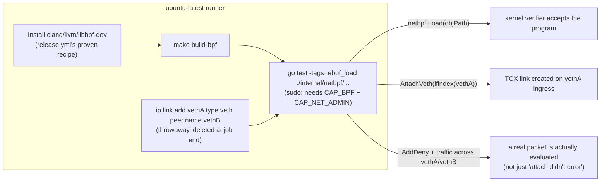

# Design: eBPF CI loading lane

**Date:** 2026-09-01
**Status:** proposed
**Stack:** GitHub Actions (`ubuntu-latest`) + Go 1.24; no new service, no new language
**Issue:** #1663 (split from #1660, umbrella #1645) — blocks #1664 (real two-org fence-probe e2e)

## Problem

The threat-detection fence-probe rules (#1642) ship with only fake-based test
coverage (`internal/threatdetect/fence_probe_e2e_test.go` uses a fake
`RuleContext` and a fake `FindingSink`) because nothing in CI ever loads the
real eBPF network-policy object. `internal/netbpf/netpolicy.bpf.o` is
gitignored, built only by `make build-bpf` (needs clang + kernel UAPI
headers), and `release.yml` already proves that half — it runs
`make build-bpf` successfully on `ubuntu-latest` for every release. What
nothing proves is the other half: that the compiled object actually **loads**
into a real kernel and **attaches** its TC hooks to a real interface. A
`.bpf.o` that compiles but has a verifier-rejected instruction, a map
mismatch, or a broken `AttachTCX` call ships invisibly today — `go build`/
`go test` never touch the real object at all (they link the `embed_stub.go`
no-op).

**Why now:** #1664 (the two-org e2e proving the fence-probe rules for real)
is blocked on this. Without it, #1645's own Definition of Done — "the
two-org e2e ... proves cross-tenant + deny-burst detection" — cannot be met.

## Design

One new CI job. **Not** an extension of `incus-create.yml`: that lane's
setup (ZFS pool, Incus, image pull) exists because the create path it tests
*needs* Incus. `AttachVeth(ifindex int)` in `internal/netbpf/loader.go`
takes any real network interface's ifindex — nothing about loading the
object or attaching TC hooks depends on Incus, ZFS, or a real container.
Coupling this lane to `incus-create.yml`'s setup would make every
netbpf-only change wait on an unrelated image pull, the exact anti-pattern
`incus-create.yml`'s own header explains it was kept separate from
`zfs-encryption.yml` to avoid. This lane creates its own throwaway veth pair
directly on the bare runner (`ip link add vethA type veth peer name vethB`)
— no Incus, no ZFS, no container.

### Components

1. **Toolchain + build step** — reuses `release.yml`'s already-proven recipe
   verbatim (`apt-get install -y clang llvm libbpf-dev linux-libc-dev` then
   `make build-bpf`). Nothing new to design here; the risk this design
   doc exists to retire is entirely in the load/attach step below.

2. **Throwaway veth pair** — `ip link add vethA type veth peer name vethB`,
   both sides brought up (`ip link set vethA up`, `ip link set vethB up`).
   Ephemeral: created and torn down within the job, never touches a real
   container or the daemon. This is what makes the lane self-contained and
   fast (seconds, not the image-pull-bound minutes `incus-create.yml`
   budgets 45 for).

3. **A new Go integration test**, gated behind a build tag
   (`-tags=ebpf_load`, following the repo's existing `-tags=incus`/
   `-tags=integration` convention so it never runs in the default `go test
   ./...` lane on a dev laptop with no root/kernel access) in
   `internal/netbpf/`:
   - `netbpf.Load(objPath)` against the object `make build-bpf` just
     produced — proves the verifier accepts it (a verifier-rejected
     program returns an error here, not a `go build` failure — this is
     exactly the gap this lane closes).
   - `Loader.AttachVeth(ifindex)` against `vethA`'s real ifindex (resolved
     via `net.InterfaceByName`) — proves `AttachTCX` actually succeeds on
     this runner's kernel.
   - `Loader.SetVethPolicy` / `AddDeny` to install a real policy entry,
     then real traffic sent across `vethA`↔`vethB` (a `ping` or a raw
     socket write) — proves the attached program actually evaluates
     packets, not just that `AttachTCX` returned nil. This is the
     difference between "the lane didn't crash" and "the lane proves the
     thing #1642 needs proven."
   - `Loader.DetachVeth(ifindex)` — proves the cleanup path the daemon
     itself relies on when a container stops.
   - Cleanup: `ip link delete vethA` (deleting one side removes the pair).

4. **Workflow placement** — a new job in a new workflow file,
   `.github/workflows/ebpf-load.yml`, triggered on `pull_request`/`push`
   with a `paths:` filter on `internal/netbpf/**`,
   `experimental/ebpf-phaseA/**`, and its own workflow file (same
   no-`branches:`-filter-on-`pull_request` convention `incus-create.yml`
   documents the reason for — a base filter leaves stacked PRs with no
   checks at all). `permissions: contents: read`, matching every other
   lane in this repo — the job needs `sudo` *inside* the ephemeral runner
   VM (to load a kernel object and manage a veth), which is a different
   thing from the GitHub-issued `GITHUB_TOKEN` having write access to
   anything; the token stays read-only regardless.

### Security / operational tradeoffs

This is new privileged-CI-execution surface, so the tradeoffs get named
explicitly rather than assumed away:

- **What's actually new here vs. `incus-create.yml`:** `incus-create.yml`
  already runs `sudo` on every PR (including from forks) to install
  packages, create a ZFS pool, and drive Incus as root. This lane adds
  loading a kernel-verified eBPF program and creating/attaching to a veth
  — both also root-requiring, both bounded by the same ephemeral,
  disposable-VM blast radius the existing lane already accepts. Nothing
  about *loading eBPF specifically* introduces a new secrets-exfiltration
  path: the job uses `pull_request` (not `pull_request_target`), so a
  fork's PR runs with GitHub's default fork protections — a read-only
  `GITHUB_TOKEN` and **no repo secrets in the environment at all**,
  identical to `incus-create.yml`'s posture today. Root inside a
  secret-less, ephemeral, throwaway VM is not the same threat model as
  root with access to this repo's signing keys or deploy credentials.
- **The eBPF verifier is the actual safety boundary, not CI config.** A
  malicious or buggy program cannot get the kernel to do something unsafe
  regardless of privilege level — that is the verifier's entire job, and
  it runs on every `netbpf.Load` call whether in this CI lane, in
  production, or on a developer's laptop. This lane does not change that
  boundary; it exercises it.
- **Residual risk, accepted:** a kernel bug *in the verifier itself* could
  theoretically be triggered by a crafted program and crash the runner.
  This is the same residual risk any project loading real eBPF in CI
  accepts (and the same class of risk `incus-create.yml` already accepts
  by loading a real ZFS kernel module) — mitigated by using
  `ubuntu-latest`'s stock, patched kernel rather than anything custom, and
  is not something a CI workflow can design its way out of. Worth a
  one-line note in the new workflow's header comment (matching this
  repo's convention of writing the accepted-risk reasoning inline, not
  just in a design doc nobody reads at 2am).
- **Kernel version assumption to verify, not assert:** `AttachVeth` uses
  `link.AttachTCX`, which the loader's own doc comment notes needs
  "kernel ≥ 6.6." `ubuntu-latest` (aliasing `ubuntu-24.04` as of this
  writing) ships a 6.8+ kernel, so this should hold — but "should" is not
  "does," and this is exactly the kind of assumption `incus-create.yml`'s
  own header describes discovering the hard way ("#1614's actual root
  cause turned out NOT to be..."). The first PR implementing this design
  is where this gets confirmed, not this doc.

### Test strategy

| Component | Test | Real vs. mocked |
|-----------|------|------------------|
| Toolchain + `make build-bpf` | Already proven in `release.yml`; no new test needed, just reused | Real clang, real kernel UAPI headers |
| `netbpf.Load` (verifier acceptance) | New: `TestLoad_RealObjectPassesVerifier` (`-tags=ebpf_load`) | Real compiled object, real kernel verifier |
| `Loader.AttachVeth`/`AttachVethEgress` | New: `TestAttachVeth_RealInterface` | Real veth pair, real `AttachTCX` |
| Policy evaluation (the actual point) | New: `TestAttachedProgram_EvaluatesRealTraffic` — install a deny rule, send traffic across the veth pair, assert it's actually acted on (dropped, or an event lands in the events map) | Real traffic, real program execution, not just "attach didn't error" |
| `Loader.DetachVeth` | New: `TestDetachVeth_RemovesLink` | Real link teardown |
| Workflow itself | The `Assert nothing was skipped`-style guard `incus-create.yml` uses (#1234's fix) — a lane that silently skips because "no root here" must fail, not report green | N/A — CI-config-level test |

Type gate: `go vet`/`go build` on the new test file (same as every other Go
change); no new language, no new dependency beyond what `internal/netbpf`
already imports (`cilium/ebpf`, already a `go.mod` dependency).

## Language choices

| Component | Language | Why this one | Type gate in CI |
|-----------|----------|---------------|------------------|
| Load/attach/traffic test | Go | Already the language of `internal/netbpf` and every other test in the package; no reason to introduce anything else for one test file | `go vet` + `go build` (existing lanes) |
| Workflow orchestration | YAML (GitHub Actions) | Same as every other CI lane in this repo | N/A |

No new language, no new deployable, no new datastore.

## Contracts

None new. This lane exercises the existing `internal/netbpf` package's
existing exported surface (`Load`, `AttachVeth`, `AttachVethEgress`,
`SetVethPolicy`/`AddDeny`, `DetachVeth`) — it adds test coverage of that
surface under real conditions, not a new API.

## Deviations from the default stack

None. No new language, no new deployable. One deliberate scoping decision,
documented above: this lane is **not** built on top of `incus-create.yml`,
despite issue #1663's own text suggesting that as the default assumption —
investigation during this design showed the dependency isn't there, and
coupling them would cost every netbpf change an unrelated image-pull wait
for no benefit.

## Rejected alternatives

- **Extend `incus-create.yml` with a new step.** Rejected: `AttachVeth`
  takes any real ifindex; nothing about loading/attaching the eBPF program
  needs Incus, ZFS, or a real container. Coupling them would make every
  netbpf-only PR wait on an unrelated image pull — the same reasoning
  `incus-create.yml`'s own header gives for staying a separate workflow
  from `zfs-encryption.yml`.
- **Test only that `make build-bpf` succeeds (compile-only, no load).**
  Rejected: `release.yml` already proves this today. The actual gap this
  issue exists to close is load/attach/evaluate, not compile — a
  compile-only lane would ship the same false confidence #1660 found (a
  green CI that never actually loads the object into a kernel).
- **Self-hosted runner instead of `ubuntu-latest`.** Rejected: no benefit
  over a GitHub-hosted runner for this workload (same kernel-version
  concern either way), and it introduces a whole separate operational
  cost (a machine to own and patch) this repo's other CI lanes don't
  carry.

## At 10x

This lane's cost doesn't scale with fleet size or tenant count — it's a
fixed-cost, single-veth-pair test that runs once per relevant PR. The one
thing that *would* change at 10x traffic through the real fence-probe e2e
(#1664, once this lane exists) is unrelated to this design: that's a
question for #1664's own scoping, not this CI-infra lane.
