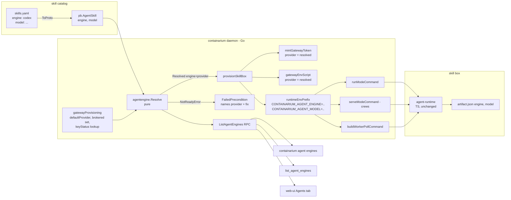

# Design: agent router — per-skill engine resolution on one daemon

**Date:** 2026-10-01
**Status:** proposed
**PRD:** `docs/product/agent-router.md` (#2222 – #2225)
**Stack:** protobuf/gRPC (grpc-gateway) + Docker; Go 1.26 / TypeScript 5 + Next.js 16 + Tailwind 4. No Python.

## Problem

The in-box agent runtime already speaks three engines (Claude, Codex, Gemini)
and picks one from `CONTAINARIUM_AGENT_ENGINE`. The daemon sets that variable
**once for every skill box** from the gateway's "primary" provider
(`gatewayPrimaryProvider` → `engineEnvPrefix`, `internal/server/agent_server.go:938`)
and mints every gateway token for that same provider. The skill manifest has no
engine field, and its `model` field is recorded but never exported. Nothing
reports which engines a deployment can run.

The design moves one decision — *which engine, which provider* — from a
daemon-global constant to a **pure, per-run resolution** that every launch path
goes through, and exposes the same resolution read-only as `ListAgentEngines`.
The runtime (TypeScript, in the box) needs **no code change**: it already honours
the env contract the daemon will now set per skill.

## Design



### Components

| # | Component | Responsibility | Touches |
| --- | --- | --- | --- |
| 1 | **Proto contract** | `AgentEngine` enum, `AgentSkill.engine`, `ListAgentEngines` RPC + messages | `proto/containarium/v1/agent.proto`, regenerated `pkg/pb`, `.pb.gw.go`, swagger |
| 2 | **`internal/agentengine`** (new, pure) | Engine ↔ env value ↔ provider mapping; the one `Resolve` function; readiness rows | new package, no I/O |
| 3 | **Skill catalog loader** | `engine:` in YAML → enum at load; unknown value is a load error | `pkg/core/skills/skills.go` |
| 4 | **AgentSkillServer** | Resolve once per run, mint and seed for the resolved provider, export engine + model on every exec path, record on run; serve `ListAgentEngines` | `internal/server/agent_server.go`, `agent_gateway.go`, `agent_queue_server.go`, `crew_server.go`, `dual_server.go`, `internal/runlease` |
| 5 | **Client + CLI + MCP** | `ListAgentEngines()` on the typed client; `containarium agent engines`; `list_agent_engines` tool wrapping the same function | `internal/client/{grpc,http}.go`, `internal/cmd/agent_engines.go`, `internal/mcp/tools.go` |
| 6 | **Web UI Agents tab** | Render the RPC per server; zod-parse the JSON boundary | `web-ui/src/{types,lib/api,lib/hooks,components/agents}`, `web-ui/app/page.tsx` |
| 7 | **Two-engine crew e2e** | Prove two members, two engines, two token providers on one daemon | `scripts/engineer-crew-e2e.sh` |

No new deployable, no new container, no new config surface: provider keys
still enter the daemon as env (`ANTHROPIC_API_KEY`, `OPENAI_API_KEY`,
`GEMINI_API_KEY`, `<PROVIDER>_UPSTREAM_URL`/`_API_KEY`) or per owner through
`SetTenantProviderKey`. Nothing is baked into an image.

### 2. `internal/agentengine` — the core, pure

```go
package agentengine

// Parse resolves a manifest / flag value ("claude", "codex", "gemini").
// Unknown is an error listing the valid names — never a silent default
// (same rule as internal/coderun/engine.ParseName).
func Parse(s string) (pb.AgentEngine, error)

// EnvValue is what CONTAINARIUM_AGENT_ENGINE carries for e. Panics on
// UNSPECIFIED: callers resolve first.
func EnvValue(e pb.AgentEngine) string

// Provider is the gateway provider e speaks: CLAUDE→"anthropic",
// CODEX→"openai", GEMINI→"gemini". ok=false for UNSPECIFIED.
func Provider(e pb.AgentEngine) (name string, ok bool)

// ForProvider inverts Provider; UNSPECIFIED for a provider no engine speaks
// (gemini-openai, operator-registered OpenAI-shaped upstreams — see
// "What changes at 10x").
func ForProvider(provider string) pb.AgentEngine

// All lists every concrete engine, in enum order.
func All() []pb.AgentEngine

// Gateway is the daemon's view of its model gateway. nil = direct mode.
type Gateway struct {
    DefaultProvider string            // today's gatewayPrimaryProvider(keys)
    Brokered        map[string]Source // provider → how the daemon can serve it
    KeyStatus       KeyStatusLookup   // per-owner keys; nil when no Postgres
}

type Source int // SourceGlobalKey | SourceRegisteredUpstream

type KeyStatusLookup interface {
    HasProviderKey(ctx context.Context, keyOwner, provider string) (bool, error)
}

type Resolved struct {
    Engine   pb.AgentEngine        // never UNSPECIFIED
    Provider string                // "" in direct mode
    Source   pb.AgentCredentialSource
    Default  bool                  // true when the manifest left engine unset
}

type NotReadyError struct {
    Engine, Provider, KeyOwner string
    Reason string // the text ListAgentEngines also prints
    Fix    string // the command that would make it ready
}

// Resolve turns a manifest choice into the engine and provider a run uses.
//
//   gateway != nil, want == UNSPECIFIED → ForProvider(DefaultProvider), Default=true
//   gateway != nil, want named          → provider := Provider(want);
//                                         ready if Brokered[provider] is a global key,
//                                         or KeyStatus says keyOwner has one;
//                                         else *NotReadyError
//   gateway == nil, want == UNSPECIFIED → Engine=CLAUDE (the runtime's own default),
//                                         Provider="", Source=DIRECT_MODE, Default=true;
//                                         caller exports NO engine env (unchanged behaviour)
//   gateway == nil, want named          → Engine=want, Source=DIRECT_MODE
func Resolve(ctx context.Context, want pb.AgentEngine, keyOwner string, gw *Gateway) (Resolved, error)

// Statuses is Resolve applied to All() for one key owner, as the rows
// ListAgentEngines returns. Never errors on a not-ready engine: that is a row.
func Statuses(ctx context.Context, keyOwner string, gw *Gateway, skills []*pb.AgentSkill) []*pb.AgentEngineStatus
```

Why this split: `Resolve` is the only place the rule lives, it has no I/O
except the injected `KeyStatusLookup`, and both the run path and the status
RPC call it. Drift between "what we tell the user is ready" and "what a run
does" becomes impossible by construction. The existing `engineForProvider`
and `gatewayPrimaryProvider` move into this package; `engineEnvPrefix` is
deleted.

**Readiness semantics, decided:**

- "Ready" is *key resolvable for this owner*. There is no live model call: it
  costs money, takes seconds and needs a box.
- The PRD's `engine not in runtime bundle` reason is **dropped**. The daemon
  cannot see the box's `/opt/agent-runtime/dist/engines`, and does not need
  to: `scripts/verify-agent-runtime-bundle.sh` fails the release build if any
  engine is missing, and the daemon passes its own release tag when it
  provisions the box. Bundle completeness is a release-time guarantee, stated
  in the doc, not a runtime probe.
- Direct mode is reported honestly as `UNKNOWN_DIRECT_MODE`: the daemon holds
  no key, the box's own secrets decide, and the daemon will not guess.

### 4. AgentSkillServer changes

`gatewayProvisioning` (`internal/server/agent_gateway.go:32`) changes shape:

```go
type gatewayProvisioning struct {
    engines   agentengine.Gateway   // DefaultProvider + Brokered + KeyStatus
    httpPort  int
    secret    []byte
    egressCIDR string
}
// provider string is gone. allowedModels (never assigned today) is removed
// here and returns, assigned from the manifest, in the P1 model-ceiling work.

func (g *gatewayProvisioning) mintGatewayToken(tenant, skillID, runID, keyOwner, provider string) (string, tokenid.MintedID, error)
```

`SetGatewayProvisioning` gains the brokered set and the key-status lookup;
`dual_server.go:2064` already computes both inputs (`keys`, `gwRegistered`,
`containerServer.secretsStore`). Key **values** never enter this struct — only
provider names and a lookup.

`provisionSkillBox` (`agent_server.go:709`) resolves **before** minting:

```go
keyOwner := runKeyOwner(ctx, box)
res, err := agentengine.Resolve(ctx, skill.GetEngine(), keyOwner, s.gateway.enginesOrNil())
var nr *agentengine.NotReadyError
if errors.As(err, &nr) {
    return ..., status.Errorf(codes.FailedPrecondition,
        "skill %s needs engine %s (provider %s) but %s; fix: %s",
        skill.Id, agentengine.EnvValue(nr.Engine), nr.Provider, nr.Reason, nr.Fix)
}
```

Then `mintGatewayToken(..., res.Provider)` and `gatewayEnvScript(res.Provider, ...)`
use the resolved provider. The gateway already refuses a token whose provider
claim does not match the `/v1/model/<provider>` path (`modelgateway/gateway.go:203`),
so a Codex box with an openai-bound token cannot spend the Anthropic key.

One new function replaces `engineEnvPrefix()` on all three exec paths
(`runModeCommand`, `serveModeCommand`, `buildWorkerPollCommand`):

```go
// runtimeEnvPrefix renders the per-skill engine + model exports.
// Direct mode with an unspecified engine renders "" — byte-identical to today.
func runtimeEnvPrefix(res agentengine.Resolved, model string) string
// → "CONTAINARIUM_AGENT_ENGINE=codex CONTAINARIUM_AGENT_MODEL='gpt-5' "
```

`model` is shell-quoted with the one quoter the injection tests cover
(`shellSingleQuote`). This is the line that finally delivers the manifest's
`model` field.

`serveModeCommand(seedDir, skillID)` and `startServeMode` gain the `Resolved`
parameter; `RunCrew` (`crew_server.go:200-205`) already provisions each
member through `provisionSkillBox`, so a two-engine crew falls out with no
crew-specific code. `startedSkillRun` carries `res` so the exec paths and the
registry read the same value.

Recording: `runlease.Info` gains `Engine pb.AgentEngine`; `runLeaseIssueDetail`
gains `Engine string`; `artifact.json` already carries `engine` from the
runtime. The tracker identity stamp (`internal/tracker/identity.go`) renders
`(engine/model)` instead of `(model)`.

`ListAgentEngines` handler: `RequireScope(agents:read)`; `keyOwner` is
`modelgateway.UserKeyOwner(subject)` for a tenant, `""` (global view) for an
admin — the same rule `ListGatewayModels` uses; returns
`agentengine.Statuses(ctx, keyOwner, gw, s.catalog.List())`.

### 3. Skill catalog loader

`skillDef` gains `Engine string yaml:"engine,omitempty"`. `ToProto` calls
`agentengine.Parse`; `Validate` rejects an unknown name with the valid list.
`LoadEmbedded` therefore fails at daemon start on a typo, not at a run.

### 5. Client, CLI, MCP

- `API` interface: `ListAgentEngines() (*pb.ListAgentEnginesResponse, error)`;
  gRPC and HTTP implementations beside `ListAgentSkills` (`grpc.go:786`,
  `http.go:1634`).
- `internal/cmd/agent_engines.go`: `containarium agent engines [--json]`.
  Table columns: ENGINE, PROVIDER, READY, SOURCE, DEFAULT, SKILLS, REASON.
  `--json` prints `protojson` of the response. Requires `--server` (there is
  no offline answer: readiness is daemon state).
- `internal/mcp/tools.go`: `list_agent_engines`, scope `agents:read`,
  handler calls `client.ListAgentEngines()` and returns the protojson. Thin
  wrapper; no HTTP of its own.

### 6. Web UI

The dashboard is one page with server tabs (`web-ui/app/page.tsx`; the
`/versions` route re-exports it). The Agents surface is a **tab**, not a
route, following that pattern:

- `src/types/agents.ts` — `AgentEngineStatus` and `ListAgentEnginesResponse`
  **plus a zod schema** `listAgentEnginesResponseSchema`. The client parses
  the axios body with it; a `as ListAgentEnginesResponse` cast is not allowed
  on this boundary.
- `src/lib/api/client.ts` — `listAgentEngines(): Promise<ListAgentEnginesResponse>`
  → `GET /v1/agent-engines`, `schema.parse(data)`.
- `src/lib/hooks/useAgentEngines.ts` — SWR, key `agent-engines-${server.id}`,
  `refreshInterval: 0`, `revalidateOnFocus: true` (same as `useApps`). No SSE:
  readiness changes when keys change, which is rare.
- `src/components/agents/AgentEnginesPanel.tsx` — one row per engine: name,
  provider, a readiness badge (`READY` green, `NOT_READY` red with the
  server's `reason` verbatim, `UNKNOWN_DIRECT_MODE` grey with its reason),
  `DEFAULT` chip, skill ids. Empty-key state is just three NOT_READY rows with
  the server's reasons plus one static line linking to the gateway key doc.
  Tailwind utilities only; no new dependency.

### 7. e2e

`scripts/engineer-crew-e2e.sh` gains an opt-in block, gated on **both**
`ANTHROPIC_API_KEY` and `OPENAI_API_KEY` being present (skipped and *reported
as skipped* otherwise): register a two-member fixture crew whose members set
`engine: claude` and `engine: codex`, run it, then assert per member
`artifact.json.engine`, the `CONTAINARIUM_AGENT_ENGINE` in the box's launch
command (from the process log), and the `provider` claim of each box's
`gateway.env` token (decode the JWT body with `base64 -d`; no signature check
needed, the daemon wrote it). Then `containarium agent engines --json` must
show claude and codex `READY` and gemini `NOT_READY` with reason matching
`no key for provider gemini`.

### Data flow — one run, happy and failure paths

1. `agent run code-review` → `RunAgentSkill` → catalog returns the skill with
   `engine` (UNSPECIFIED for today's manifests).
2. `provisionSkillBox` resolves `keyOwner`, calls `Resolve`.
   - Not ready → `FailedPrecondition` to the caller **before any box work**.
     Message carries provider, reason and fix. Nothing is provisioned, no
     lease is issued, nothing to clean up.
3. Mint the platform JWT (unchanged), mint the gateway token for the
   **resolved** provider, write `gateway.env` for that provider.
4. Exec: `set -a; . gateway.env; set +a; CONTAINARIUM_AGENT_ENGINE=codex
   CONTAINARIUM_AGENT_MODEL='…' CONTAINARIUM_RUN_ID=… agent-runtime`.
5. Runtime picks the engine from env (existing `pickEngine`), writes
   `artifact.json` with `engine`.
6. Registry and audit record the engine; `agent engines` shows the skill
   under its engine.

Failure paths that change: a mismatched engine/provider can no longer reach
the box (today it fails in-box with `Not logged in`). Failure paths that do
not change: gateway mint or env-script failure still logs and falls back to
direct mode (`agent_server.go:824`), exactly as today — this design does not
make a previously-best-effort step fatal.

### Deployment shape

Unchanged. Daemon, CLI, MCP server and web UI ship in their existing images.
`make proto` regenerates `pkg/pb`, the gateway shim and the swagger; the web
UI's zod schema is checked against that swagger in CI (Test strategy, 6).

## Language choices

| Component | Language | Why this one | Type gate in CI |
| --- | --- | --- | --- |
| 1 proto contract | protobuf | the repo's single source of truth; grpc-gateway gives REST for the UI for free | `buf lint` / `buf generate` drift check |
| 2 `internal/agentengine` | Go | pure logic inside the daemon; must be importable by the server and by tests without I/O | `go vet`, `go build` |
| 3 skill loader | Go | existing package | `go vet` |
| 4 AgentSkillServer | Go | existing daemon | `go vet` |
| 5 client / CLI / MCP | Go | existing binaries; CLI-first convention | `go vet` |
| 6 web UI | TypeScript | the browser; existing Next.js app | `tsc --noEmit` (`strict: true` is set; `noUncheckedIndexedAccess` is **not** — see Deviations) |
| 7 e2e | bash | extends an existing script; the assertions are on files and JSON a shell can read | `shellcheck` |
| agent-runtime | TypeScript | **no change** — it already reads the env contract | n/a |

Two languages, both already in the system. No Python: there is no ML or data
work here.

## Contracts

| Boundary | Contract | Source of truth | Generated consumers |
| --- | --- | --- | --- |
| manifest → daemon | `pb.AgentSkill.engine` (`AgentEngine` enum, field 11); YAML `engine:` | `agent.proto`; YAML is parsed into the proto by `ToProto` | `pkg/pb` |
| daemon → box | env: `CONTAINARIUM_AGENT_ENGINE` ∈ {claude, codex, gemini}, `CONTAINARIUM_AGENT_MODEL`, plus the per-provider `gateway.env` vars already in `gatewayProviderEnvs` | `agentengine.EnvValue` on the Go side; `pickEngine` on the TS side | none — pinned by a cross-side test (strategy, 2) |
| daemon → gateway | `GatewayClaims.Provider` must equal the resolved provider | `internal/modelgateway` | n/a (same process) |
| daemon ↔ CLI / MCP / UI | `ListAgentEngines` | `agent.proto` | `pkg/pb` (Go), swagger → zod schema check (TS) |

Proto additions (sketch):

```proto
enum AgentEngine {
  AGENT_ENGINE_UNSPECIFIED = 0;   // runtime default (today's behaviour)
  AGENT_ENGINE_CLAUDE = 1;        // Claude Agent SDK, provider anthropic
  AGENT_ENGINE_CODEX = 2;         // OpenAI Codex SDK, provider openai
  AGENT_ENGINE_GEMINI = 3;        // Google Gen AI SDK, provider gemini
}

message AgentSkill { /* … */ AgentEngine engine = 11; }

enum AgentEngineReadiness {
  AGENT_ENGINE_READINESS_UNSPECIFIED = 0;
  AGENT_ENGINE_READINESS_READY = 1;
  AGENT_ENGINE_READINESS_NOT_READY = 2;
  // The daemon serves no model gateway; the box's own secrets decide.
  AGENT_ENGINE_READINESS_UNKNOWN_DIRECT_MODE = 3;
}

enum AgentCredentialSource {
  AGENT_CREDENTIAL_SOURCE_UNSPECIFIED = 0;
  AGENT_CREDENTIAL_SOURCE_GLOBAL_KEY = 1;      // daemon env key
  AGENT_CREDENTIAL_SOURCE_OWNER_KEY = 2;       // SetTenantProviderKey
  AGENT_CREDENTIAL_SOURCE_DIRECT_MODE = 3;
}

message AgentEngineStatus {
  AgentEngine engine = 1;
  GatewayProvider provider = 2;        // reuse model_gateway.proto's enum
  AgentEngineReadiness readiness = 3;
  string reason = 4;                   // empty when READY; the CLI/UI print it verbatim
  AgentCredentialSource source = 5;
  bool is_default = 6;                 // what UNSPECIFIED resolves to
  repeated string skill_ids = 7;       // manifests naming this engine
}

message ListAgentEnginesRequest {}
message ListAgentEnginesResponse {
  repeated AgentEngineStatus engines = 1;
  string key_owner = 2;                // whose view this is; "" = global
}

rpc ListAgentEngines(ListAgentEnginesRequest) returns (ListAgentEnginesResponse) {
  option (google.api.http) = { get: "/v1/agent-engines" };
}
```

Every "one of X, Y, Z" above is an enum, per `CLAUDE.md`. `reason` is free
text by design: it is a sentence for a human, and the CLI and UI must print
the same one.

## Test strategy

Written before implementation; each is the red test the engineer starts
from.

**2. `internal/agentengine`** (table-driven, no I/O)
- `TestParse`: every valid name, mixed case, whitespace; unknown → error
  listing valid names; empty → UNSPECIFIED is *not* accepted by Parse (the
  loader passes empty straight through).
- `TestProviderRoundTrip`: `ForProvider(Provider(e)) == e` for all; unknown
  provider → UNSPECIFIED.
- `TestResolve`: the full matrix (gateway nil / set) × (want UNSPECIFIED /
  each engine) × (global key / owner key / none) → expected `Resolved` or
  `NotReadyError{Reason, Fix}` text pinned exactly. Uses a fake
  `KeyStatusLookup` with a call recorder, asserting the owner-key lookup is
  **not** made when a global key exists and **is** made otherwise.
- `TestStatuses`: three engines, two keys → one NOT_READY row with the pinned
  reason; `is_default` set on exactly one row; `skill_ids` grouped
  correctly; direct mode → all `UNKNOWN_DIRECT_MODE`.

**3. skill loader**
- Extend `TestValidateRejectsBadManifests` with `engine: cluade`; extend
  `TestEmbeddedCatalogLoads` to assert the shipped catalog round-trips
  `engine` (all UNSPECIFIED today).

**4. AgentSkillServer**
- `TestRuntimeEnvPrefix` (replaces `TestEngineEnvPrefix`): resolved engine
  × model present/absent × direct/gateway, pinning exact bytes including
  quoting of a model id containing `'`.
- `TestRunModeCommand_*`, `TestServeModeCommand_*`,
  `buildWorkerPollCommand` test: each launch path contains the prefix for a
  Codex-resolved skill and **nothing** for an unspecified direct-mode skill.
- `TestProvisionSkillBox_NotReadyRefusesBeforeProvisioning`: fake gateway
  with only an anthropic key, skill `engine: codex` → `FailedPrecondition`,
  message contains `openai` and `gateway key set`, container manager
  recorded zero calls.
- `TestProvisionSkillBox_TokenBoundToResolvedProvider`: decode the minted
  token's claims; `Provider == "openai"` for a Codex skill on a daemon whose
  default is anthropic. The seeded `gateway.env` script contains
  `OPENAI_BASE_URL`, not `ANTHROPIC_BASE_URL`.
- `TestRunCrew_TwoEnginesTwoTokens`: two-member crew fixture → two
  `serveModeCommand`s with different `CONTAINARIUM_AGENT_ENGINE`, two tokens
  with different provider claims.
- `TestRunRegistryRecordsEngine` and the audit payload golden.
- `TestListAgentEngines_OwnerView`: tenant subject sees its owner key count;
  admin sees global; `key_owner` echoed.

**Cross-side env contract (2 ↔ runtime)**
- Go: `TestEnvValuesMatchRuntime` reads `agent-runtime/src/index.ts` and
  asserts every `agentengine.EnvValue` appears as a `case "<name>":` in
  `pickEngine`. Cheap, and it is the only thing that pins the string
  contract across the language boundary. (A proto-generated TS enum would
  be better; the runtime does not consume `pkg/pb` today and that change is
  out of this scope.)

**5. client / CLI / MCP**
- Table test `TestAgentEnginesTable` on the renderer with a fixed response →
  golden table; `--json` round-trips through `protojson`.
- HTTP client test against a `httptest.Server` serving the swagger-shaped
  JSON, asserting the path `/v1/agent-engines` (beside the existing `/v1/agent-skills`).
- MCP: extend the existing tool-scope map test (`tools.go:1867` region) so
  `list_agent_engines` requires `agents:read`.

**6. web UI** (Vitest + testing-library)
- `agents.schema.test.ts`: the zod schema accepts a fixture captured from
  the daemon and rejects a row with an unknown readiness string.
- `swagger-contract.test.ts`: load `api/swagger/containarium.swagger.json`,
  take `definitions.v1AgentEngineStatus.properties` and the two enums, and
  assert the zod schema's keys and enum values are exactly those. This is
  the typed-boundary check in place of a generated client.
- `AgentEnginesPanel.test.tsx`: READY / NOT_READY / UNKNOWN_DIRECT_MODE
  render their badge and the server's `reason` verbatim; empty-key fixture
  shows three NOT_READY rows and the doc link.
- `tsc --noEmit` stays the build gate.

**7. e2e** — as in component 7. The script must fail once on purpose
(force the codex member onto `engine: claude` and watch the provider
assertion go red) before the green run counts.

**What is real vs. mocked:** the daemon's key registry is a real in-memory
map; the per-owner store is a fake implementing `KeyStatusLookup`; the
container manager is the existing test fake; the gateway token is really
minted and really decoded (HMAC with a test secret). The runtime is not
run in unit tests — its contract is pinned by the cross-side test and
exercised for real only in the e2e.

## Deviations from the default stack

- **Web UI types are hand-written, not generated from the proto.** This is
  the repo-wide state of `web-ui/src/types/*` and `client.ts`; this design
  does not fix it globally. Containment: the new boundary gets a zod schema
  that is checked against the generated swagger in CI, so proto drift fails
  a test. Generating a TS client from the swagger for the whole UI is a
  separate change.
- **`noUncheckedIndexedAccess` is off in `web-ui/tsconfig.json`.** Not
  changed here (it would surface errors across the app). The new code
  avoids indexed access on the response arrays except through `.map`.
- **The daemon → box env contract is strings, not a shared type.** The
  runtime does not import `pkg/pb`. Contained by the cross-side test that
  reads `index.ts`. Moving the runtime to a generated TS enum is noted as
  follow-up, not done here.
- **bash for the e2e.** Existing script, existing lane.

## Rejected alternatives

- **`string engine` on the manifest.** Rejected: `CLAUDE.md` is explicit
  that "one of X, Y, Z" is an enum, and the runtime already proves the cost
  of strings (`"cluade"` would be a run that dies in-box).
- **Route inside the model gateway** (accept any SDK dialect, pick a
  provider per request). Rejected: `docs/AGENT-MODEL-GATEWAY-DESIGN.md:66`
  names "not a general LLM router" a non-goal; the Codex SDK speaks the
  OpenAI protocol and cannot be pointed at Anthropic by a URL swap; and it
  would put routing where neither the manifest nor the operator can see it.
- **A crew-level default engine.** Rejected for the MVP: the member's
  manifest is where the "this topic runs on this agent" decision belongs,
  and `RunCrew` already provisions per member, so a crew field adds a
  second precedence rule for no new capability. Open question 6 in the PRD.
- **Keep the per-box tenant secret as the override.** Rejected: it is
  per-box not per-skill, invisible to the API, untyped, and cannot change
  the gateway token's provider — so it only ever worked in direct mode.
- **Live readiness probe.** Rejected for the MVP: a model call per engine
  per status check costs money and seconds and needs a box; key
  resolvability is what `MintGatewayToken --dry-run` already treats as the
  install-time truth for `containarium code`. A `--probe` flag is P1.

## What changes at 10x

- **Engines whose provider is not fixed** — Codex against an
  operator-registered OpenAI-shaped upstream (`GATEWAY_PROVIDER_KAFEIDO`,
  `gemini-openai`). Today `Provider(CODEX) == "openai"`. The slot for this
  is an optional `GatewayProvider provider = 12` on `AgentSkill` that
  overrides the engine's default provider; `Resolve` takes it as an input
  and the matrix test grows one axis. Not needed for the PRD's MVP, so not
  added now.
- **Per-invocation override** (`agent run --engine`): one field on
  `RunAgentSkillRequest`, resolved by the same `Resolve` with `want` taken
  from the request when set. The design already has the seam.
- **Policy routing** (labels → engine): a function that produces `want`
  before `Resolve`; `Resolve` itself does not change.
- **Many owners, many keys**: `Statuses` makes one `HasProviderKey` call
  per (owner, provider) with no global key; at thousands of owners the UI
  should not fan this out per daemon on every focus — cache in the hook,
  or add a batched status RPC. Not a concern at today's scale.
