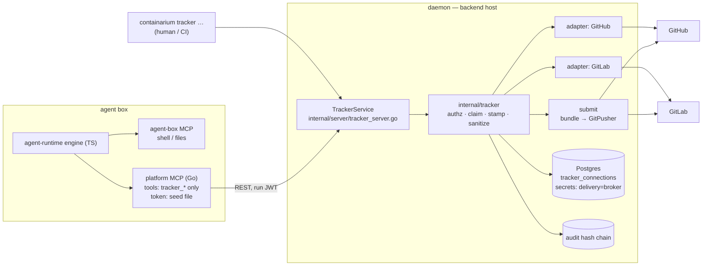

# Design: agent tracker broker

**Date:** 2026-09-18
**Status:** proposed — decision D1 needs owner sign-off on #1920 before #1921 merges
**Stack:** Go 1.26.6 (daemon, CLI, platform MCP); TypeScript 5.6 / Node ≥ 20
(`agent-runtime`, one engine-mount change); protobuf/gRPC + grpc-gateway. No
new languages, no new services, no new deployables.

> Scope: the implementable architecture for the proposal in
> `docs/AGENT-TRACKER-BROKER-DESIGN.md` — the *why*, the threat model, and the
> relationship to earlier decisions live there and are not restated.
> Issues: epic #1920; #1921 (Phase 0), #1922 (Phase 1), #1923 (Phase 2).

## Problem

An agent running in a box needs to read an issue, claim it, post status, and
open a change request on GitHub or GitLab. Today that requires a tracker
credential inside the box, and provider knowledge inside the agent's prompt.
We want the credential held daemon-side only, the provider resolved from
configuration, and every write attributed by the platform — using the
run-scoped platform JWT the box already has.

Requirements this is designed to, and no further: one backend daemon; a
handful of concurrent agent runs per tenant; GitHub (SaaS or Enterprise
Server) and GitLab (SaaS or self-managed, **Free tier**); the tracker may be
reachable only from the backend's network.

## Decisions

| # | Question | Decision |
| --- | --- | --- |
| D1 | Forge credential in daemon custody, or a separate broker process? | **In the daemon**, as package `internal/tracker` behind interfaces. Needs sign-off — see below. |
| D2 | Host git or a pure-Go library for the push? | **Host git via `os/exec`**, behind a `GitPusher` interface, hardened (below). |
| D3 | One project per connection, or many? | **One project per connection; many connections per tenant; a run is bound to exactly one connection at launch.** |
| D4 | How does an in-box agent reach the verbs? | **The platform MCP mounted in-box with a tool allow-list.** Skill boxes have no `containarium` CLI; the CLI remains the human/CI surface. |

**D1 — why in-daemon, and what sign-off means.** A separate process would
need its own copy of platform-JWT verification, the revocation store, the
run-lease liveness that `ClaimTrackerIssue` depends on, and the audit hash
chain — and would be a second deployable on every backend host, including
bring-your-own-compute hosts. None of that buys isolation the daemon doesn't
already need for the model gateway's provider keys. The cost is real and
stated in the design note: it reverses the "no forge PAT inside the daemon"
stance. The seam that keeps the reversal cheap: `internal/tracker` receives
its credential through a `CredentialSource` interface and its run facts
through a `RunResolver` interface, so moving it out of process later is a
wiring change, not a rewrite. **#1921 can start now; it must not merge until
the D1 checkbox on #1920 is ticked**, because a broker-only secret mode *is*
daemon custody.

**D2 — why host git.** Commits leave the box as a git bundle. No maintained
pure-Go library reads bundles, and adding one would be the largest new
dependency tree in `go.mod` for a single call site. `internal/transfer`
already execs git with package-validated argv. Host git is a **preflight,
not an assumption**: `tracker status` reports the host git version, and
`SubmitTrackerChange` returns `FAILED_PRECONDITION` when git is missing or
older than 2.31 (needed for env-based config). Phases 0–1 have no git
dependency at all.

**D3 — why bind a run to one connection.** Least privilege, enforced where
it can't be forged. `RunAgentSkillRequest` gains `tracker_connection` (a
connection name). The daemon validates it against the caller's tenant and
mints it into the run JWT as a typed claim. Tracker verbs called with a run
token use the claim and reject a request that names a different connection;
operator tokens (no `run_id`) may name any connection in their tenant. Same
anti-forgery rule as the `act` claim: derived from the verified token, never
from a request field.

**D4 — why the platform MCP.** The engine mounts only the in-box `agent-box`
MCP today (`agent-runtime/src/engines/claude.ts`); `seed.ts` already carries
`tokenPath` "for the platform MCP", and `cmd/mcp-server` already supports
`CONTAINARIUM_JWT_TOKEN_FILE` (re-read per request). What is missing is a
filter: the platform MCP registers 64 tools, and an agent should see seven.

## Design



### Components

| Component | Location | Single responsibility |
| --- | --- | --- |
| Contract | `proto/containarium/v1/tracker.proto`, `secrets.proto` (+1 enum value), `agent.proto` (+1 field) | Source of truth for every boundary below |
| Broker-only secrets | `internal/secrets` | A secret that no delivery path can load and no API can read back |
| Connection store | `internal/tracker/store.go` | CRUD for `tracker_connections` (Postgres, same pool and `initSchema` idiom as secrets) |
| Broker core | `internal/tracker` | Pure logic: connection resolution, claim rules, identity stamp, text sanitization, label allow-list. No network, no DB — interfaces in, values out |
| Provider adapters | `internal/tracker/github`, `internal/tracker/gitlab` | Translate the `Provider` interface to REST. stdlib `net/http`, no SDK dependency (precedent: `internal/runner/github.go`) |
| gRPC service | `internal/server/tracker_server.go` | Authn/authz, wiring, audit emission. Thin |
| Submit path | `internal/tracker/submit` | Bundle extraction, validation, `GitPusher`, change-request creation |
| Client + CLI | `internal/client/{grpc,http}.go`, `internal/cmd/tracker*.go` | `containarium tracker connect\|list\|status\|disconnect`, `… issue view\|list\|comment\|claim\|label`, `… change view\|submit` |
| Platform MCP tools | `internal/mcp/tools.go`, `cmd/mcp-server` | `tracker_*` tools wrapping the same client functions; **new `CONTAINARIUM_MCP_TOOLS` allow-list** (comma-separated names / `prefix_*`), unset = all tools, as today |
| In-box mount | `agent-runtime/src/engines/*.ts`, `engine.ts` | When the seed carries a platform-MCP config, mount it as a second MCP server and extend `allowedTools` with `mcp__containarium__tracker_*` |

Seams (all constructor-injected, no globals):

```go
// internal/tracker
type Provider interface { // one per adapter
    GetIssue(ctx context.Context, c Conn, number int64) (Issue, error)
    ListIssues(ctx context.Context, c Conn, f IssueFilter) ([]Issue, error)
    Comment(ctx context.Context, c Conn, number int64, body string) (Comment, error)
    AssignIfUnassigned(ctx context.Context, c Conn, number int64) (assigned bool, err error)
    SetLabels(ctx context.Context, c Conn, number int64, add, remove []string) error
    GetChange(ctx context.Context, c Conn, number int64) (Change, error)
    OpenChange(ctx context.Context, c Conn, req OpenChangeRequest) (Change, error)
    DescribeCredential(ctx context.Context, c Conn) (CredentialInfo, error) // scopes, expiry, breadth
}
type CredentialSource interface { BrokerCredential(ctx context.Context, tenant, secretName string) (string, error) }
type RunResolver     interface { Live(runID string) bool }                  // backed by run leases
type GitPusher       interface { PushBundle(ctx context.Context, p PushSpec) (PushResult, error) }
type Clock           interface { Now() time.Time }
```

`Conn` carries provider, base URL, project, and the resolved credential; it
is built per call and never stored or logged. `Issue`, `Comment`, `Change`
are named structs mirroring the proto messages — no `map[string]interface{}`
anywhere, including adapter JSON decoding (named response structs per
provider endpoint).

### Broker-only secrets — enforced in the store, not by callers

- `SECRET_DELIVERY_BROKER_ONLY = 4` in the proto enum; `DeliveryBroker =
  "broker"` beside the existing store constants.
- **Never delivered:** the one loader every delivery path funnels through
  (`LoadAllForUserWithDelivery`; `LoadAllForUser` delegates to it) excludes
  `delivery = 'broker'` **in its SQL**. A new delivery path written next
  year cannot forget a check it never had to make.
- **Still rotated:** excluding broker rows from *delivery* must not exclude
  them from *key management*. `rewrapTenant` and the envelope migrator keep
  operating on every row regardless of mode.
- **Write-only:** `Store.Get` returns `ErrBrokerOnly` for a broker row. The
  value is reachable through one method, `BrokerCredential`, which satisfies
  `CredentialSource` and is wired only into `internal/tracker`. `GetSecret`
  maps `ErrBrokerOnly` to a response with metadata and an empty value.
- **One-way:** `Set` on an existing broker row with a delivering mode is
  rejected (`FAILED_PRECONDITION`); delete and re-create is the only path.
- A `TrackerConnection` may reference only a broker-mode secret.

### Identity stamp and claims

Every brokered write ends with a visible line and a hidden, machine-readable
marker (HTML comments are not rendered by either provider):

```
— <skill>/<run-id-short> (<model>) via Containarium
<!-- containarium:run=<run_id> skill=<skill_id> kind=claim|comment|change -->
```

All values come from the verified JWT and the run record. `<model>` is the
skill manifest's declared model; omitted when the manifest declares none.

`ClaimTrackerIssue`, under a per-`(connection, issue)` mutex:

1. Read comments; find the newest `kind=claim` marker from a **different** run.
2. If that run is `RunResolver.Live`, or the marker is younger than
   `stale_after` (request field, default 2h, for claims made through another
   daemon) → return `ALREADY_CLAIMED` with the holder's run id. No write.
3. Otherwise post the claim, then `AssignIfUnassigned` — never replaces an
   assignee, which is what makes it correct on GitLab Free's single-assignee
   model.
4. Re-read; if an earlier foreign claim landed concurrently, post a yield
   comment and return `ALREADY_CLAIMED`.

A same-run re-claim is idempotent: marker found, nothing posted.

### Sanitizing agent-supplied text

Agent text is data; it must not carry provider commands. For GitLab, any
line whose first non-space character is `/` followed by a letter gets a
U+200B inserted before the slash, inside and outside code fences — relying
on fence parsing to match the provider's would be a parser-differential bug
waiting to happen. For both providers the hidden marker syntax
`<!-- containarium:` is stripped from agent text so a run cannot forge a
marker. Content flowing the other way (issue bodies into the agent) is
returned as plain fields and never interpreted.

### Submit path

```
SubmitTrackerChange(issue, title, description, draft)      ← no remote, no ref, no credential
  1  base := run record's git_commit                        (FAILED_PRECONDITION if the run had no git_source)
  2  exec in box:  git bundle create <seed>/out.bundle <base>..HEAD
  3  pull file out (size-capped, default 50 MiB) → host tmpdir, mode 0600
  4  GitPusher.PushBundle:
       git init --bare <tmp>; git bundle verify; git fetch <bundle>
       git push <remote-url> <sha>:refs/heads/agent/<run-id-short>/<issue>-<slug>   (no --force)
  5  Provider.OpenChange(head branch, closing reference, stamped description)
  6  audit(commit range, branch, change number); rm -rf <tmp>   (deferred; runs on every path)
```

`GitPusher` hardening, all set by the implementation and asserted by tests:
`HOME=<tmp>`, `GIT_CONFIG_NOSYSTEM=1`, `GIT_CONFIG_GLOBAL=/dev/null`,
`GIT_TERMINAL_PROMPT=0`, `-c core.hooksPath=/dev/null`,
`-c transfer.fsckObjects=true`, and the credential as an `http.extraHeader`
supplied through `GIT_CONFIG_COUNT` / `GIT_CONFIG_KEY_0` /
`GIT_CONFIG_VALUE_0` — **environment, never argv**, so it is absent from the
host process table. The remote URL is built from the connection record, not
from anything in the bundle or the box.

### Data flow and failure paths

| Failure | Behavior |
| --- | --- |
| Missing scope / revoked or expired JWT / lease ended | `PERMISSION_DENIED` / `UNAUTHENTICATED` before any upstream call |
| Run token names a connection other than its claim | `PERMISSION_DENIED` |
| No connection, or secret missing / not broker-mode | `FAILED_PRECONDITION`, names the connection, never the secret value |
| Upstream 401/403 | `FAILED_PRECONDITION` "credential rejected by tracker" + audit event; surfaces in `tracker status` |
| Upstream 429 / 5xx | `UNAVAILABLE` with retry-after when the provider supplies one. **No daemon-side retry of writes** — a duplicate comment is worse than a surfaced error |
| Label outside the connection's allow-list | `INVALID_ARGUMENT` |
| Bundle empty / fails verify / over cap | `INVALID_ARGUMENT`, no upstream call made |
| Host git missing or < 2.31 | `FAILED_PRECONDITION` |

Errors returned to a run token never include upstream response bodies
verbatim (they can echo request headers); the full body goes to the daemon
log with the credential header redacted.

### Deployment shape

No new deployable, container, or port. The daemon gains a Postgres table via
the existing `initSchema` idiom (`CREATE TABLE IF NOT EXISTS
tracker_connections`, provider stored as `TEXT` with a `CHECK`, converted to
the typed enum at the store boundary). The agent box recipe must ship the
platform MCP binary beside `agent-box` — **verify, and add it to the
release artifacts the recipe pulls if it is not there** (#1922). With egress
enforcement on, the box needs a route to the daemon's REST port and nothing
tracker-related. The credential enters only through `SetSecret`.

## Language choices

| Component | Language | Why this one | Type gate in CI |
| --- | --- | --- | --- |
| Service, core, adapters, store, submit, CLI, platform MCP | Go | It is the daemon; long-running, concurrent, already owns JWT, leases, audit, secrets | `go build` / `go vet` / `golangci-lint` |
| In-box engine mount | TypeScript | `agent-runtime` already is TypeScript (the engine SDK is); this is a ~30-line change, not a new component | `tsc --noEmit` (`strict: true`) |

Two languages, both already in the system. The seed file the daemon writes
and the runtime reads is the one cross-language boundary touched: its shape
is parsed and validated in `seed.ts`, not cast.

## Contracts

| Boundary | Contract | Source of truth | Generated |
| --- | --- | --- | --- |
| Any caller ↔ daemon | `TrackerService`: `Create/Get/List/DeleteTrackerConnection`, `GetTrackerStatus`, `GetTrackerIssue`, `ListTrackerIssues`, `GetTrackerChange`, `CommentOnTrackerIssue`, `ClaimTrackerIssue`, `SetTrackerIssueLabels`, `SubmitTrackerChange` | `proto/containarium/v1/tracker.proto` with `google.api.http` + OpenAPI annotations | `pkg/pb`, `.pb.gw.go`, swagger via `make proto` |
| Enums | `TrackerProvider`, `TrackerIssueState`, `TrackerCiVerdict` (`UNSPECIFIED`, `NONE`, `PENDING`, `SUCCESS`, `FAILED`), `TrackerCredentialBreadth` (`PREFERRED`, `BROAD`) | same | same |
| Secrets | `SECRET_DELIVERY_BROKER_ONLY = 4` | `secrets.proto` | same |
| Run ↔ connection | `RunAgentSkillRequest.tracker_connection`; JWT claim `tracker_conn` on `auth.Claims` | `agent.proto`; `internal/auth/token.go` | — |
| Scopes | `tracker:read`, `tracker:write`, `tracker:admin` (connection CRUD) | `internal/auth/scopes.go` | — |
| Daemon ↔ in-box runtime | `platform_mcp.json` in the run's seed dir: `{command, args, server_url, token_file, tools}` | Go struct in `internal/server`, validated parse in `agent-runtime/src/seed.ts` | — (a fixture shared by both test suites pins it) |
| Core ↔ adapters | `tracker.Provider` | `internal/tracker/provider.go` | — |
| Storage | `tracker_connections(username, name, provider, base_url, project, credential_secret, label_allowlist, created_at, updated_at, PRIMARY KEY(username, name))` | `internal/tracker/store.go` `initSchema` | — |

`make proto` rewrites the gateway shims with version-drift noise; keep only
the files the change actually touches.

## Test strategy

Each component names its tests before its implementation. Unit tests are
table-driven; nothing in the default lane needs a network.

**Broker-only secrets** (`internal/secrets`) — real Postgres container, the
package's existing test idiom:
- `TestLoadAllForUserWithDelivery_ExcludesBrokerRows` — broker row never appears in the delivery set (and therefore not in `LoadAllForUser`)
- `TestRewrapTenant_IncludesBrokerRows`, `TestEnvelopeMigration_IncludesBrokerRows` — a KEK change must not strand a broker credential
- `TestGet_BrokerRow_ReturnsErrBrokerOnly`
- `TestBrokerCredential_ReturnsValue_OnlyForBrokerRows` — refuses a delivering row
- `TestSet_BrokerToDeliveringMode_Rejected`
- `TestGetSecretRPC_BrokerRow_EmptyValueEvenWithSecretsRead` (server level)
- `TestBrokerCredentialCallers_Allowlist` — source scan: only `internal/tracker` and the server wiring reference `BrokerCredential`

**Connection store** — real Postgres: CRUD round-trip; tenant isolation
(`TestGet_OtherTenantsConnection_NotFound`); `CHECK` rejects an unknown
provider string; connection referencing a non-broker secret rejected.

**Broker core** (`internal/tracker`) — pure, fakes for every interface:
- `TestStamp_FromClaimsOnly` — request fields cannot influence the signature
- `TestStamp_OmitsModelWhenManifestHasNone`
- `TestSanitize_GitLabQuickActions` — table: leading `/assign`, indented, inside fences, mid-line slash untouched, URL paths untouched
- `TestSanitize_StripsForgedMarker`
- `TestClaim_RefusesLiveForeignClaim`, `_RefusesFreshUnknownClaim`, `_TakesOverStaleClaim`, `_IdempotentForSameRun`, `_YieldsWhenEarlierClaimAppearsOnReread`
- `TestClaim_ConcurrentSameIssue_ExactlyOneWins` — run with `-race`
- `TestClaim_NeverReplacesAssignee`
- `TestLabels_OutsideAllowlist_Rejected`
- `TestResolveConnection_RunTokenUsesClaim_RejectsMismatch`, `_OperatorTokenMayName`

**Adapters** — `httptest.Server` replaying recorded provider responses
(fixtures under `testdata/`, scrubbed):
- one conformance suite, `TestProviderConformance`, run against **both**
  adapters, asserting identical normalized output for equivalent fixtures —
  this is the test that keeps "provider-neutral" true
- per adapter: auth header shape, pagination, `iid` vs `id` (GitLab), CI
  verdict mapping table (`manual` / `skipped` / `canceled` ≠ `SUCCESS`),
  base-URL handling for Enterprise Server / self-managed, 401/403/429/5xx mapping
- `TestErrors_NeverEchoCredential` — fuzz the fixture bodies with the
  credential string; assert it appears in no returned error

**gRPC service** — handlers with fakes: scope matrix per RPC (table);
`TestVerb_AfterLeaseEnd_Denied`; audit event emitted per write with the
expected typed payload; no audit payload contains the credential.

**Submit path**:
- `TestGitPusher_EnvAndArgv` — fake `exec` records the command: credential
  present in env config, **absent from argv**; hardening env and `-c` flags all set
- `TestBranchName_DaemonChosen` — slug table; request cannot influence ref
- `TestBundle_Rejected` — empty, corrupt, over cap → no `Provider` call
- `TestTmpdir_RemovedOnEveryPath`
- integration (real git, no network): `TestSubmit_HostileRepo` — a workspace
  with a `pre-push` hook, `credential.helper`, `url.insteadOf`, and
  `http.proxy` pointing at a capture sink; push to a local bare "remote";
  the sink stays empty and the branch arrives

**Client / CLI / MCP** — existing `http_requests_test.go` idiom for the
typed client; cobra tests for argument validation;
`TestMCPToolFilter` — unset = all tools, `tracker_*` = exactly the tracker
tools, unknown pattern = startup error (fail closed, not "zero tools").

**In-box mount** (TypeScript, Vitest — add the dev dependency and a `test`
script; `agent-runtime` has a type gate but no test runner today):
`seed.test.ts` — absent file → no mount; malformed → throws;
`engine-options.test.ts` — options carry the second MCP server and the
extended `allowedTools` only when the seed config is present. Requires
extracting option-building into a pure function, which is the point.

**Mocked vs real:** Postgres real (container); tracker HTTP replayed
fixtures; git real in one integration test; model engine not exercised.
**Opt-in lane, not default CI:** a real GitLab CE container proving
quick-action sanitization and single-assignee behavior end to end. It is
heavy (multi-GB, minutes to boot) — run it on adapter changes and before a
release, and record in the PR when it was last green.

**Happy-path e2e** (pairs with `/qa:e2e-test`, after Phase 1): connect →
run a skill bound to the connection → the issue shows a stamped claim → end
the run → the same token is denied.

## Build order

| Step | Issue | Deliverable | Depends on |
| --- | --- | --- | --- |
| 1 | #1921 | Broker-only secret mode (proto enum, store, RPC behavior) | — |
| 2 | #1921 | `tracker.proto` connections + store + `tracker:*` scopes + `tracker connect/list/disconnect` | 1 |
| 3 | #1921 | `DescribeCredential` on both adapters + `tracker status` (breadth, expiry, reachability) | 2 |
| 4 | #1922 | Core + `Provider` interface + conformance suite + both adapters' read verbs | 2 |
| 5 | #1922 | Write verbs: stamp, sanitize, claim, labels, audit | 4 |
| 6 | #1922 | `tracker_connection` run binding + JWT claim | 2 |
| 7 | #1922 | MCP `tracker_*` tools + `CONTAINARIUM_MCP_TOOLS` + in-box mount + recipe ships the binary | 5, 6 |
| 8 | #1923 | Submit path | 5, host-git preflight |

Steps 1–3 and 4 can run in parallel once step 2's proto is merged. Each step
is one reviewable PR.

## Deviations from the default stack

- **No Docker deployable** — this is a package inside an existing daemon
  that ships as a host binary; nothing new to containerize.
- **Shelling out to host git** (D2) — contained behind `GitPusher`, one
  implementation file, preflighted, and absent from Phases 0–1.
- **Hand-written REST calls to the trackers** rather than generated clients
  — neither provider's API is defined by our protos; contained inside the
  two adapter packages with named response structs, pinned by the
  conformance suite.

## At 10×

- Claims serialize on an in-process mutex: correct for one daemon. Several
  daemons sharing a project need a Postgres advisory lock keyed by
  `(connection, issue)`; the re-read-and-yield step already bounds the damage
  until then.
- Every read hits the upstream. Provider API quotas are shared with humans;
  at volume, add conditional requests (ETag) in the adapters before adding a
  cache.
- Per-run and per-connection write budgets (Phase 3) become necessary the
  first time an agent loops.

## Rejected alternatives

- **Transparent credential-injecting HTTP proxy** (the model gateway's
  shape). Cheapest to build, and the box could use stock tracker CLIs. It
  loses the three things this design exists for: the upstream token's
  coarseness passes straight through (no least-privilege by verb), provider
  knowledge stays in the agent, and the identity stamp and quick-action
  sanitization have nowhere to live short of parsing every provider endpoint
  — at which point it is this design with worse types.
- **Separate broker process running as an ordinary client** (the
  `runner reconcile` arrangement). Honors the no-PAT-in-daemon stance, but
  duplicates JWT verification, revocation, lease liveness, and audit, and
  adds a deployable to every backend host. Kept as the documented fallback
  behind the `CredentialSource` / `RunResolver` seams if D1 is declined.
- **In-box push with an injected one-shot credential** (the fetch path's
  technique). Unsafe after the agent has had write access to the repository:
  hooks and git config are attacker-controlled input at that point.
- **Running the push in a throwaway platform-owned box** instead of on the
  host. Avoids the host git dependency but puts the credential back inside a
  container boundary and adds a provision step to every submit; revisit only
  if host git proves unavailable on real backends.
