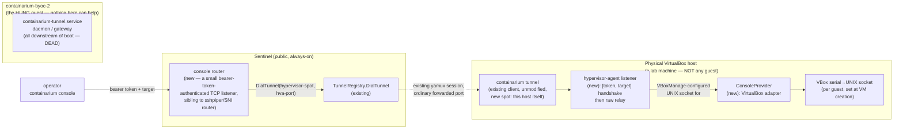

# Design: Console access to BYOC VM hosts (no external dependency)

**Date:** 2026-09-07
**Status:** proposed
**Stack:** Go (daemon/tunnel-agent side, no new languages); protobuf/gRPC contract for the control path; hypervisor-native console primitives for the data path (`incus console`, VirtualBox serial-to-socket)
**Origin:** operational gap found live-debugging `containarium-byoc-2` — the box was stuck at BIOS POST and nothing at the network layer could reach it, so it stayed undiagnosed.

## Problem

Containarium already has a way to reach a BYOC host or its workloads that
depends on nothing external: the host's `containarium-tunnel.service`
dials **outbound** to the sentinel (`internal/cmd/tunnel.go`,
`internal/sentinel/tunnel_registry.go`), and the sentinel's `sshpiper` +
SSH-CA setup (`docs/SENTINEL-DESIGN.md`) rides that tunnel to give an
operator an interactive shell. No VPN mesh, no third-party relay.

That path has one hard requirement: **the target has to have booted far
enough to bring up its own network stack and an SSH daemon.** For an LXC
container that's almost always true. For a VM — either a BYOC host that
is itself a VM (a VirtualBox guest simulating bare metal, a cloud VM
instance), or an Incus-managed VM instance running as a workload on a
host (e.g. the k3s worker VMs in
[`managed-k8s-clusters.md`](managed-k8s-clusters.md)) — it is not: a
BIOS/firmware hang, a GRUB misconfiguration, a kernel panic before
`network.target`, or a broken `containarium-tunnel.service` inside the
guest all leave the operator with *no* path in. SSH and the tunnel are
both downstream of the exact boot stages that need debugging.

This is the same problem Kubernetes solves for pods with `kubectl
exec`/`attach` — the API server talks to the kubelet, not the pod's own
network — and that KubeVirt solves one layer lower for VMs: `virtctl
console`/`virtctl vnc` proxies to the serial/VNC device the hypervisor
exposes on the **host**, independent of whether the guest OS or its
network ever comes up. Containarium has no equivalent today (confirmed:
no console/serial/VNC access mechanism exists anywhere in `internal/cmd`,
`internal/sentinel`, or `docs/architecture`).

## Goals

- An operator can attach to a VM's boot-time console (BIOS/UEFI POST,
  bootloader, kernel log, a getty if the guest gets that far) with **no
  dependency on the guest's own network stack, sshd, or tunnel agent
  being up**.
- No new external dependency — the console stream rides the same
  outbound-dialed tunnel + sentinel infrastructure already used for SSH.
  No VPN mesh (Tailscale or otherwise), no inbound listener opened on the
  BYOC host.
- One CLI verb works the same way regardless of hypervisor: `containarium
  console <target>` — whether `<target>` is a whole BYOC host that
  happens to run as a VM, or an individual Incus-managed VM instance on a
  host.
- Access is auth-gated the same way interactive SSH already is (short-lived
  SSH-CA certs from the sentinel), not a separate credential system.

## Non-goals

- Full graphical console / remote desktop (VNC framebuffer streaming).
  Text/serial console is the target; a VNC transport can reuse the same
  tunnel plumbing later if a real need shows up, but it is not this doc's
  scope.
- Changing how LXC *containers* are reached — they boot fast enough and
  `containarium exec` / SSH already cover them. This is strictly for
  VM-backed targets.
- Replacing sentinel/sshpiper's role for anything that already has a
  working guest network. Console is a fallback path for when that layer
  isn't up yet, not a general-purpose replacement for SSH.

## Design

### Two VM boundaries in scope

1. **A BYOC host that is itself a VM** — a VirtualBox guest standing in
   for bare metal (`containarium-byoc-1`/`-2` today), or a cloud VM
   instance. The hypervisor here is *outside* Containarium's control
   (VirtualBox on someone's workstation, or the cloud provider's own
   hypervisor) — access has to come from whatever manages that guest.
2. **An Incus-managed VM instance running as a workload on a host** — the
   k3s worker/control-plane VMs from the managed-k8s design. Here Incus
   already owns the hypervisor (`qemu`) and already exposes `incus
   console <instance>` natively; there is nothing to build at the
   hypervisor layer, only plumbing to get that stream off the host and
   through the tunnel to the operator.

The design has to cover both without operators needing to know which one
they're talking to.

### Topology (revised — see "Correction" below)



The console-serving listener runs on the **physical hypervisor host**,
not inside any guest — that's the load-bearing fix from the original
version of this doc (below). Reaching it costs zero tunnel-protocol
changes: the hypervisor host just advertises one more port via the
*existing*, unmodified `containarium tunnel` client
(`internal/sentinel/tunnel_client.go`), and the sentinel already has
`TunnelRegistry.DialTunnel(spotID, port)` for opening a stream to any
advertised port on any connected spot. What's genuinely new is a small
listener on that port (the "hypervisor-agent") and a bearer-token-checked
router on the sentinel side to reach it from the public internet — the
sentinel today only routes two specific ports publicly (`:22` via
sshpiper-by-username, `:443` via SNI), not arbitrary advertised ports.

### Correction — what the original version of this doc got wrong

Two assumptions here turned out to be wrong once I read the actual
tunnel code (`internal/sentinel/tunnel_client.go`,
`tunnel_registry.go`) instead of describing it from memory:

1. **"A new stream type multiplexed over the tunnel's existing yamux
   session"** implied the yamux session was a general-purpose message
   bus a handler could add a new logical channel to. It isn't — it's a
   plain reverse port-forwarder: the box advertises `--ports
   22,80,443,...`, and every yamux stream carries a 2-byte port header
   telling the box which local port to dial. Adding console support
   needs no yamux/protocol change at all — it's just one more advertised
   port with a new thing listening on it locally.
2. **"Reuses the sentinel's existing SSH-CA... a cert's principal
   determines whether it's routed to a normal shell or to the console
   router"** assumed the sentinel and the JWT-authenticated daemon
   gateway (where #1750/#1751's `ConsoleHandler` landed) were the same
   trust domain reachable from one process. They are not: the sentinel
   (`internal/sentinel/`) and the daemon (`internal/gateway/`,
   `internal/server/`) are **separate processes** with separate auth
   models (SSH-CA / pre-shared tunnel tokens on the sentinel; JWT on the
   daemon). More importantly, the daemon — and the guest's own
   `containarium-tunnel.service` — run **inside the guest**. For a guest
   hung at BIOS POST, *neither has started*, so no design that only adds
   code to the guest's own tunnel-agent or daemon can reach it. This is
   why #1750/#1751 (both daemon-gateway features) correctly only solve
   the "workload VM instance hung on an otherwise-healthy host" case —
   they were never going to reach a genuinely dead host, and this doc
   originally implied they were the same problem.

The thing that is *not* inside the hung guest is whatever manages the
guest from outside it. For an Incus-managed VM *instance*, that's the
host's own Incus daemon (already covered: #1750/#1751). For a BYOC host
that is itself a VirtualBox guest, that's the **physical machine running
VirtualBox** — a distinct, normally-booting Linux/macOS box. Confirmed
by hand against the real lab boxes (2026-09-07): the physical machine
hosting them runs VirtualBox 7.2.14 with both `containarium-byoc-1` and
`containarium-byoc-2` registered, and is reachable independent of either
guest's boot state. `containarium-byoc-2`'s current config has
`uart1="off"` — no serial redirect configured yet, and VirtualBox only
accepts UART changes while the VM is powered off. Provisioning the
serial socket on a live, already-hung incident box is a deliberate,
separate action requiring explicit sign-off — not something this design
(or its implementation) does as a side effect.

### `ConsoleProvider` (hypervisor-agent side)

Unchanged in shape from the original version, but it now lives in a new
**hypervisor-agent** process (see below), not "in the tunnel-agent" —
there is no single tunnel-agent that spans both the guest and its host.

```go
type ConsoleProvider interface {
    // OpenConsole returns a raw byte stream to the target's console.
    // No PTY negotiation, no shell — this is a dumb pipe, matching what
    // a serial console actually is.
    OpenConsole(ctx context.Context, targetID string) (io.ReadWriteCloser, error)
}
```

- **VirtualBox adapter**: dials the guest's serial-port UNIX socket
  (`VBoxManage modifyvm <vm> --uart1 0x3F8 4 --uartmode1 server
  /path/to.sock`, configured once per guest, VM powered off). Pure
  `net.Dial("unix", ...)` — no VBoxManage subprocess needed at
  attach-time, only at provisioning time.
- **Incus adapter**: not built here. #1750/#1751 already solved the
  Incus-instance-on-a-healthy-host case via the daemon's own gateway,
  which is the more direct path when it applies (no extra network hop
  through a hypervisor-agent) — a second Incus adapter here would be
  redundant, not complementary. Worth revisiting only if a bare-metal
  Incus host itself needs the "host is unreachable" treatment, which is
  a different problem this doc doesn't cover.

### The hypervisor-agent (new component)

A new `containarium hypervisor-agent` cobra subcommand — same binary,
new mode, matching this repo's "everything is the `containarium` binary
in a different hat" pattern (`sentinel`, `tunnel`, `agent-box` are all
precedent). It:

1. Runs the *existing, unmodified* `sentinel.TunnelClient` as a library
   call, enrolling as its own spot (its own `--spot-id`, distinct from
   any guest it manages consoles for) and advertising exactly one port.
2. Listens locally on that port for a tiny framed handshake — length-
   prefixed `{token, target}` — checked against a pre-shared token
   (`--token`/`CONTAINARIUM_TUNNEL_TOKEN`'s own existing pattern, not a
   new credential system), then dispatches to `ConsoleProvider.OpenConsole(target)`
   and relays bytes.

This piece is self-contained, requires no sentinel or tunnel-protocol
change, and is fully unit-testable (fake `ConsoleProvider`, a real
`net.Pipe()` for the framing/auth logic) without any real VirtualBox or
tunnel infrastructure.

### The sentinel-side console router (new component, separate follow-up)

Reaching the hypervisor-agent from the public internet needs one more
piece: today the sentinel only publicly routes two specific ports
(`:22` via sshpiper-by-username, `:443` via SNI) — there's no generic
"expose spot X's port Y publicly" path for anything else. A console
router is a small new listener on the sentinel, sibling to sshpiper and
the SNI router, that authenticates a bearer token, resolves it to
`(hypervisor spotID, hypervisor's advertised console port)`, calls the
already-existing `TunnelRegistry.DialTunnel(spotID, port)`, and relays.

This is scoped as a **separate follow-up issue** rather than bundled
into the hypervisor-agent PR: it touches the sentinel, a shared
production process fronting real customer traffic, which is a
meaningfully higher blast radius than a new opt-in agent binary nobody
has to run. The hypervisor-agent is independently buildable and
testable without it.

### CLI

`containarium console <target>` (already shipped for #1750/#1751) is
the eventual single entry point; reaching a hypervisor-managed console
through the sentinel's console router is additive to it, not a new
verb — once the router exists, `console`'s dial logic gains a second
path alongside the existing daemon-gateway one.

### Enrollment

`containarium pool join` (`internal/cmd/pool_join.go`) remains the
enrollment path for a BYOC host's own daemon/tunnel identity. The
hypervisor-agent is a *distinct* enrollment (a different spot, run once
per physical hypervisor machine, not per guest) — it does not extend
`pool join`, since a hypervisor host managing multiple guests isn't
itself a BYOC host in the existing sense.

## Open questions

- **Reconnect semantics**: a console stream should survive the operator's
  client disconnecting (so a boot log isn't lost between attach attempts)
  but should the hypervisor-agent buffer scrollback, and how much?
- **Should the VirtualBox adapter re-verify the socket path against the
  live VM config on each `OpenConsole` call**, or trust a path cached at
  agent startup — a guest could be reconfigured or recreated between the
  two.
- Does this want a dedicated proto RPC for the *control* plane (open/list
  active console sessions, audit trail) even though the *data* plane is a
  raw stream over the tunnel? Given `CLAUDE.md`'s protobuf-first
  convention, probably yes for session bookkeeping — that part should
  route through `.proto` like everything else that mutates state; only
  the byte-stream itself is out of band. This applies to the sentinel
  console-router follow-up, not the hypervisor-agent itself.

## Why this, not Tailscale-as-a-fix

The tempting shortcut is "put these lab/BYOC boxes on the same VPN mesh
as our operator laptops." That solves *our* immediate access problem but
adds a real external dependency to a design that currently has none, and
doesn't generalize to a customer's own BYOC VM host (we can't put a
customer's infrastructure on our mesh). Extending the tunnel Containarium
already ships — the same one a real customer's BYOC host uses — keeps the
architecture dependency-free and fixes the problem for every VM-backed
host, not just the ones we personally operate.
