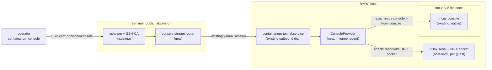

# Design: Console access to BYOC VM hosts (no external dependency)

**Date:** 2026-09-07
**Status:** proposed
**Stack:** Go (daemon/tunnel-agent side, no new languages); protobuf/gRPC contract for the control path; hypervisor-native console primitives for the data path (`incus console`, VirtualBox serial-to-socket)
**Origin:** operational gap found live-debugging `containarium-byoc-2` — the box was stuck at BIOS POST and nothing at the network layer could reach it, so it stayed undiagnosed.

## Problem

Containarium already has a way to reach a BYOC host or its workloads that
depends on nothing external: the host's `containarium-tunnel.service`
dials **outbound** to the sentinel (`internal/cmd/tunnel.go`,
`internal/sentinel/tunnel_registry.go`), and the sentinel's `sshpiper` +
SSH-CA setup (`docs/SENTINEL-DESIGN.md`) rides that tunnel to give an
operator an interactive shell. No VPN mesh, no third-party relay.

That path has one hard requirement: **the target has to have booted far
enough to bring up its own network stack and an SSH daemon.** For an LXC
container that's almost always true. For a VM — either a BYOC host that
is itself a VM (a VirtualBox guest simulating bare metal, a cloud VM
instance), or an Incus-managed VM instance running as a workload on a
host (e.g. the k3s worker VMs in
[`managed-k8s-clusters.md`](managed-k8s-clusters.md)) — it is not: a
BIOS/firmware hang, a GRUB misconfiguration, a kernel panic before
`network.target`, or a broken `containarium-tunnel.service` inside the
guest all leave the operator with *no* path in. SSH and the tunnel are
both downstream of the exact boot stages that need debugging.

This is the same problem Kubernetes solves for pods with `kubectl
exec`/`attach` — the API server talks to the kubelet, not the pod's own
network — and that KubeVirt solves one layer lower for VMs: `virtctl
console`/`virtctl vnc` proxies to the serial/VNC device the hypervisor
exposes on the **host**, independent of whether the guest OS or its
network ever comes up. Containarium has no equivalent today (confirmed:
no console/serial/VNC access mechanism exists anywhere in `internal/cmd`,
`internal/sentinel`, or `docs/architecture`).

## Goals

- An operator can attach to a VM's boot-time console (BIOS/UEFI POST,
  bootloader, kernel log, a getty if the guest gets that far) with **no
  dependency on the guest's own network stack, sshd, or tunnel agent
  being up**.
- No new external dependency — the console stream rides the same
  outbound-dialed tunnel + sentinel infrastructure already used for SSH.
  No VPN mesh (Tailscale or otherwise), no inbound listener opened on the
  BYOC host.
- One CLI verb works the same way regardless of hypervisor: `containarium
  console <target>` — whether `<target>` is a whole BYOC host that
  happens to run as a VM, or an individual Incus-managed VM instance on a
  host.
- Access is auth-gated the same way interactive SSH already is (short-lived
  SSH-CA certs from the sentinel), not a separate credential system.

## Non-goals

- Full graphical console / remote desktop (VNC framebuffer streaming).
  Text/serial console is the target; a VNC transport can reuse the same
  tunnel plumbing later if a real need shows up, but it is not this doc's
  scope.
- Changing how LXC *containers* are reached — they boot fast enough and
  `containarium exec` / SSH already cover them. This is strictly for
  VM-backed targets.
- Replacing sentinel/sshpiper's role for anything that already has a
  working guest network. Console is a fallback path for when that layer
  isn't up yet, not a general-purpose replacement for SSH.

## Design

### Two VM boundaries in scope

1. **A BYOC host that is itself a VM** — a VirtualBox guest standing in
   for bare metal (`containarium-byoc-1`/`-2` today), or a cloud VM
   instance. The hypervisor here is *outside* Containarium's control
   (VirtualBox on someone's workstation, or the cloud provider's own
   hypervisor) — access has to come from whatever manages that guest.
2. **An Incus-managed VM instance running as a workload on a host** — the
   k3s worker/control-plane VMs from the managed-k8s design. Here Incus
   already owns the hypervisor (`qemu`) and already exposes `incus
   console <instance>` natively; there is nothing to build at the
   hypervisor layer, only plumbing to get that stream off the host and
   through the tunnel to the operator.

The design has to cover both without operators needing to know which one
they're talking to.

### Topology



The only new wire-level thing is a second stream type multiplexed over
the tunnel's existing `yamux` session (`internal/sentinel/tunnel_registry.go`
already assigns each backend a session; console is a new logical channel
on it, not a new dial, new port, or new credential store). Everything
else — the outbound dial, the SSH-CA cert issuance, the sentinel's role
as the only public-facing surface — is unchanged.

### `ConsoleProvider` (host-side)

A small interface in the tunnel-agent, one implementation per hypervisor:

```go
type ConsoleProvider interface {
    // OpenConsole returns a raw byte stream to the target's console.
    // No PTY negotiation, no shell — this is a dumb pipe, matching what
    // a serial console actually is.
    OpenConsole(ctx context.Context, targetID string) (io.ReadWriteCloser, error)
}
```

- **Incus VM instances**: shells out to `incus console --type=console
  <instance>` and wires its stdio to the returned stream. Incus already
  does the hard part; this is a thin adapter.
- **VirtualBox-hosted hosts**: requires the guest's serial port to be
  redirected to a UNIX domain socket
  (`VBoxManage modifyvm <vm> --uart1 0x3F8 4 --uartmode1 server /path/to.sock`),
  configured once at VM creation (or backfilled — `pool join` could set
  this up as part of enrollment, see below). `OpenConsole` just connects
  to that socket.
- Adding a third hypervisor later (KVM/libvirt, a cloud provider's serial
  console API) means adding one adapter, not touching the tunnel or
  sentinel.

### Auth

Reuses the sentinel's existing SSH-CA (`internal/sentinel/keysync.go`,
`trusted_user_ca_keys`) rather than inventing a parallel credential
system. A cert's principal determines whether it's routed to a normal
shell or to the console router — same trust root, narrower scope.
Console-only certs should be issuable independent of full shell access,
since "let someone watch a boot log" and "let someone run arbitrary
commands" are different privilege levels.

### CLI

`containarium console <target>` — one new cobra subcommand
(`internal/cmd/console.go`), CLI-first per this repo's convention: it
calls a shared client function, and any future MCP tool wraps that same
function rather than talking to a bespoke endpoint.

### Enrollment

`containarium pool join` (`internal/cmd/pool_join.go`) is the existing
one-command enrollment path for a new BYOC host. For VM-backed hosts,
join should also provision whatever the local `ConsoleProvider` needs
(e.g. the VirtualBox serial-socket flag) so console access isn't a
separate manual setup step from joining the pool at all.

## Open questions

- **Where does the yamux console channel get registered** — a new stream
  type negotiated at tunnel-dial time, or a side-channel the tunnel-agent
  opens on demand when a console request arrives? The latter avoids
  holding an idle stream per host but adds a round trip on first attach.
- **Reconnect semantics**: a console stream should survive the operator's
  client disconnecting (so a boot log isn't lost between attach attempts)
  but should the host buffer scrollback, and how much?
- **Should `incus console`'s existing local auth model (root on the
  host) be trusted as-is, or does the `ConsoleProvider` need its own
  check before shelling out**, given it's now reachable from a remote
  operator instead of only someone with host shell access?
- Does this want a dedicated proto RPC for the *control* plane (open/list
  active console sessions, audit trail) even though the *data* plane is a
  raw stream over the tunnel? Given `CLAUDE.md`'s protobuf-first
  convention, probably yes for session bookkeeping — that part should
  route through `.proto` like everything else that mutates state; only
  the byte-stream itself is out of band.

## Why this, not Tailscale-as-a-fix

The tempting shortcut is "put these lab/BYOC boxes on the same VPN mesh
as our operator laptops." That solves *our* immediate access problem but
adds a real external dependency to a design that currently has none, and
doesn't generalize to a customer's own BYOC VM host (we can't put a
customer's infrastructure on our mesh). Extending the tunnel Containarium
already ships — the same one a real customer's BYOC host uses — keeps the
architecture dependency-free and fixes the problem for every VM-backed
host, not just the ones we personally operate.
