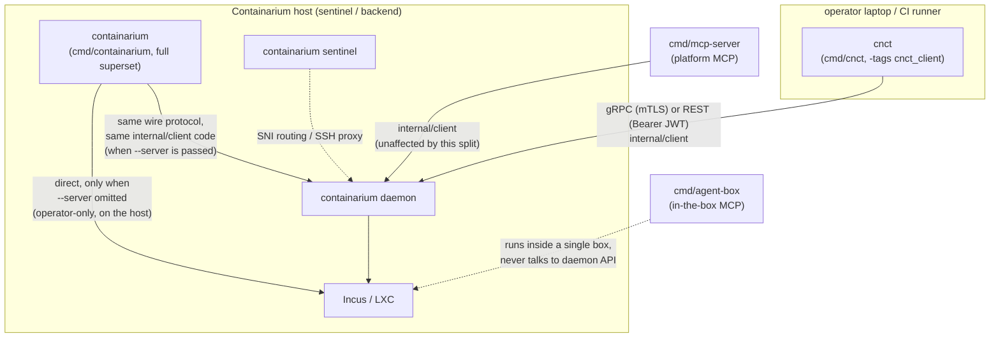

# Design: CLI client/server split — a `cnct` client binary

**Date:** 2026-09-07
**Status:** proposed
**Stack:** Go (cobra), existing protobuf/gRPC + grpc-gateway contract (no proto changes), existing Makefile/release pipeline

## Problem

`cmd/containarium` is one binary built from the flat `internal/cmd` package
(148 command files + 46 test files). It mixes three unrelated concerns
with no structural line between them:

1. **Pure client commands** — only ever talk over gRPC/REST
   (`internal/client`) to a remote daemon: `debug`, `console`, `app`,
   `backup`, `agent`, `ttl`, `scale-down`, `runner`, …
2. **Server/operator processes** — run *on* the box itself and mutate it
   directly: `daemon`, `sentinel`, `hypervisor-agent`, `node`, `pool
   join/leave`, `doctor`, `recover`, `sync-accounts`, `image-bake`, …
3. **Hybrid commands** — twelve of them (`create`, `delete`, `get`,
   `list`, `info`, `label list/set/remove`, `install-stack`, `resize`,
   `ssh-config sync`, `prune`) branch on `serverAddr == ""` to
   *silently* fall back from "call the remote daemon" to "mutate Incus
   on whatever host this binary happens to be running on."

That third bucket is the concrete footgun. `--server` defaults to the
`CONTAINARIUM_SERVER` env var, and `resolveAuthToken` (root.go)
auto-fills the auth **token** from `~/.containarium/credentials.json`'s
`default_server` when `--server` is omitted — but nothing fills in
`serverAddr` itself from that same file. So a user who has already run
`containarium login` against a remote daemon, then runs `containarium
list` without `--server` or the env var set, doesn't get an auth error —
they get local mode:
a live query (or, for `create`/`delete`, a live mutation) against Incus on
whatever machine the binary is running on. Nothing in the output
distinguishes "you're talking to your remote fleet" from "you just
touched this laptop/host's own Incus." This is exactly the class of bug
behind #1487 (a `debug` command that couldn't tell a missing host-side
Linux account from a missing in-container one) — the CLI's responsibility
boundary is blurred at the command level, not just inside one handler.

Notably, three commands already do the right thing: `ttl`, `scale-down`
and `runner` refuse outright with `--server is required` when no server
is set (they import `pkg/core/incus` only for the `ContainerInfo` type,
never for a local fallback). That is the precedent this design
generalizes — the twelve hybrids are the stragglers, not the norm.

**Goal:** a client-only binary that structurally *cannot* fall into local
mode — no flag to forget, no silent branch — while leaving the existing
`containarium` binary's behavior unchanged for anyone/anything already
depending on it (docs, CI, demo recordings, `release.yml`'s download URL).

## Design

### The real fix isn't file-moving, it's registration

Every command file self-registers via `func init() { rootCmd.AddCommand(x)
}` onto one package-level `var rootCmd`. Because `init()` runs on package
import, a second `main.go` that simply imports package `cmd` gets **every
command** regardless of which files "belong" to it. Splitting the
binary is therefore not a matter of moving files into two directories —
it's a matter of making command registration *conditional per build*,
without touching the 100+ files that are unambiguously client-only.

**Mechanism: Go build tags, not a package split.**

- Files that must never compile into the client binary — every
  server/operator command, and the `*Local` half of every hybrid command
  — get `//go:build !cnct_client` added to their existing build
  constraints (most have none today; `daemon.go` already has one for
  `!windows` and simply gains a second).
- `cmd/cnct/main.go` imports `internal/cmd`, is itself constrained with
  `//go:build cnct_client`, and is built with `-tags cnct_client`. The
  Go toolchain excludes every `!cnct_client` file from that build — they
  never compile, so their `init()`s never run, so `rootCmd` under that
  build genuinely only contains the client surface. The constraint on
  `main.go` is what makes a bare `go build ./cmd/cnct` (no tag) fail
  with "build constraints exclude all Go files" instead of silently
  producing a full-surface binary named `cnct`.
- `cmd/containarium/main.go` keeps building exactly as today (no tag) —
  full superset, byte-for-byte the same behavior. This is what makes the
  migration section below trivial: nothing existing has to change.
- For each of the twelve hybrid commands, the file keeps its cobra
  `Use`/`RunE` and its `*Remote`/`*RemoteHTTP` implementation
  (client-shaped, no tag needed). Everything local-mode-only moves into a
  sibling file tagged `!cnct_client`: `create_local.go`,
  `delete_local.go`, `get_local.go`, `list_local.go`, `info_local.go`,
  `label_local.go` (all three label verbs), `install_stack_local.go`,
  `resize_local.go`. `ssh-config sync` and `prune` only call
  `listLocal()`/`deleteLocal()` so they need no file of their own.
  "Everything" includes the host-account steps that today sit *outside*
  the `*Local` functions behind their own `serverAddr == ""` checks —
  `container.CreateJumpServerAccount` after `createLocal`,
  `container.DeleteJumpServerAccount` after `deleteLocal` — which fold
  into the local functions so `create.go`/`delete.go` stop importing
  `pkg/core/container` altogether.
- **One stub file is required**, `local_stubs_cnct.go` tagged
  `cnct_client`: the dispatch code still references `createLocal`,
  `deleteLocal`, `getLocal`, `listLocal`, `getLabelsLocal`,
  `setLabelsLocal`, `removeLabelsLocal`, `installStackLocal`,
  `runResizeLocal` and the two `info` helpers by name, so the client
  build must define them or fail to compile. Each stub is one line
  returning a shared `errNoLocalMode` ("cnct has no local mode — pass
  --server or run `cnct login`"). The stubs are defence in depth: with
  the server resolution below, a remote call with no server already
  fails at the client constructor before dispatch reaches a stub — but
  the stub is what turns a future forgotten check into a *clear error*
  rather than a build break or a silent Incus call.

This keeps the package layout as one `internal/cmd` (no `internal/cmdops`
/ `internal/cmdclient` split, no duplicated logic, no import-graph
surgery) and makes "which binary is this command in" a property checkable
at the file level: `grep -l '^//go:build.*!cnct_client' *.go` lists the
server-only files; everything else builds into both binaries. (There
is no `cnct_client`-positive tag on client files — the client surface
is the *untagged* set — so audit the untagged files, not a tag.)

**What "structurally cannot" does and doesn't mean.** Under
`cnct_client` there is no call path to `container.New()`,
`incus.New()`, `pgxpool.New()`, systemd or iptables — those live only in
excluded files, and the CI dependency check below proves
`pkg/core/container`, `internal/server`, `internal/sentinel`,
`internal/hosting` and `pgx` are absent from the link. But
`pkg/core/incus` itself **stays linked**, because `incus.ContainerInfo`
/ `incus.ServerInfo` are the return types of every `internal/client`
call, and that package imports `github.com/lxc/incus/v6/client`. The
guarantee is "no code path", not "no bytes". Making it "no bytes" means
moving those two structs into a types-only package (e.g.
`pkg/core/incus/types`) — a mechanical follow-up, listed under Open
decisions, not a prerequisite.

### `cnct`'s hybrid-command behavior: use `default_server`, never local

`ssh.go` and `login.go` already resolve a server from
`credentials.json`'s `default_server` when `--server` is blank (used by
`ssh setup/list/remove`, `logout`, `whoami`). `cnct` adopts that
resolution for `serverAddr` too, so the chain is:

1. `--server` flag
2. `CONTAINARIUM_SERVER` env (already the flag's default today)
3. `credentials.json` `default_server` — **`cnct` only**
4. if a command then tries to *dial* with an empty address: "no server
   configured — run `cnct login` or pass `--server`"

Two design constraints shape where these live:

- **Step 3 must not change `containarium`.** `rootCmd` and its
  `PersistentPreRunE` are shared by both binaries, so a global fallback
  would silently repoint `containarium list` on an operator's host from
  local Incus to whatever `default_server` a stale credentials file
  names — exactly the surprise this design is meant to remove, in the
  other direction. So the fallback is a tag-split helper:
  `server_resolve_cnct.go` (`cnct_client`) implements
  `resolveServerAddr(flagOrEnv string) string` with the credentials-file
  lookup; `server_resolve_default.go` (`!cnct_client`) implements it as
  the identity function. `PersistentPreRunE` calls it unconditionally;
  under `containarium` it is a no-op.
- **Step 4 must not apply to offline commands.** `cert generate`,
  `pki`, `token generate`/`inspect`, `version`, and every group parent
  legitimately run with no server at all, so "fail in pre-run if no
  server" would break them — and an exemption list would have to be
  maintained by hand. Instead the error lives at the one seam every
  remote command already passes through: `client.NewGRPCClient` and
  `client.NewHTTPClient` return the "no server configured" error when
  handed an empty address. Offline commands never construct a client,
  so they are exempt by construction. Under `containarium` this only
  changes the message for a pure-client command invoked with no server
  (today: an opaque gRPC dial failure at the first RPC); hybrids branch
  to local before constructing a client and are untouched.

The token-resolution exemption list in `PersistentPreRunE`
(`login`/`logout`/`whoami`/`config get-token`) is unchanged and applies
to step 3 as well.

### Component diagram

`internal/mcp` does not import `internal/cmd` at all — it defines its own
`API` interface (`internal/mcp/server.go`) backed by `internal/client` (or
a cloud backend, via `newBackend`). **This split requires zero changes to
either MCP server.** They were already correctly decoupled from the CLI's
cobra layer; the split just makes the CLI layer match that same
discipline.

## Language choices

| Component | Language | Why this one | Type gate in CI |
|-----------|----------|---------------|------------------|
| `cnct` | Go | Matches `containarium`, `internal/client`, `internal/cmd` — a second language for a thin cobra wrapper over existing typed Go client code would be pure overhead | `go vet` + `go build` (both binaries), existing `golangci-lint` |

No new language, no new contract format — this is a build-graph and
packaging change over existing Go code and the existing proto-generated
`internal/client`.

## Contracts

Unchanged. `cnct` and `containarium` (in remote mode) both go through the
same `internal/client.NewGRPCClient` / `NewHTTPClient`, generated from
`proto/containarium/v1/*.proto` exactly as before. No new RPCs, no new
REST routes, no swagger regen. The split is entirely below the API
boundary — it changes what a *binary* contains, not what the *daemon*
exposes.

## Per-hybrid-command disposition

The twelve commands that actually fall back to local Incus when
`serverAddr == ""`. Verified by reading each dispatch, not by grepping
for the string: `ttl`, `scale-down` and `runner` also contain that
check but use it to *refuse*; `route_client.go` dials the gRPC client
unconditionally with no local branch; `quickstart` has the check only
to print a hint and otherwise composes `create`/`expose-port`, so it
inherits their behavior.

| Command | `cnct` (client build) | `containarium` (unchanged) |
|---|---|---|
| `create` | remote only; empty server fails at the client constructor, `createLocal` stub is the backstop | remote + `createLocal` + `CreateJumpServerAccount` (direct Incus + host `useradd`), as today |
| `delete` | remote only | remote + `deleteLocal` + `DeleteJumpServerAccount`, as today. `deleteLocal` is also the rollback path in `create.go` and `prune.go`'s delete — both hit the stub under `cnct`. |
| `get` | remote only | remote + `getLocal`, as today |
| `list` | remote only | remote + `listLocal`, as today |
| `info` | remote only | remote + two `container.New()` branches (server info, container info), as today |
| `label list` / `label set` / `label remove` | remote only | remote + `getLabelsLocal`/`setLabelsLocal`/`removeLabelsLocal`, as today |
| `install-stack` | remote only | remote + `installStackLocal`, as today |
| `resize` | remote only | remote + `runResizeLocal`, as today |
| `ssh-config sync` | remote only (`loadContainersForSSHConfig`'s `listLocal()` fallback hits the stub) | unchanged |
| `prune` | remote only (`pruneList`'s `listLocal()` and its `deleteLocal()` hit the stub) | unchanged |

### Local-only commands that were sitting with the client set

These have **no remote path at all** — they call `container.New()`,
`iptables`, or Postgres directly, unconditionally — and are operator
commands that were only ever "CLI-general" by virtue of the flat
package. They move to `containarium`-only (`!cnct_client`) outright, no
dispatch change:

| Group / files | Why local-only |
|---|---|
| `sidecar.go` | `incus.New()` unconditionally |
| `portforward` — `portforward.go` + `setup`/`remove`/`show` (4 files) | iptables NAT rules for Caddy on this host |
| `passthrough` — `passthrough.go` + `add`/`list`/`remove` (4 files) | `network.CheckIPTablesAvailable()` + `NewPassthroughManager` — host iptables. (`passthrough route *` is a *separate* group with its own parent in `passthrough_route.go`; it goes through the daemon and stays client.) |
| `collaborator` — `collaborator.go` + `add`/`remove`/`list` (4 files) | `container.New()` + `NewCollaboratorManager`, no `--server` branch. The proto already has collaborator RPCs; the CLI handlers simply never grew a remote path. Adding one is Open decision 6 — until then `cnct` has no `collaborator` verb. |
| `export.go` | Refuses with `--server` set: "only available in local mode" |
| `audit.go` (`query`/`verify`/`verify-anchor`) | Opens Postgres directly via `getPostgresConnString()` |
| `cloud.go` (`cloud login`/`enroll`) | "Enroll **this host** with a cloud control plane" — writes host-side `cloud.yaml`. `cloud_target.go` (`isCloudTarget`, used by `debug`/`console`/`info`) is a pure helper and stays in both builds. |

### Classification method

The disposition above was regenerated with a rule an implementer can
re-run, because the first pass (keyed on the `pkg/core/incus` import)
missed six of the twelve hybrids and all of `collaborator`,
`passthrough`, `audit`, `export` and `cloud`:

> A file is **host-touching** if it calls a host primitive:
> `container.New(`, `incus.New(`, `network.New*`/`network.Check*`,
> `exec.Command("incus"|"iptables"|"systemctl"|"zfs"|"useradd"…)`,
> `os.Geteuid`, `pgxpool.New`, or imports `internal/server`,
> `internal/sentinel`, `internal/hosting`, `internal/hypervisor`.
> A file is **remote** if it constructs `client.NewGRPCClient`/
> `NewHTTPClient` or an HTTP client to a `--server`/`default_server`.
> Host-touching **and** remote → hybrid (split into `*_local.go` +
> stub). Host-touching only → `!cnct_client`. Remote only, or neither
> (offline tools, group parents, helpers) → both binaries.

Three false positives from the grep, resolved by reading: `daemon.go`
and `hosting_status.go` match "remote" only because they open an HTTP
client to `localhost` (server-only); `sentinel_register_token.go` and
`sentinel_fetch_release.go`/`sentinel_pprof.go` are remote-shaped but
register on `sentinelCmd`, which lives in the excluded `sentinel.go`,
so the whole `sentinel` group is tagged together.

**Group-parent rule:** a tagged-out file must not define a symbol an
untagged file references, or the client build fails to compile. Every
group parent whose children split across binaries — `pool`, `secrets`,
`token`, `runner`, `label` — stays untagged; every group tagged out as a
whole (`sentinel`, `hosting`, `portforward`, `passthrough`,
`collaborator`, `audit`) takes its parent with it. The compiler enforces
this for free; it is stated here so the split is done group-by-group
rather than file-by-file.

## Full binary layout

Of the 148 command files, **~45 become `containarium`-only** and the
remaining **~103 build into both binaries** unchanged. The split adds 8
`*_local.go` files (server side) and 1 `local_stubs_cnct.go` (client
side).

**Both binaries (~103 files, unchanged logic):** every command that is
remote-only, offline, a group parent, or a helper — `agent*`, `app*`,
`backends*`, `backup*`, `capacity`, `cert` (offline CA/server/client
cert generation via `internal/mtls` — writes only to `--output`,
touches no host state; it is what `internal/client`'s own "certificates
not found" error points users at), `cloud_target.go`, `cluster`,
`code*`, `compose`, `console*`, `connect`, `crew*`, `debug`,
`egress-via-client`, `expose-port`, `kms` (status/coverage/migrate —
over the wire, unlike `secrets migrate-to-envelope`), `label.go`
(parent), `login`/`logout`/`whoami`/`config get-token`, `monitoring*`,
`move`, `network-policy`, `passthrough route *` (own parent), `pki`,
`pool` + `pool list` (reads `/v1/backends` over HTTP — the *only*
client verb in the `pool` group), `protect`, `push`/`sync` (SSH via the
sentinel), `quickstart`, `recipe*`, `route*`, `runner` + `runner
reconcile`, `sandbox`, `scale-down`, `secrets`, `security*`,
`snapshot*`, `ssh*`, `token*` + `token inspect`, `traffic`, `ttl`,
`volume`, plus the remote half of the twelve hybrids.

**`containarium`-only (`!cnct_client`, ~45 files):** `daemon`,
`sentinel*` (7 files), `hypervisor-agent`, `egress-relay`, `node`,
`pool join`/`pool leave`/`pool regions` + `pool_sentinel.go`/
`pool_join_handshake.go` (5 files — run on the host being joined),
`postgres`, `upgrade-watchdog`, `sync-accounts`, `image-bake`, `recover`,
`storage-probe`, `doctor`, `hosting*` (5 files incl. the group parent),
`sidecar`, `portforward*` (4), `passthrough` + `add`/`list`/`remove`
(4), `collaborator*` (4), `export`, `audit`, `cloud.go`,
`secrets_migrate.go`, `service.go`, `tunnel.go`, plus the 8 new
`*_local.go` files.

Cobra handles a group with fewer children (`pool`, `secrets`, `token`,
`runner`, `label` under `cnct`) without any change.

## Test strategy

- **Dependency-graph gate (new; the test that pins the property this
  design exists for):** a CI step running
  `go list -deps -tags cnct_client ./cmd/cnct` and failing if the output
  contains any of `pkg/core/container`, `internal/server`,
  `internal/sentinel`, `internal/hosting`, `internal/hypervisor`,
  `github.com/jackc/pgx`. This is stronger than inspecting `--help`: it
  proves the *code* is out of the link, not just the cobra registration.
  A forgotten `!cnct_client` tag on a new server command that imports
  any of those fails here, not in review. (`pkg/core/incus` is
  deliberately *not* on this list until the types follow-up lands.)
- **Command-tree gate (new, in-package, allow-list):** a Go test in
  `internal/cmd` tagged `cnct_client` walks `rootCmd.Commands()`
  recursively, renders every registered path (`pool list`, `label set`,
  …), and compares the full set against a checked-in golden list of
  approved client paths — failing on *any* path not in the list, and on
  any approved path that went missing. A deny-list of known server
  names would miss a new server command that uses only the standard
  library (a `systemctl` shell-out registers fine and imports nothing
  gated); an allow-list catches it because a new command of either
  kind has to be added deliberately. The dependency-graph gate above
  stays as the supplementary check that the *code*, not just the
  registration, is out of the link.
- **Hybrid-command dispatch (table-driven, per command):** for each of
  the twelve hybrids, a test under `cnct_client` asserting that with no
  `--server`, no `CONTAINARIUM_SERVER`, and an empty credentials file,
  the command returns the "no server configured" error from the client
  constructor without reaching a `*Local` call; and one test that
  calling each stub directly returns `errNoLocalMode`. Under the
  default build, the existing pure-function tests in those files
  (`TestListJSONShape`, `TestFilterForPrune`, `TestParseLabelFilter`, …)
  run unchanged — note none of them exercise local mode today;
  local-mode coverage remains the integration suite's job, as now.
- **Offline commands stay offline (new):** under `cnct_client`, with no
  server configured anywhere, `cert generate --output <tmp>`, `token
  inspect <jwt>`, `token generate --secret x`, and `version` succeed.
  This is the test that pins "the server requirement lives at the dial
  seam, not in pre-run".
- **`resolveServerAddr` (new, tag-split helper):** under `cnct_client`,
  flag wins over env, env wins over `default_server`, empty flag +
  populated file resolves, all three empty yields empty (and the
  constructor errors). Under the default build the same inputs return
  the flag/env value unchanged — the test that pins "`containarium`
  behavior is untouched".
- **`client.NewGRPCClient("")` / `NewHTTPClient("")`** return the
  "no server configured" error (both builds).
- **Existing test files that reference server-only symbols must gain
  the same `!cnct_client` tag** or `go test -tags cnct_client
  ./internal/cmd` fails to compile — at minimum `audit_test.go`,
  `cloud_test.go`, `doctor_test.go`, `daemon_base_domains_test.go`,
  `debug_actions_parse_test.go` (imports `internal/server`),
  `pool_join_test.go`, `sentinel_pprof_test.go`, `service_test.go`,
  `service_backoff_test.go`, `tunnel_forward_test.go`; the compiler
  names any others. CI runs `go test` for `internal/cmd` under both tag
  sets.
- **Regression guard on MCP:** `go build ./cmd/mcp-server ./cmd/agent-box`
  in CI already exists; no test changes needed there, but the CI job list
  gets an explicit comment noting *why* it's unaffected (so the next
  person doesn't assume it needs updating when they see a new `cmd/cnct`
  appear next to it).

## Build & release changes

- **Makefile:** new `CNCT_BINARY_NAME=cnct` plus `build-cnct` /
  `build-cnct-linux` / `build-cnct-all` targets mirroring the existing
  `build` / `build-linux` / `build-all` targets, using a fixed
  `-tags cnct_client` and **not** `$(GO_TAGS)`. Two reasons: `go build`
  does not merge repeated `-tags` flags (the last one wins, so
  `$(GO_TAGS) -tags cnct_client` would silently drop `embed_bpf` or
  `cnct_client` depending on order — tags must be comma-joined in a
  single flag), and `cnct` has no business embedding the eBPF object
  anyway — `internal/netbpf` is daemon-side. Like `build-mcp`, use
  `CGO_ENABLED=0` so the linux artifact is static. `build-release`
  gains `build-cnct-all` so `cnct` ships as a first-class release
  artifact alongside the existing 10.
- **`.github/workflows/release.yml`:** add `bin/cnct-linux-amd64`,
  `bin/cnct-darwin-amd64`, `bin/cnct-darwin-arm64` to the release asset
  list, same pattern as the existing `containarium-*` entries. A
  windows build is possible but inherits the same gap `containarium`'s
  windows build has: three *client* files carry `//go:build !windows`
  (`audit.go`, `collaborator_*.go` with no OS-specific code in them —
  cargo-cult; `egress_via_client.go` for `syscall.SIGTERM`). Dropping
  those tags is a separate cleanup; until then windows `cnct` lacks
  `audit` and `collaborator`.
- **No changes** to `containarium-daemon.yml`, `build-mcp*`,
  `build-agent-box*`, or the swagger/proto generation steps — none of
  them touch `cmd/containarium` or `internal/cmd`.
- **Docs/scripts that invoke `containarium <client-verb>` directly**
  (`.github/workflows/fence-probe-e2e.yml`, `release.yml`'s own
  self-download-and-smoke-test step, ~20 files under `docs/`): **no
  changes required.** `containarium` remains the exact superset binary it
  is today; every one of those call sites keeps working unmodified. This
  is the deliberate payoff of the build-tag approach over a package
  split — the migration cost is close to zero because nothing existing
  moved.

## Deviations from the default stack

None. Same language, same proto contract, same client library, same
release pipeline shape — this is a build-graph change, not a new
service.

## Open decisions

1. **Binary name.** `cnct` (matches the user's suggested abbreviation,
   no collision found anywhere in the repo) vs. `ctnr` (closer to the
   `ctnr_…` cloud API token prefix already used in `internal/mcp`) vs.
   spelling it `containarium-client`. Recommendation: `cnct` — short
   enough to type constantly (the whole point, kubectl-style), and
   `ctnr_` is already a *token* prefix elsewhere so reusing it as a
   binary name risks visual confusion in docs that show both side by
   side.
2. **Deprecation-shim alias.** Should `containarium` print a one-line
   nudge ("consider `cnct <verb>` for remote-only use — see docs/…") when
   invoked with a client verb and no `--server`, before falling into
   local mode? This directly targets the footgun in the Problem section
   without breaking anything. Recommendation: yes, but as a `stderr` hint
   only, gated to the twelve hybrid commands, never a hard behavior change
   — needs a decision on wording/opt-out (`CONTAINARIUM_NO_HINT=1`?).
3. **Does `cnct` ship a `default_server` **write** path (`cnct login`,
   `cnct config set-server`), or does it require the file to already
   exist (written by `containarium login` once, historically)?**
   `login.go`'s login/logout/whoami/get-token subcommands are already
   client-only per the disposition table above, so the natural answer is
   `cnct` gets full read/write of `credentials.json` — flagging only
   because "does the client binary own the credentials file, or does the
   operator binary" is a naming/ownership question worth a sentence in
   the follow-up issue.
4. **Types follow-up: move `incus.ContainerInfo` / `incus.ServerInfo`
   out of `pkg/core/incus`.** Until then `github.com/lxc/incus/v6/client`
   is linked into `cnct` for a struct definition. Mechanical (the structs
   have no methods that need the incus client) but it touches every
   `internal/client` signature and the MCP `API` interface, so it is its
   own PR, after the split lands, and is what lets `pkg/core/incus` join
   the dependency-gate list.
5. **Drop the cargo-cult `!windows` tag** on `egress_via_client.go`'s
   siblings if any remain client-side (see Build & release). `audit.go`
   and `collaborator_*.go` turned out to be server-only, so their
   `!windows` tags are moot for `cnct`. Independent of this design.
6. **Give `collaborator add/remove/list` a remote path.** The proto
   already carries collaborator RPCs (the cloud shim uses them), but the
   OSS CLI handlers only ever call `container.New()` directly, so
   `cnct` ships with no `collaborator` verb at all. Adding the
   `--server` branch (same shape as `label`) turns it into the thirteenth
   hybrid and puts it back in the client. Per CLAUDE.md's CLI-first
   rule this is a gap worth closing regardless of the split; it's
   listed here so `cnct`'s first release doesn't silently drop a verb.

## Rejected alternatives

- **Full package split (`internal/cmd` → `internal/cmd` +
  `internal/cmdclient`, physically moving ~103 files).** Same end state,
  much higher diff/review cost and merge-conflict surface for zero
  behavioral difference from the build-tag approach — every file's
  package clause, relative imports of shared package-level vars
  (`serverAddr`, `certsDir`, `httpMode`, `authToken`, all declared once
  in `root.go`) would need re-threading across a package boundary.
  Rejected: the build-tag approach gets the identical guarantee (files
  literally absent from the client binary) without the churn.
- **Single binary, runtime flag (`containarium --client-only`) instead of
  a second binary.** Rejected because it doesn't solve the actual
  problem: the local-mode code is still *in* the binary, so "forgot the
  flag" is still a way to hit it — this is exactly the bug class in the
  Problem section, just moved one flag over. A second binary makes the
  guarantee structural (the code isn't there to fall into) rather than a
  runtime toggle someone can still forget.
