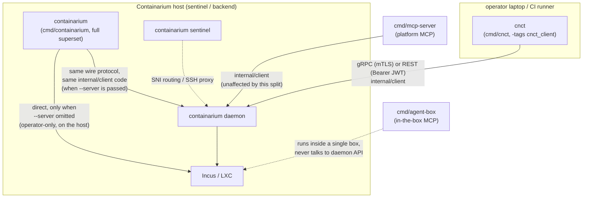

# Design: CLI client/server split — a `cnct` client binary

**Date:** 2026-09-07
**Status:** proposed
**Stack:** Go (cobra), existing protobuf/gRPC + grpc-gateway contract (no proto changes), existing Makefile/release pipeline

## Problem

`cmd/containarium` is one binary built from the flat `internal/cmd` package
(148 command files + 46 test files). It mixes three unrelated concerns
with no structural line between them:

1. **Pure client commands** — only ever talk over gRPC/REST
   (`internal/client`) to a remote daemon: `debug`, `console`, `app`,
   `backup`, `agent`, `ttl`, `scale-down`, `runner`, …
2. **Server/operator processes** — run *on* the box itself and mutate it
   directly: `daemon`, `sentinel`, `hypervisor-agent`, `node`, `pool
   join/leave`, `doctor`, `recover`, `sync-accounts`, `image-bake`, …
3. **Hybrid commands** — `create`, `get`, `list`, `info`, `ssh-config
   sync`, `prune` branch on `serverAddr == ""` to *silently* fall back
   from "call the remote daemon" to "mutate Incus on whatever host this
   binary happens to be running on."

That third bucket is the concrete footgun. `--server` defaults to the
`CONTAINARIUM_SERVER` env var, and `resolveAuthToken` (root.go)
auto-fills the auth **token** from `~/.containarium/credentials.json`'s
`default_server` when `--server` is omitted — but nothing fills in
`serverAddr` itself from that same file. So a user who has already run
`containarium login` against a remote daemon, then runs `containarium
list` without `--server` or the env var set, doesn't get an auth error —
they get local mode:
a live query (or, for `create`/`delete`, a live mutation) against Incus on
whatever machine the binary is running on. Nothing in the output
distinguishes "you're talking to your remote fleet" from "you just
touched this laptop/host's own Incus." This is exactly the class of bug
behind #1487 (a `debug` command that couldn't tell a missing host-side
Linux account from a missing in-container one) — the CLI's responsibility
boundary is blurred at the command level, not just inside one handler.

Notably, three commands already do the right thing: `ttl`, `scale-down`
and `runner` refuse outright with `--server is required` when no server
is set (they import `pkg/core/incus` only for the `ContainerInfo` type,
never for a local fallback). That is the precedent this design
generalizes — the six hybrids are the stragglers, not the norm.

**Goal:** a client-only binary that structurally *cannot* fall into local
mode — no flag to forget, no silent branch — while leaving the existing
`containarium` binary's behavior unchanged for anyone/anything already
depending on it (docs, CI, demo recordings, `release.yml`'s download URL).

## Design

### The real fix isn't file-moving, it's registration

Every command file self-registers via `func init() { rootCmd.AddCommand(x)
}` onto one package-level `var rootCmd`. Because `init()` runs on package
import, a second `main.go` that simply imports package `cmd` gets **every
command** regardless of which files "belong" to it. Splitting the
binary is therefore not a matter of moving files into two directories —
it's a matter of making command registration *conditional per build*,
without touching the 100+ files that are unambiguously client-only.

**Mechanism: Go build tags, not a package split.**

- Files that must never compile into the client binary — every
  server/operator command, and the `*Local` half of every hybrid command
  — get `//go:build !cnct_client` added to their existing build
  constraints (most have none today; `daemon.go` already has one for
  `!windows` and simply gains a second).
- `cmd/cnct/main.go` imports `internal/cmd` and is built with
  `-tags cnct_client`. The Go toolchain excludes every `!cnct_client`
  file from that build — they never compile, so their `init()`s never
  run, so `rootCmd` under that build genuinely only contains the client
  surface. There is no local-Incus code *in the binary* to fall back to,
  not just a flag that happens not to be set.
- `cmd/containarium/main.go` keeps building exactly as today (no tag) —
  full superset, byte-for-byte the same behavior. This is what makes the
  migration section below trivial: nothing existing has to change.
- For each of the six hybrid commands, the file keeps its cobra
  `Use`/`RunE` and its `*Remote`/`*RemoteHTTP` implementation
  (client-shaped, no tag needed). Everything local-mode-only moves into a
  sibling file tagged `!cnct_client` (`create_local.go`, `get_local.go`,
  `list_local.go`, `info_local.go`; `ssh-config` and `prune` only call
  `listLocal()` so they need no file of their own). "Everything" includes
  the post-create `container.CreateJumpServerAccount` step in
  `create.go`, which today sits *outside* `createLocal` behind its own
  `serverAddr == ""` check — it folds into `createLocal` so `create.go`
  stops importing `pkg/core/container` altogether.
- **One stub file is required**, `local_stubs_cnct.go` tagged
  `cnct_client`: the dispatch code in `create.go`/`get.go`/… still
  references `createLocal`, `getLocal`, `listLocal`, and the two
  `info` helpers by name, so the client build must define them or fail
  to compile. Each stub is one line returning a shared
  `errNoLocalMode` ("cnct has no local mode — pass --server or run
  `cnct login`"). The stubs are defence in depth: with the
  `default_server` resolution below in `PersistentPreRunE`, dispatch
  never reaches them (an empty `serverAddr` already errored), but they
  are what makes a forgotten check a *clear error* rather than a build
  break or a silent Incus call.

This keeps the package layout as one `internal/cmd` (no `internal/cmdops`
/ `internal/cmdclient` split, no duplicated logic, no import-graph
surgery) and makes "which binary is this command in" a property checkable
at the file level (`grep -L cnct_client *.go` for server-only, or the
absence of the tag for client-only).

**What "structurally cannot" does and doesn't mean.** Under
`cnct_client` there is no call path to `container.New()`,
`incus.New()`, `pgxpool.New()`, systemd or iptables — those live only in
excluded files, and the CI dependency check below proves
`pkg/core/container`, `internal/server`, `internal/sentinel`,
`internal/hosting` and `pgx` are absent from the link. But
`pkg/core/incus` itself **stays linked**, because `incus.ContainerInfo`
/ `incus.ServerInfo` are the return types of every `internal/client`
call, and that package imports `github.com/lxc/incus/v6/client`. The
guarantee is "no code path", not "no bytes". Making it "no bytes" means
moving those two structs into a types-only package (e.g.
`pkg/core/incus/types`) — a mechanical follow-up, listed under Open
decisions, not a prerequisite.

### `cnct`'s hybrid-command behavior: use `default_server`, never local

`ssh.go` and `login.go` already resolve a server from
`credentials.json`'s `default_server` when `--server` is blank (used by
`ssh setup/list/remove`, `logout`, `whoami`). `cnct` adopts the same
resolution once, globally, in `rootCmd.PersistentPreRunE` (next to the
existing `resolveAuthToken` call), so the chain for every command is:

1. `--server` flag
2. `CONTAINARIUM_SERVER` env (already the flag's default today)
3. `credentials.json` `default_server`
4. otherwise fail: "no server configured — run `cnct login` or pass
   `--server`"

The same pre-run exemption list that skips token resolution for
`login`/`logout`/`whoami`/`config get-token` applies here. This is
strictly better than today's `containarium` behavior for logged-in
users, and it's what makes dropping local mode from `cnct` a net
usability improvement, not just a restriction. (Whether `containarium`
itself should also gain step 3 is Open decision 2 — it would change
behavior for anyone relying on local mode with a stale credentials
file, so it is not bundled in here.)

### Component diagram

`internal/mcp` does not import `internal/cmd` at all — it defines its own
`API` interface (`internal/mcp/server.go`) backed by `internal/client` (or
a cloud backend, via `newBackend`). **This split requires zero changes to
either MCP server.** They were already correctly decoupled from the CLI's
cobra layer; the split just makes the CLI layer match that same
discipline.

## Language choices

| Component | Language | Why this one | Type gate in CI |
|-----------|----------|---------------|------------------|
| `cnct` | Go | Matches `containarium`, `internal/client`, `internal/cmd` — a second language for a thin cobra wrapper over existing typed Go client code would be pure overhead | `go vet` + `go build` (both binaries), existing `golangci-lint` |

No new language, no new contract format — this is a build-graph and
packaging change over existing Go code and the existing proto-generated
`internal/client`.

## Contracts

Unchanged. `cnct` and `containarium` (in remote mode) both go through the
same `internal/client.NewGRPCClient` / `NewHTTPClient`, generated from
`proto/containarium/v1/*.proto` exactly as before. No new RPCs, no new
REST routes, no swagger regen. The split is entirely below the API
boundary — it changes what a *binary* contains, not what the *daemon*
exposes.

## Per-hybrid-command disposition

The six commands that actually fall back to local Incus when
`serverAddr == ""` (verified by reading each dispatch, not by grepping
for the string — `ttl`, `scale-down` and `runner` also contain that
check but use it to *refuse*, and `route_client.go` dials the gRPC
client unconditionally with no local branch at all):

| Command | `cnct` (client build) | `containarium` (unchanged) |
|---|---|---|
| `create` | remote only (`createRemote`/`createRemoteHTTP`); `PersistentPreRunE` errors first, `createLocal` stub errors second | remote + `createLocal` + `CreateJumpServerAccount` (direct Incus + host `useradd`), as today |
| `get` | remote only | remote + `getLocal`, as today |
| `list` | remote only | remote + `listLocal`, as today |
| `info` | remote only | remote + two `container.New()` branches (server info, container info), as today |
| `ssh-config sync` | remote only (`loadContainersForSSHConfig`'s `listLocal()` fallback hits the stub) | unchanged |
| `prune` | remote only (`pruneList`'s `listLocal()` fallback hits the stub) | unchanged |

Four more files are **local-only today** — no `serverAddr` branch at
all, they call `incus.New()` or shell out to `iptables` unconditionally
— and are operator commands that were miscategorized as CLI-general only
by sitting in the same flat package: `sidecar.go`, and the whole
`portforward` group (`portforward.go`, `portforward_setup.go`,
`portforward_remove.go`, `portforward_show.go` — "Manage iptables port
forwarding rules for Caddy"). These move to `containarium`-only
(`!cnct_client`) outright, no dispatch change needed.

## Full binary layout

Of the 148 command files, **~34 become `containarium`-only** and the
remaining **~114 build into both binaries** unchanged. The split adds 4
`*_local.go` files (server side) and 1 `local_stubs_cnct.go` (client
side).

**`cnct` (client-only, ~114 files, unchanged logic):** every command
group that already imports `internal/client` or resolves
`serverAddr`/`default_server` with no direct Incus/Postgres/host access —
`agent*`, `app*`, `audit`, `backends*`, `backup*`, `capacity`, `cert`
(offline CA/server/client cert generation via `internal/mtls` — writes
only to `--output`, touches no host state; it is what `internal/client`'s
own "certificates not found" error points users at), `cluster`, `code*`,
`collaborator*`, `compose`, `console*`, `connect`, `crew*`, `debug`,
`delete`, `egress-via-client`, `export`, `expose-port`, `install-stack`,
`kms` (status/coverage/migrate — over the wire, unlike `secrets
migrate-to-envelope` below), `label*`, `login`/`logout`/`whoami`/`config
get-token`, `monitoring*`, `move`, `network-policy`, `passthrough*`,
`pool` + `pool list` (reads `/v1/backends` over HTTP — the *only* client
verb in the `pool` group), `protect`, `push`, `quickstart`, `recipe*`,
`resize`, `route*`, `runner` + `runner reconcile`, `sandbox`, `scale-down`,
`secrets`, `security*`, `snapshot*`, `ssh*`, `token*` + `token inspect`,
`traffic`, `ttl`, `volume`, plus the remote half of the six hybrids.

**`containarium`-only (`!cnct_client`, ~34 files):** `daemon`,
`sentinel*` (7 files), `hypervisor-agent`, `egress-relay`, `node`,
`pool join`/`pool leave`/`pool regions` + `pool_sentinel.go`/
`pool_join_handshake.go` (5 files — run on the host being joined),
`postgres`, `upgrade-watchdog`, `sync-accounts`, `image-bake`, `recover`,
`storage-probe`, `doctor`, `hosting*` (5 files incl. the group parent),
`sidecar`, `portforward*` (4 files), `secrets_migrate.go`, `service.go`,
`tunnel.go`, plus the 4 new `*_local.go` files.

Group parents whose children split across binaries (`pool`, `secrets`,
`runner`, `token`) stay client-side; under `cnct` the server-only
children simply don't appear. Cobra handles a group with fewer children
without any change.

### Audit: the nine previously-unresolved files

Resolved by reading each file rather than guessing from import/flag
signal — a wrong guess here would reproduce exactly the bug this design
exists to prevent:

| File | Verdict | Evidence |
|---|---|---|
| `hosting_status.go` | server-only | Checks `/usr/local/bin/caddy`, `systemctl is-active caddy`, `/etc/caddy/Caddyfile` on the local filesystem — inherently host-local, no `--server`/daemon path at all. |
| `hosting_config.go` | server-only | Reads/writes `/etc/containarium/hosting.json` directly via `internal/hosting`. |
| `hosting_providers.go` | server-only | Static reference text for `hosting setup`'s flags — no host access itself, but it's `hosting setup` documentation; kept with its group rather than split across binaries. |
| `hosting_setup.go` | server-only | Requires `os.Geteuid() != 0` root check, installs Caddy via systemd, writes `/etc/containarium/hosting.json`. |
| `secrets_migrate.go` | server-only | Doc comment is explicit: "Run this with the same Postgres credentials and master key the daemon uses" — direct Postgres + master-key-file access, by design, not through the daemon API. |
| `service.go` | server-only | Installs/removes `/etc/systemd/system/containarium.service`, calls `systemctl`, requires root. |
| `tunnel.go` | server-only | Long-running reverse-tunnel process meant to run *on* a spot VM alongside `containarium daemon`/`sshd` — same category as `daemon`/`sentinel`, not an operator-laptop command. |
| `runner_reconcile.go` | client | Doc comment is explicit: "authenticates as an ordinary client (the same `--server`/token path as every other CLI verb) ... no GitHub PAT or privileged auth context has to live inside the daemon." No Incus access. |
| `token_inspect.go` | client | Doc comment is explicit: "The token never leaves the local machine. No daemon contact." Pure offline JWT decode, no root/host access — safe and useful on an operator's laptop. |

No remaining unresolved files — every file in `internal/cmd` now has a
tagging disposition.

## Test strategy

- **Dependency-graph gate (new; the test that pins the property this
  design exists for):** a CI step running
  `go list -deps -tags cnct_client ./cmd/cnct` and failing if the output
  contains any of `pkg/core/container`, `internal/server`,
  `internal/sentinel`, `internal/hosting`, `internal/hypervisor`,
  `github.com/jackc/pgx`. This is stronger than inspecting `--help`: it
  proves the *code* is out of the link, not just the cobra registration.
  A forgotten `!cnct_client` tag on a new server command that imports
  any of those fails here, not in review. (`pkg/core/incus` is
  deliberately *not* on this list until the types follow-up lands.)
- **Command-tree gate (new, in-package):** a Go test in `internal/cmd`
  tagged `cnct_client` that walks `rootCmd.Commands()` recursively and
  asserts `daemon`, `sentinel`, `node`, `hosting`, `portforward`,
  `tunnel`, `service`, `pool join` are absent — catches server commands
  that don't happen to import a gated package.
- **Hybrid-command dispatch (table-driven, per command):** for each of
  the six hybrids, a test under `cnct_client` asserting that with no
  `--server`, no `CONTAINARIUM_SERVER`, and an empty credentials file,
  `PersistentPreRunE` returns the "no server configured" error before
  `RunE` executes; and one test that calling a `*Local` stub directly
  returns `errNoLocalMode`. Under the default build, the existing
  pure-function tests in those files (`TestListJSONShape`,
  `TestFilterForPrune`, `TestParseLabelFilter`, …) run unchanged — note
  none of them exercise local mode today; local-mode coverage remains the
  integration suite's job, as now.
- **`default_server` fallback (new, shared helper):** table test for
  flag → env → `default_server` → error: explicit flag wins over env;
  env wins over file; empty flag + populated file resolves; all three
  empty errors.
- **Existing test files that reference server-only symbols must gain
  the same `!cnct_client` tag** or `go test -tags cnct_client
  ./internal/cmd` fails to compile: `doctor_test.go`,
  `daemon_base_domains_test.go`, `debug_actions_parse_test.go` (imports
  `internal/server`), `pool_join_test.go`, `sentinel_pprof_test.go`,
  `service_test.go`, `service_backoff_test.go`,
  `tunnel_forward_test.go`. CI runs `go test` for `internal/cmd` under
  both tag sets.
- **Regression guard on MCP:** `go build ./cmd/mcp-server ./cmd/agent-box`
  in CI already exists; no test changes needed there, but the CI job list
  gets an explicit comment noting *why* it's unaffected (so the next
  person doesn't assume it needs updating when they see a new `cmd/cnct`
  appear next to it).

## Build & release changes

- **Makefile:** new `CNCT_BINARY_NAME=cnct` plus `build-cnct` /
  `build-cnct-linux` / `build-cnct-all` targets mirroring the existing
  `build` / `build-linux` / `build-all` targets, using a fixed
  `-tags cnct_client` and **not** `$(GO_TAGS)`. Two reasons: `go build`
  does not merge repeated `-tags` flags (the last one wins, so
  `$(GO_TAGS) -tags cnct_client` would silently drop `embed_bpf` or
  `cnct_client` depending on order — tags must be comma-joined in a
  single flag), and `cnct` has no business embedding the eBPF object
  anyway — `internal/netbpf` is daemon-side. Like `build-mcp`, use
  `CGO_ENABLED=0` so the linux artifact is static. `build-release`
  gains `build-cnct-all` so `cnct` ships as a first-class release
  artifact alongside the existing 10.
- **`.github/workflows/release.yml`:** add `bin/cnct-linux-amd64`,
  `bin/cnct-darwin-amd64`, `bin/cnct-darwin-arm64` to the release asset
  list, same pattern as the existing `containarium-*` entries. A
  windows build is possible but inherits the same gap `containarium`'s
  windows build has: three *client* files carry `//go:build !windows`
  (`audit.go`, `collaborator_*.go` with no OS-specific code in them —
  cargo-cult; `egress_via_client.go` for `syscall.SIGTERM`). Dropping
  those tags is a separate cleanup; until then windows `cnct` lacks
  `audit` and `collaborator`.
- **No changes** to `containarium-daemon.yml`, `build-mcp*`,
  `build-agent-box*`, or the swagger/proto generation steps — none of
  them touch `cmd/containarium` or `internal/cmd`.
- **Docs/scripts that invoke `containarium <client-verb>` directly**
  (`.github/workflows/fence-probe-e2e.yml`, `release.yml`'s own
  self-download-and-smoke-test step, ~20 files under `docs/`): **no
  changes required.** `containarium` remains the exact superset binary it
  is today; every one of those call sites keeps working unmodified. This
  is the deliberate payoff of the build-tag approach over a package
  split — the migration cost is close to zero because nothing existing
  moved.

## Deviations from the default stack

None. Same language, same proto contract, same client library, same
release pipeline shape — this is a build-graph change, not a new
service.

## Open decisions

1. **Binary name.** `cnct` (matches the user's suggested abbreviation,
   no collision found anywhere in the repo) vs. `ctnr` (closer to the
   `ctnr_…` cloud API token prefix already used in `internal/mcp`) vs.
   spelling it `containarium-client`. Recommendation: `cnct` — short
   enough to type constantly (the whole point, kubectl-style), and
   `ctnr_` is already a *token* prefix elsewhere so reusing it as a
   binary name risks visual confusion in docs that show both side by
   side.
2. **Deprecation-shim alias.** Should `containarium` print a one-line
   nudge ("consider `cnct <verb>` for remote-only use — see docs/…") when
   invoked with a client verb and no `--server`, before falling into
   local mode? This directly targets the footgun in the Problem section
   without breaking anything. Recommendation: yes, but as a `stderr` hint
   only, gated to the six hybrid commands, never a hard behavior change
   — needs a decision on wording/opt-out (`CONTAINARIUM_NO_HINT=1`?).
3. **Does `cnct` ship a `default_server` **write** path (`cnct login`,
   `cnct config set-server`), or does it require the file to already
   exist (written by `containarium login` once, historically)?**
   `login.go`'s login/logout/whoami/get-token subcommands are already
   client-only per the disposition table above, so the natural answer is
   `cnct` gets full read/write of `credentials.json` — flagging only
   because "does the client binary own the credentials file, or does the
   operator binary" is a naming/ownership question worth a sentence in
   the follow-up issue.
4. **Types follow-up: move `incus.ContainerInfo` / `incus.ServerInfo`
   out of `pkg/core/incus`.** Until then `github.com/lxc/incus/v6/client`
   is linked into `cnct` for a struct definition. Mechanical (the structs
   have no methods that need the incus client) but it touches every
   `internal/client` signature and the MCP `API` interface, so it is its
   own PR, after the split lands, and is what lets `pkg/core/incus` join
   the dependency-gate list.
5. **Drop the cargo-cult `!windows` tags** on `audit.go` and
   `collaborator_*.go` (see Build & release) so a windows `cnct` is
   complete. Independent of this design; noted so it isn't lost.

## Rejected alternatives

- **Full package split (`internal/cmd` → `internal/cmd` +
  `internal/cmdclient`, physically moving ~114 files).** Same end state,
  much higher diff/review cost and merge-conflict surface for zero
  behavioral difference from the build-tag approach — every file's
  package clause, relative imports of shared package-level vars
  (`serverAddr`, `certsDir`, `httpMode`, `authToken`, all declared once
  in `root.go`) would need re-threading across a package boundary.
  Rejected: the build-tag approach gets the identical guarantee (files
  literally absent from the client binary) without the churn.
- **Single binary, runtime flag (`containarium --client-only`) instead of
  a second binary.** Rejected because it doesn't solve the actual
  problem: the local-mode code is still *in* the binary, so "forgot the
  flag" is still a way to hit it — this is exactly the bug class in the
  Problem section, just moved one flag over. A second binary makes the
  guarantee structural (the code isn't there to fall into) rather than a
  runtime toggle someone can still forget.
