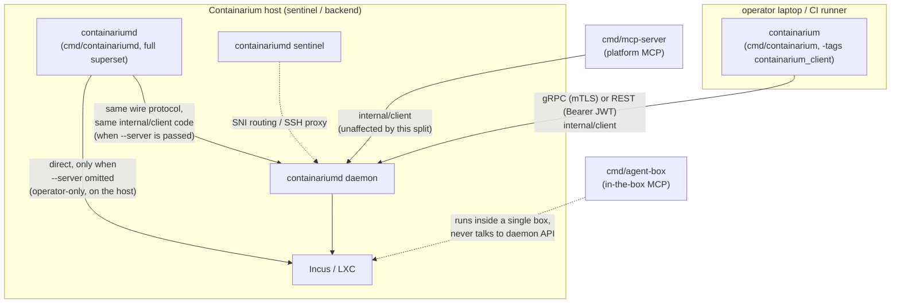

# Design: CLI client/server split — `containarium` (client) and `containariumd` (server)

**Date:** 2026-09-07
**Status:** proposed
**Stack:** Go (cobra), existing protobuf/gRPC + grpc-gateway contract (no proto changes), existing Makefile/release pipeline

## Problem

`cmd/containarium` is one binary built from the flat `internal/cmd` package
(148 command files + 46 test files). It mixes three unrelated concerns
with no structural line between them:

1. **Pure client commands** — only ever talk over gRPC/REST
   (`internal/client`) to a remote daemon: `debug`, `console`, `app`,
   `backup`, `agent`, `ttl`, `scale-down`, `runner`, …
2. **Server/operator processes** — run *on* the box itself and mutate it
   directly: `daemon`, `sentinel`, `hypervisor-agent`, `node`, `pool
   join/leave`, `doctor`, `recover`, `sync-accounts`, `image-bake`, …
3. **Hybrid commands** — twelve of them (`create`, `delete`, `get`,
   `list`, `info`, `label list/set/remove`, `install-stack`, `resize`,
   `ssh-config sync`, `prune`) branch on `serverAddr == ""` to
   *silently* fall back from "call the remote daemon" to "mutate Incus
   on whatever host this binary happens to be running on."

That third bucket is the concrete footgun. `--server` defaults to the
`CONTAINARIUM_SERVER` env var, and `resolveAuthToken` (root.go)
auto-fills the auth **token** from `~/.containarium/credentials.json`'s
`default_server` when `--server` is omitted — but nothing fills in
`serverAddr` itself from that same file. So a user who has already run
`containarium login` against a remote daemon, then runs `containarium
list` without `--server` or the env var set, doesn't get an auth error —
they get local mode: a live query (or, for `create`/`delete`, a live
mutation) against Incus on whatever machine the binary is running on.
Nothing in the output distinguishes "you're talking to your remote
fleet" from "you just touched this laptop/host's own Incus." This is
exactly the class of bug behind #1487 (a `debug` command that couldn't
tell a missing host-side Linux account from a missing in-container one)
— the CLI's responsibility boundary is blurred at the command level,
not just inside one handler.

Notably, three commands already do the right thing: `ttl`, `scale-down`
and `runner` refuse outright with `--server is required` when no server
is set (they import `pkg/core/incus` only for the `ContainerInfo` type,
never for a local fallback). That is the precedent this design
generalizes — the twelve hybrids are the stragglers, not the norm.

**Goal:** a client binary that structurally *cannot* fall into local
mode — no flag to forget, no silent branch — and a server binary that
keeps every operator capability the on-host binary has today, rolled
out without breaking a fleet that upgrades itself.

## Design

### Naming: the daemon-suffix convention

The user-facing CLI keeps the product name. The on-host binary gets the
`d` suffix:

| Binary | Role | Built from | Contains |
|---|---|---|---|
| **`containarium`** | client — laptops, CI runners, MCP hosts | `cmd/containarium` (`-tags containarium_client`) | every remote-only, offline and group-parent command, plus the remote half of the twelve hybrids. **No local-Incus code path.** |
| **`containariumd`** | server / operator — sentinels, backends, node-VMs | `cmd/containariumd` (untagged) | everything: `daemon`, `sentinel`, `hypervisor-agent`, `node`, `pool join`, … *and* the client surface including local mode, exactly as today's binary. |

This is `docker`/`dockerd`, `incus`/`incusd`, `ssh`/`sshd`,
`containerd`/`ctr`. The name a person types every day stays the product
name — brand, muscle memory, every doc and demo recording that says
`containarium create …` stays correct. The suffix on the other binary
already tells an operator "this runs as a service".

The alternative — leave the on-host binary alone and invent a short new
client name — was seriously considered and is recorded under Rejected
alternatives: there is no good 3–4 letter abbreviation of "containarium"
that is free, unambiguous, and doesn't read as an English word.

`containariumd` is a **superset**: on a host, `sudo containariumd list`
in local mode does what `sudo containarium list` does today, so operator
runbooks keep working with a rename. The long-term direction is for
local mode to go away entirely and for the on-host `containarium` client
to talk to the local daemon (Open decision 6); this design does not
require that.

### The real fix isn't file-moving, it's registration

Every command file self-registers via `func init() { rootCmd.AddCommand(x)
}` onto one package-level `var rootCmd`. Because `init()` runs on package
import, a second `main.go` that simply imports package `cmd` gets **every
command** regardless of which files "belong" to it. Splitting the
binary is therefore not a matter of moving files into two directories —
it's a matter of making command registration *conditional per build*,
without touching the 100+ files that are unambiguously client-only.

**Mechanism: Go build tags, not a package split.**

- Files that must never compile into the client binary — every
  server/operator command, and the `*Local` half of every hybrid command
  — get `//go:build !containarium_client` added to their existing build
  constraints (most have none today; `daemon.go` already has one for
  `!windows` and simply gains a second).
- `cmd/containarium/main.go` imports `internal/cmd`, is itself
  constrained with `//go:build containarium_client`, and is built with
  `-tags containarium_client`. The Go toolchain excludes every
  `!containarium_client` file from that build — they never compile, so
  their `init()`s never run, so `rootCmd` under that build genuinely
  only contains the client surface. The constraint on `main.go` is what
  makes a bare `go build ./cmd/containarium` (no tag) fail with "build
  constraints exclude all Go files" instead of silently producing a
  full-surface binary under the client's name.
- `cmd/containariumd/main.go` is today's `cmd/containarium/main.go`,
  moved, untagged — full superset, byte-for-byte the same behavior as
  the binary hosts run now.
- For each of the twelve hybrid commands, the file keeps its cobra
  `Use`/`RunE` and its `*Remote`/`*RemoteHTTP` implementation
  (client-shaped, no tag needed). Everything local-mode-only moves into a
  sibling file tagged `!containarium_client`: `create_local.go`,
  `delete_local.go`, `get_local.go`, `list_local.go`, `info_local.go`,
  `label_local.go` (all three label verbs), `install_stack_local.go`,
  `resize_local.go`. `ssh-config sync` and `prune` only call
  `listLocal()`/`deleteLocal()` so they need no file of their own.
  "Everything" includes the host-account steps that today sit *outside*
  the `*Local` functions behind their own `serverAddr == ""` checks —
  `container.CreateJumpServerAccount` after `createLocal`,
  `container.DeleteJumpServerAccount` after `deleteLocal` — which fold
  into the local functions so `create.go`/`delete.go` stop importing
  `pkg/core/container` altogether.
- **One stub file is required**, `local_stubs_client.go` tagged
  `containarium_client`: the dispatch code still references
  `createLocal`, `deleteLocal`, `getLocal`, `listLocal`,
  `getLabelsLocal`, `setLabelsLocal`, `removeLabelsLocal`,
  `installStackLocal`, `runResizeLocal` and the two `info` helpers by
  name, so the client build must define them or fail to compile. Each
  stub is one line returning a shared `errNoLocalMode` ("this is the
  containarium client; it has no local mode — pass --server, run
  `containarium login`, or use containariumd on the host"). The stubs
  are defence in depth: with the server resolution below, a remote call
  with no server already fails at the client constructor before dispatch
  reaches a stub — but the stub is what turns a future forgotten check
  into a *clear error* rather than a build break or a silent Incus call.
- **One moved-command stub file**, `moved_stubs_client.go` tagged
  `containarium_client`, registers the top-level server groups —
  `daemon`, `sentinel`, `service`, `tunnel`, `node`, `hypervisor-agent`,
  `egress-relay`, `upgrade-watchdog`, `sync-accounts`, `recover`,
  `image-bake`, `doctor`, `hosting`, `portforward`, `passthrough`,
  `collaborator`, `audit`, `export`, `cloud` — as commands that exit 2
  with "`<name>` lives in containariumd on the host; this is the client
  binary". This exists for exactly one failure mode: a host whose
  systemd unit or startup script still says `containarium daemon` after
  the client build has taken over that name (Rollout, Phase 2). Cobra's
  default "unknown command" would leave that host's journal saying
  nothing useful; the stub names the fix. These stubs appear in the
  allow-list gate explicitly, marked as moved.

This keeps the package layout as one `internal/cmd` (no `internal/cmdops`
/ `internal/cmdclient` split, no duplicated logic, no import-graph
surgery) and makes "which binary is this command in" a property checkable
at the file level: `grep -l '^//go:build.*!containarium_client' *.go`
lists the server-only files; everything else builds into both binaries.
(There is no positive tag on client files — the client surface is the
*untagged* set — so audit the untagged files, not a tag.)

**What "structurally cannot" does and doesn't mean.** Under
`containarium_client` there is no call path to `container.New()`,
`incus.New()`, `pgxpool.New()`, systemd or iptables — those live only in
excluded files, and the CI dependency check below proves
`pkg/core/container`, `internal/server`, `internal/sentinel`,
`internal/hosting` and `pgx` are absent from the link. But
`pkg/core/incus` itself **stays linked**, because `incus.ContainerInfo`
/ `incus.ServerInfo` are the return types of every `internal/client`
call, and that package imports `github.com/lxc/incus/v6/client`. The
guarantee is "no code path", not "no bytes". Making it "no bytes" means
moving those two structs into a types-only package (e.g.
`pkg/core/incus/types`) — a mechanical follow-up, listed under Open
decisions, not a prerequisite.

### Server resolution in the client: `default_server`, never local

`ssh.go` and `login.go` already resolve a server from
`credentials.json`'s `default_server` when `--server` is blank (used by
`ssh setup/list/remove`, `logout`, `whoami`). The client adopts that
resolution for `serverAddr` too, so the chain is:

1. `--server` flag
2. `CONTAINARIUM_SERVER` env (already the flag's default today)
3. `credentials.json` `default_server` — **client build only**
4. if a command then tries to *dial* with an empty address: "no server
   configured — run `containarium login` or pass `--server`"

Two design constraints shape where these live:

- **Step 3 must not change `containariumd`.** `rootCmd` and its
  `PersistentPreRunE` are shared by both binaries, so a global fallback
  would silently repoint `containariumd list` on an operator's host from
  local Incus to whatever `default_server` a stale credentials file
  names — exactly the surprise this design is meant to remove, in the
  other direction. So the fallback is a tag-split helper:
  `server_resolve_client.go` (`containarium_client`) implements
  `resolveServerAddr(flagOrEnv string) string` with the credentials-file
  lookup; `server_resolve_default.go` (`!containarium_client`)
  implements it as the identity function. `PersistentPreRunE` calls it
  unconditionally; under `containariumd` it is a no-op.
- **Step 4 must not apply to offline commands.** `cert generate`,
  `pki`, `token generate`/`inspect`, `version`, and every group parent
  legitimately run with no server at all, so "fail in pre-run if no
  server" would break them — and an exemption list would have to be
  maintained by hand. Instead the error lives at the one seam every
  remote command already passes through: `client.NewGRPCClient` and
  `client.NewHTTPClient` return the "no server configured" error when
  handed an empty address. Offline commands never construct a client,
  so they are exempt by construction. Under `containariumd` this only
  changes the message for a pure-client command invoked with no server
  (today: an opaque gRPC dial failure at the first RPC); hybrids branch
  to local before constructing a client and are untouched.

The token-resolution exemption list in `PersistentPreRunE`
(`login`/`logout`/`whoami`/`config get-token`) is unchanged and applies
to step 3 as well.

### Component diagram

`internal/mcp` does not import `internal/cmd` at all — it defines its own
`API` interface (`internal/mcp/server.go`) backed by `internal/client` (or
a cloud backend, via `newBackend`). **This split requires zero changes to
either MCP server.** They were already correctly decoupled from the CLI's
cobra layer; the split just makes the CLI layer match that same
discipline.

## Language choices

| Component | Language | Why this one | Type gate in CI |
|-----------|----------|---------------|------------------|
| `containarium` (client) / `containariumd` (server) | Go | Both are builds of the existing `internal/cmd` + `internal/client` Go code — a second language for a cobra wrapper over typed Go client code would be pure overhead | `go vet` + `go build` (both binaries, both tag sets), existing `golangci-lint` |

No new language, no new contract format — this is a build-graph and
packaging change over existing Go code and the existing proto-generated
`internal/client`.

## Contracts

Unchanged. `containarium` and `containariumd` (in remote mode) both go
through the same `internal/client.NewGRPCClient` / `NewHTTPClient`,
generated from `proto/containarium/v1/*.proto` exactly as before. No
new RPCs, no new REST routes, no swagger regen. The split is entirely
below the API boundary — it changes what a *binary* contains, not what
the *daemon* exposes.

One thing that *is* a contract and is changed by this design: the
**release artifact name** `containarium-linux-amd64`. A running fleet
consumes it — see Rollout. It is treated as an API with a deprecation
period, not renamed in place.

## Per-hybrid-command disposition

The twelve commands that actually fall back to local Incus when
`serverAddr == ""`. Verified by reading each dispatch, not by grepping
for the string: `ttl`, `scale-down` and `runner` also contain that
check but use it to *refuse*; `route_client.go` dials the gRPC client
unconditionally with no local branch; `quickstart` has the check only
to print a hint and otherwise composes `create`/`expose-port`, so it
inherits their behavior.

| Command | `containarium` (client build) | `containariumd` (unchanged from today) |
|---|---|---|
| `create` | remote only; empty server fails at the client constructor, `createLocal` stub is the backstop | remote + `createLocal` + `CreateJumpServerAccount` (direct Incus + host `useradd`), as today |
| `delete` | remote only | remote + `deleteLocal` + `DeleteJumpServerAccount`, as today. `deleteLocal` is also the rollback path in `create.go` and `prune.go`'s delete — both hit the stub in the client. |
| `get` | remote only | remote + `getLocal`, as today |
| `list` | remote only | remote + `listLocal`, as today |
| `info` | remote only | remote + two `container.New()` branches (server info, container info), as today |
| `label list` / `label set` / `label remove` | remote only | remote + `getLabelsLocal`/`setLabelsLocal`/`removeLabelsLocal`, as today |
| `install-stack` | remote only | remote + `installStackLocal`, as today |
| `resize` | remote only | remote + `runResizeLocal`, as today |
| `ssh-config sync` | remote only (`loadContainersForSSHConfig`'s `listLocal()` fallback hits the stub) | unchanged |
| `prune` | remote only (`pruneList`'s `listLocal()` and its `deleteLocal()` hit the stub) | unchanged |

### Local-only commands that were sitting with the client set

These have **no remote path at all** — they call `container.New()`,
`iptables`, or Postgres directly, unconditionally — and are operator
commands that were only ever "CLI-general" by virtue of the flat
package. They become `containariumd`-only (`!containarium_client`)
outright, no dispatch change:

| Group / files | Why local-only |
|---|---|
| `sidecar.go` | `incus.New()` unconditionally |
| `portforward` — `portforward.go` + `setup`/`remove`/`show` (4 files) | iptables NAT rules for Caddy on this host |
| `passthrough` — `passthrough.go` + `add`/`list`/`remove` (4 files) | `network.CheckIPTablesAvailable()` + `NewPassthroughManager` — host iptables. (`passthrough route *` is a *separate* group with its own parent in `passthrough_route.go`; it goes through the daemon and stays client.) |
| `collaborator` — `collaborator.go` + `add`/`remove`/`list` (4 files) | `container.New()` + `NewCollaboratorManager`, no `--server` branch. The proto already has collaborator RPCs; the CLI handlers simply never grew a remote path. Adding one is Open decision 5 — until then the client has no `collaborator` verb. |
| `export.go` | Refuses with `--server` set: "only available in local mode" |
| `audit.go` (`query`/`verify`/`verify-anchor`) | Opens Postgres directly via `getPostgresConnString()` |
| `cloud.go` (`cloud login`/`enroll`) | "Enroll **this host** with a cloud control plane" — writes host-side `cloud.yaml`. `cloud_target.go` (`isCloudTarget`, used by `debug`/`console`/`info`) is a pure helper and stays in both builds. |

### Classification method

The disposition above was regenerated with a rule an implementer can
re-run, because the first pass (keyed on the `pkg/core/incus` import)
missed six of the twelve hybrids and all of `collaborator`,
`passthrough`, `audit`, `export` and `cloud`:

> A file is **host-touching** if it calls a host primitive:
> `container.New(`, `incus.New(`, `network.New*`/`network.Check*`,
> `exec.Command("incus"|"iptables"|"systemctl"|"zfs"|"useradd"…)`,
> `os.Geteuid`, `pgxpool.New`, or imports `internal/server`,
> `internal/sentinel`, `internal/hosting`, `internal/hypervisor`.
> A file is **remote** if it constructs `client.NewGRPCClient`/
> `NewHTTPClient` or an HTTP client to a `--server`/`default_server`.
> Host-touching **and** remote → hybrid (split into `*_local.go` +
> stub). Host-touching only → `!containarium_client`. Remote only, or
> neither (offline tools, group parents, helpers) → both binaries.

Three false positives from the grep, resolved by reading: `daemon.go`
and `hosting_status.go` match "remote" only because they open an HTTP
client to `localhost` (server-only); `sentinel_register_token.go` and
`sentinel_fetch_release.go`/`sentinel_pprof.go` are remote-shaped but
register on `sentinelCmd`, which lives in the excluded `sentinel.go`,
so the whole `sentinel` group is tagged together.

**Group-parent rule:** a tagged-out file must not define a symbol an
untagged file references, or the client build fails to compile. Every
group parent whose children split across binaries — `pool`, `secrets`,
`token`, `runner`, `label` — stays untagged; every group tagged out as a
whole (`sentinel`, `hosting`, `portforward`, `passthrough`,
`collaborator`, `audit`) takes its parent with it. The compiler enforces
this for free; it is stated here so the split is done group-by-group
rather than file-by-file.

## Full binary layout

Of the 148 command files, **~45 become `containariumd`-only** and the
remaining **~103 build into both binaries** unchanged. The split adds 8
`*_local.go` files (server side) and 3 client-side files
(`local_stubs_client.go`, `moved_stubs_client.go`,
`server_resolve_client.go`) plus `server_resolve_default.go`.

**Both binaries (~103 files, unchanged logic):** every command that is
remote-only, offline, a group parent, or a helper — `agent*`, `app*`,
`backends*`, `backup*`, `capacity`, `cert` (offline CA/server/client
cert generation via `internal/mtls` — writes only to `--output`,
touches no host state; it is what `internal/client`'s own "certificates
not found" error points users at), `cloud_target.go`, `cluster`,
`code*`, `compose`, `console*`, `connect`, `crew*`, `debug`,
`egress-via-client`, `expose-port`, `kms` (status/coverage/migrate —
over the wire, unlike `secrets migrate-to-envelope`), `label.go`
(parent), `login`/`logout`/`whoami`/`config get-token`, `monitoring*`,
`move`, `network-policy`, `passthrough route *` (own parent), `pki`,
`pool` + `pool list` (reads `/v1/backends` over HTTP — the *only*
client verb in the `pool` group), `protect`, `push`/`sync` (SSH via the
sentinel), `quickstart`, `recipe*`, `route*`, `runner` + `runner
reconcile`, `sandbox`, `scale-down`, `secrets`, `security*`,
`snapshot*`, `ssh*`, `token*` + `token inspect`, `traffic`, `ttl`,
`volume`, plus the remote half of the twelve hybrids.

**`containariumd`-only (`!containarium_client`, ~45 files):** `daemon`,
`sentinel*` (7 files), `hypervisor-agent`, `egress-relay`, `node`,
`pool join`/`pool leave`/`pool regions` + `pool_sentinel.go`/
`pool_join_handshake.go` (5 files — run on the host being joined),
`postgres`, `upgrade-watchdog`, `sync-accounts`, `image-bake`, `recover`,
`storage-probe`, `doctor`, `hosting*` (5 files incl. the group parent),
`sidecar`, `portforward*` (4), `passthrough` + `add`/`list`/`remove`
(4), `collaborator*` (4), `export`, `audit`, `cloud.go`,
`secrets_migrate.go`, `service.go`, `tunnel.go`, plus the 8 new
`*_local.go` files.

Cobra handles a group with fewer children (`pool`, `secrets`, `token`,
`runner`, `label` in the client) without any change.

## Rollout

### Why this has to be phased

The on-host binary is not installed by hand; a running fleet upgrades
itself, and every link in that chain names the binary:

1. `internal/sentinel/selfupdate.go` downloads
   **`containarium-linux-amd64`** (`releaseBinaryName`) from the GitHub
   release and verifies it against `checksums.txt`.
2. `internal/sentinel/binaryserver.go` serves
   **`/usr/local/bin/containarium`** (`defaultBinaryPath`) to backends
   over the tunnel.
3. `internal/server/autoupdate.go` on each backend fetches from the
   sentinel and swaps its own binary at the path the daemon was started
   with; `internal/cmd/upgrade_watchdog.go` defaults to the same path.
4. `terraform/*/scripts/startup-*.sh` (5 files) and
   `scripts/deploy-binary.sh` reconcile `/usr/local/bin/containarium`
   on boot / on deploy; `internal/cmd/service.go`, `sentinel_unit.go`
   and `pool_join.go` write systemd units whose `ExecStart` is that
   path.

Switching the `containarium-linux-amd64` artifact to the client build
in a single release would have every sentinel pull a binary with no
`sentinel` command on its next self-update, and serve it to every
backend. The artifact name is therefore treated as an API: the server
build keeps publishing under it until the fleet no longer asks for it.

### Phase 0 — code, no release

Everything in Design, landed behind the tag with no artifact change:
`cmd/containariumd/main.go` (moved from `cmd/containarium`),
`cmd/containarium/main.go` (tagged), `!containarium_client` on the ~45
server files, the 8 `*_local.go` splits, the three client stub/resolve
files, and all CI gates below. `make build` still produces one binary
named `containarium` from `cmd/containariumd` — nothing observable
changes for anyone.

### Phase 1 — release N: `containariumd` exists everywhere, `containarium` unchanged

- **Artifacts:** add `containariumd-{linux-amd64,darwin-amd64,darwin-arm64}`
  (the server build). `containarium-*` **continues to be the server
  build too**, published under both names from the same `go build`.
  `checksums.txt` lists both.
- **Every host-side reference flips to `containariumd`**, in one PR,
  so a host on release N is self-consistent: `selfupdate.go`
  (`releaseBinaryName = "containariumd-linux-amd64"`), `binaryserver.go`
  (`defaultBinaryPath`), `autoupdate.go` callers, `upgrade_watchdog.go`
  default, the three unit writers (`service.go`, `sentinel_unit.go`,
  `pool_join.go`), the five terraform startup scripts,
  `deploy-binary.sh`, the install/uninstall scripts under `hacks/` and
  `scripts/`, `release.yml`'s self-download smoke test, the
  benchmark provisioners. The grep in the CI gate below returns zero
  server-side hits for the old path.
- **Hosts converge through their normal upgrade path.** The reconcile
  step in `startup-*.sh` and the sentinel/backends' auto-update install
  `/usr/local/bin/containariumd`, rewrite the unit, and restart. They
  also leave **`/usr/local/bin/containarium` as a symlink to
  `containariumd`** for the duration of Phase 1, so any runbook, cron,
  or script this inventory missed keeps working and shows up in the
  audit log as the old name rather than failing.
- **Exit criterion:** `containarium backends versions` reports every
  backend and sentinel at ≥ N, and the repo grep for
  `/usr/local/bin/containarium\b` outside client-side files and this
  doc is empty. Both are checked before Phase 2 is tagged.

### Phase 2 — release N+k: `containarium` becomes the client

- `containarium-*` artifacts switch to the client build (`-tags
  containarium_client`, `CGO_ENABLED=0`, static). A `windows-amd64`
  client artifact is added — the client has no reason to inherit the
  `!windows` exclusions of the server commands.
- On hosts, the Phase 1 symlink is replaced by the real client binary
  (or removed — Open decision 7). A host that somehow still runs
  `containarium daemon` from a stale unit now fails at start with the
  moved-command stub's message naming `containariumd`, which is the
  entire reason the stub exists.
- Laptops and CI that ran `containarium <client-verb> --server …` see no
  change. Laptops that ran `containarium create` in **local mode**
  against a dev host's Incus get `errNoLocalMode` — that is the
  behavior change this design exists for, and the message says to use
  `containariumd` for that.

### Build changes (Phase 0)

- **Makefile:** `BINARY_NAME=containarium` builds `cmd/containarium`
  with a fixed `-tags containarium_client` and `CGO_ENABLED=0`, and
  **not** `$(GO_TAGS)` — `go build` does not merge repeated `-tags`
  flags (the last one wins; tags must be comma-joined in a single
  flag), and the client has no business embedding the eBPF object,
  which is daemon-side. New `DAEMON_BINARY_NAME=containariumd` builds
  `cmd/containariumd` with today's `$(GO_TAGS)` (`embed_bpf` when the
  object is present). `build-release` produces both plus mcp/agent-box;
  during Phase 1 the release workflow copies the daemon build to the
  `containarium-*` names as well.
- **`install`** installs both; `install-client` installs only the
  client (what a laptop wants).
- **No changes** to `containarium-daemon.yml`'s image build beyond the
  binary name, or to `build-mcp*`, `build-agent-box*`, or the
  swagger/proto generation — none of them touch `internal/cmd`.
- **Docs and demo scripts:** every `containarium <client-verb>` stays
  correct. Operator runbooks that say `sudo containarium daemon …` or
  `sudo containarium sync-accounts` are updated to `containariumd` as
  part of Phase 1; the symlink covers the gap.

## Test strategy

- **Dependency-graph gate (new; the test that pins the property this
  design exists for):** a CI step running
  `go list -deps -tags containarium_client ./cmd/containarium` and
  failing if the output contains any of `pkg/core/container`,
  `internal/server`, `internal/sentinel`, `internal/hosting`,
  `internal/hypervisor`, `github.com/jackc/pgx`. This is stronger than
  inspecting `--help`: it proves the *code* is out of the link, not
  just the cobra registration. A forgotten `!containarium_client` tag
  on a new server command that imports any of those fails here, not in
  review. (`pkg/core/incus` is deliberately *not* on this list until
  the types follow-up lands.)
- **Command-tree gate (new, in-package, allow-list):** a Go test in
  `internal/cmd` tagged `containarium_client` walks `rootCmd.Commands()`
  recursively, renders every registered path (`pool list`, `label set`,
  …), and compares the full set against a checked-in golden list of
  approved client paths — failing on *any* path not in the list, and on
  any approved path that went missing. The moved-command stubs are in
  the list, marked as such, and a companion assertion checks each one
  exits 2 with the `containariumd` message. A deny-list of known server
  names would miss a new server command that uses only the standard
  library (a `systemctl` shell-out registers fine and imports nothing
  gated); an allow-list catches it because a new command of either kind
  has to be added deliberately. The dependency-graph gate stays as the
  supplementary check that the *code*, not just the registration, is
  out of the link.
- **Untagged-build parity (new):** a test under the default tag set
  asserts `containariumd`'s command tree is a strict superset of the
  client golden list minus the moved stubs — i.e. the split never
  *loses* a command from the server binary.
- **Hybrid-command dispatch (table-driven, per command):** for each of
  the twelve hybrids, a test under `containarium_client` asserting that
  with no `--server`, no `CONTAINARIUM_SERVER`, and an empty credentials
  file, the command returns the "no server configured" error from the
  client constructor without reaching a `*Local` call; and one test
  that calling each stub directly returns `errNoLocalMode`. Under the
  default build, the existing pure-function tests in those files
  (`TestListJSONShape`, `TestFilterForPrune`, `TestParseLabelFilter`, …)
  run unchanged — note none of them exercise local mode today;
  local-mode coverage remains the integration suite's job, as now.
- **Offline commands stay offline (new):** under `containarium_client`,
  with no server configured anywhere, `cert generate --output <tmp>`,
  `token inspect <jwt>`, `token generate --secret x`, and `version`
  succeed. This is the test that pins "the server requirement lives at
  the dial seam, not in pre-run".
- **`resolveServerAddr` (new, tag-split helper):** under
  `containarium_client`, flag wins over env, env wins over
  `default_server`, empty flag + populated file resolves, all three
  empty yields empty (and the constructor errors). Under the default
  build the same inputs return the flag/env value unchanged — the test
  that pins "`containariumd` behavior is untouched".
- **`client.NewGRPCClient("")` / `NewHTTPClient("")`** return the
  "no server configured" error (both builds).
- **Artifact-name gate (Phase 1):** `selfupdate.go`'s
  `releaseBinaryName` and `binaryserver.go`'s `defaultBinaryPath` are
  asserted in a unit test to name `containariumd`; a CI grep for
  `/usr/local/bin/containarium\b` in server-side Go, shell and terraform
  files must return nothing. These are the two checks that make Phase 2
  safe to tag.
- **Existing test files that reference server-only symbols must gain
  the same `!containarium_client` tag** or `go test -tags
  containarium_client ./internal/cmd` fails to compile — at minimum
  `audit_test.go`, `cloud_test.go`, `doctor_test.go`,
  `daemon_base_domains_test.go`, `debug_actions_parse_test.go` (imports
  `internal/server`), `pool_join_test.go`, `sentinel_pprof_test.go`,
  `service_test.go`, `service_backoff_test.go`,
  `tunnel_forward_test.go`; the compiler names any others. CI runs
  `go test` for `internal/cmd` under both tag sets.
- **Regression guard on MCP:** `go build ./cmd/mcp-server ./cmd/agent-box`
  in CI already exists; no test changes needed there, but the CI job list
  gets an explicit comment noting *why* it's unaffected (so the next
  person doesn't assume it needs updating when they see `cmd/containariumd`
  appear next to it).

## Deviations from the default stack

None. Same language, same proto contract, same client library, same
release pipeline shape — this is a build-graph change plus a staged
binary rename, not a new service.

## Open decisions

1. **Local-mode hint in `containariumd`.** Should `containariumd` print
   a one-line `stderr` nudge ("no --server given — operating on this
   host's Incus directly") when one of the twelve hybrids falls into
   local mode? Directly targets the footgun in the Problem section
   without a behavior change. Recommendation: yes, gated to the twelve
   hybrids, with a `CONTAINARIUM_NO_HINT=1` opt-out for scripts.
2. **`credentials.json` ownership.** With the client binary keeping the
   product name, `containarium login` is unchanged and the client owns
   the file. `containariumd` reads it only for the token (today's
   behavior). Recorded as decided unless someone objects.
3. **Types follow-up: move `incus.ContainerInfo` / `incus.ServerInfo`
   out of `pkg/core/incus`.** Until then `github.com/lxc/incus/v6/client`
   is linked into the client for a struct definition. Mechanical but it
   touches every `internal/client` signature and the MCP `API`
   interface, so it is its own PR after the split lands, and is what
   lets `pkg/core/incus` join the dependency-gate list.
4. **Drop the cargo-cult `!windows` tags** where they remain on
   client-side files (`egress_via_client.go` uses `syscall.SIGTERM`,
   which is fine; `audit.go` and `collaborator_*.go` are server-side so
   theirs are moot). Independent of this design.
5. **Give `collaborator add/remove/list` a remote path.** The proto
   already carries collaborator RPCs (the cloud shim uses them), but the
   OSS CLI handlers only ever call `container.New()` directly, so the
   client ships with no `collaborator` verb at all. Adding the
   `--server` branch (same shape as `label`) turns it into the
   thirteenth hybrid and puts it back in the client. Per CLAUDE.md's
   CLI-first rule this is a gap worth closing regardless of the split.
6. **Retire local mode entirely.** With `containariumd` on every host,
   the on-host `containarium` client could talk to the local daemon
   (`service install` mints a root token and writes `default_server =
   localhost:<http-port>` into root's `credentials.json`). Then
   `containariumd`'s hybrid verbs and the twelve `*_local.go` files can
   be deleted, and `containariumd` becomes daemon-only like `dockerd`.
   Out of scope here; the split is what makes it possible.
7. **Phase 1 symlink lifetime.** Keep `/usr/local/bin/containarium →
   containariumd` on hosts for one release, or indefinitely until
   decision 6? One release is enough if the exit criterion in Phase 1
   is enforced; indefinitely is safer for hosts outside the auto-update
   chain (offline-install bundles, BYOC hosts on pinned versions).
   Recommendation: keep it until decision 6 lands, since it costs
   nothing and the moved-command stubs cover the client-installed case.

## Rejected alternatives

- **A short new client name (`cnct`, `ctnr`, `ctm`, …) with the on-host
  binary left as `containarium`.** Additive and migration-free, which
  is why it was the first draft. Rejected after checking the candidates:
  `cnct` reads as "connect" and this CLI has a `connect` verb; `ctnr` is
  already this repo's cloud-token prefix and one letter from
  containerd's `ctr`; `cntr`, `ctm`, `cnr` are taken on npm/PyPI/crates;
  `carium` is a healthcare company's brand; the free remainder
  (`tarium`, `contm`) don't say "containarium" to anyone who hasn't been
  told. There is no good abbreviation, and a CLI name is permanent — the
  cost of the staged rename is paid once; the cost of a bad name is paid
  on every invocation. Typing length is solved by a shell alias.
- **Full package split (`internal/cmd` → `internal/cmd` +
  `internal/cmdclient`, physically moving ~103 files).** Same end state,
  much higher diff/review cost and merge-conflict surface for zero
  behavioral difference from the build-tag approach — every file's
  package clause, relative imports of shared package-level vars
  (`serverAddr`, `certsDir`, `httpMode`, `authToken`, all declared once
  in `root.go`) would need re-threading across a package boundary.
  Rejected: the build-tag approach gets the identical guarantee (files
  literally absent from the client binary) without the churn.
- **Single binary, runtime flag (`containarium --client-only`) instead of
  a second binary.** Rejected because it doesn't solve the actual
  problem: the local-mode code is still *in* the binary, so "forgot the
  flag" is still a way to hit it — this is exactly the bug class in the
  Problem section, just moved one flag over. A second binary makes the
  guarantee structural (the code isn't there to fall into) rather than a
  runtime toggle someone can still forget.
- **Rename in one release (no Phase 1).** Rejected because the artifact
  name is consumed by the fleet's self-update chain; a one-shot rename
  hands every sentinel a binary without a `sentinel` command on its next
  update.
