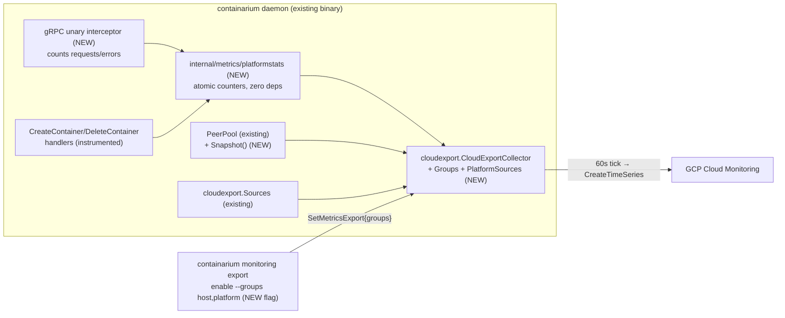

# Design: Platform-domain metrics in cloud-provider monitoring (metric groups)

**Date:** 2026-07-24
**Status:** proposed
**Stack:** Go 1.26 + protobuf/gRPC (grpc-gateway) / no frontend component / ships inside the existing daemon binary
**PRD:** `docs/product/cloud-export-domain-metrics.md` — stories #1081 (groups), #1082 (API health), #1083 (provisioning), #1084 (connectivity), #1085 (dashboard/quickstart)

## Problem

The #1069/#1070 export pipeline (shipped v0.60.0) sends host-infra series to
GCP Cloud Monitoring, but platform-level state — API errors, provisioning
outcomes, BYOC peer connectivity — is still invisible from the provider
console. This design adds a **platform** series group to the existing
`internal/metrics/cloudexport` pipeline behind independently enableable
**metric groups**, keeping the billed sample surface a deliberate,
golden-tested allowlist. It also fixes #1080 (resumed collectors exporting
placeholder identity labels) structurally, because the groups work rebuilds
the same collector construction path.

## Design

No new deployable, no new goroutine model: the existing
`CloudExportCollector` (one dedicated `MeterProvider` + `PeriodicReader`,
one async callback per tick) gains per-group instrument registration and one
new read-side seam. Event-shaped facts (requests, provisioning outcomes) are
accumulated in a tiny dependency-free counter package and *observed* by the
collector at tick time — the export pipeline stays pull-based and the
counters cost nothing when export is disabled.

| Component | Responsibility | Location |
|---|---|---|
| `CloudMetricsGroup` enum + `groups` fields | Typed group selection on the wire and in persisted config | `proto/containarium/v1/container.proto` |
| `platformstats.Stats` | Lock-free (atomic) accumulation of API request/error counts by code class and provisioning attempts/failures/duration-sum by operation; snapshot read | `internal/metrics/platformstats/stats.go` (NEW) |
| gRPC unary interceptor | Increment `platformstats` per RPC completion; classify by gRPC status code | `internal/server/dual_server.go` (wired into the existing chain) |
| Provisioning instrumentation | Wrap the CreateContainer/DeleteContainer handler bodies: attempts, failures, duration | `internal/server/container_server.go` |
| `PeerPool.Snapshot()` | Point-in-time `[]PeerState{ID string; Healthy bool}` from the existing peers map | `internal/server/peer.go` |
| `cloudexport.PlatformSources` | Read-side seam: `Stats() platformstats.Snapshot` + `Peers() []PeerState`; keeps the collector unit-testable with no server import | `internal/metrics/cloudexport/sources.go` |
| Per-group registration in `CloudExportCollector` | `CollectorOptions.Groups []Group`; each group registers its instruments; golden test per group pins the billed surface | `internal/metrics/cloudexport/collector.go` |
| Late-bound labels (#1080 fix) | `CollectorOptions.LabelsFn func() Labels` evaluated at each tick (not frozen at build) so a startup-resumed collector picks up real `backend_id`/`region` once identity init completes | `internal/metrics/cloudexport/collector.go` |
| CLI `--groups` | Parse `host,container,platform` → enum list; omitted ⇒ server default | `internal/cmd/monitoring_export.go` |
| Committed dashboard + quickstart | Reproducible GCM dashboard JSON incl. platform charts; quickstart gains the platform-alert recipe | `deploy/monitoring/gcm-containarium-hosts.json` (NEW), `docs/CLOUD-NATIVE-METRICS-EXPORT.md` (#1073/#1085) |

### Exported series added by the `platform` group

Additions require touching this list *and* the golden test — same rule as #1070.

| Series | Kind | Labels |
|---|---|---|
| `containarium.platform.api.requests` | counter | backend_id, hostname, region, `code_class` (`ok`\|`client_error`\|`server_error`) |
| `containarium.platform.api.errors` | counter | same |
| `containarium.platform.provision.attempts` / `.failures` | counter | backend_id, hostname, region, `operation` (`create`\|`delete`) |
| `containarium.platform.provision.duration_seconds_sum` | counter | same |
| `containarium.platform.peers.connected` | gauge | backend_id, hostname, region |
| `containarium.platform.tunnel.state` (0/1) | gauge | backend_id, hostname, region, `peer_id` |

Design choices inside that table:

- **`code_class`, not HTTP status.** All product traffic (REST via
  grpc-gateway and native gRPC) converges on the gRPC server, so one unary
  interceptor counts both transports with no double counting. gRPC status
  codes map cleanly to `ok`/`client_error`/`server_error`; raw `2xx/4xx/5xx`
  (the PRD's shorthand) would be a lie for native gRPC callers. The handful
  of legacy gateway-native handlers (`/healthz`, key sync) are
  infrastructure plumbing outside the product contract and are deliberately
  not counted.
- **`duration_seconds_sum` counter, not a histogram.** Sum + attempts gives
  mean latency and rate in MQL/PromQL at exactly one series; a GCM
  distribution costs one series *per bucket* and the alerting stories
  (#1083) need "failures > 0" and "mean creeping up," not tail percentiles.
  Revisit only with a written cost case.
- **`peer_id` cardinality is bounded** by enrolled peers (single digits
  today). The label is the enrolled host name — the enrollment path already
  forbids org/tenant identifiers in it, and the no-tenant-label golden test
  asserts it stays that way.

### Config, persistence, resume

`cloudexport.Config` gains `Groups []Group` (JSON `groups`), persisted in the
same single `daemon_config` key. **Backward compatibility rule: absent or
empty `groups` ⇒ `[HOST]`** — a config written by v0.60.0 resumes exactly
today's behavior. Changing groups re-runs the existing enable path (probe →
build collector → swap) — group changes are collector rebuilds, not partial
mutations, so there is no instrument-registration drift.

### Failure paths

Unchanged from #1070 by construction: a `PlatformSources` error or nil at
tick time logs and skips that group's observations for the tick (never
panics, never blocks the host group); `platformstats` is process-local and
cannot fail; a peer-pool snapshot during discovery churn returns whatever is
registered at that instant.

## Contracts

| Boundary | Contract | Source of truth |
|---|---|---|
| CLI/MCP ↔ daemon | `SetMetricsExportRequest{enabled, provider, repeated CloudMetricsGroup groups}`, `GetMetricsExportResponse{... repeated CloudMetricsGroup groups}` | `proto/containarium/v1/{container,service}.proto` → `make proto` (grpc-gateway REST + swagger regenerate; generated code never edited) |
| Persisted config | `cloudexport.Config` JSON under `cloudexport.ConfigStoreKey` (one key, whole struct — the #1062/#1064 lesson) | `internal/metrics/cloudexport/config.go` |
| Collector ↔ event counters | `platformstats.Snapshot` (typed struct: `Requests map[CodeClass]uint64`, `Provision map[Op]ProvisionStats`) | `internal/metrics/platformstats` |
| Collector ↔ peer registry | `cloudexport.PeerState{ID string; Healthy bool}` via `PlatformSources` | `internal/metrics/cloudexport/sources.go` |
| Exported series | The table above + golden tests | `internal/metrics/cloudexport/collector.go` |

## Test strategy

**`platformstats` (unit, table-driven):**
`TestStats_IncrementAndSnapshot` (each class/op lands in the right bucket,
snapshot is a copy not a view); `TestStats_ConcurrentIncrements` (`-race`,
N goroutines, totals conserve); `TestStats_DurationSumAccumulates`.

**Interceptor (unit):** `TestUnaryInterceptor_CountsByCodeClass` —
table-driven over handler results (OK, InvalidArgument, Internal, panic →
Internal) asserting exactly one increment in the right class and that
errors also increment `api.errors`; `TestUnaryInterceptor_OrderPreserved`
(existing auth interceptor still runs — wrap, don't replace).

**Provisioning instrumentation (unit, via the existing builder seam):**
`TestCreateContainer_IncrementsAttempts` /
`_FailureIncrementsFailures` / `TestDeleteContainer_Instrumented` — reuse the
`metrics_export_server_test.go` fake-manager pattern; assert duration sum > 0.

**Collector groups (unit, extends existing golden tests):**
`TestCollector_GoldenSeriesPerGroup` — table over
`{[host]}, {[host,platform]}, {[platform]}` pinning the exact exported
series+labels via the in-memory exporter; `TestCollector_NoTenantLabels`
extended over platform series incl. `peer_id`;
`TestCollector_PlatformSourcesErrorSkipsGroupNotTick` (host series still
export when platform source errors); `TestCollector_LabelsFnLateBinding`
(#1080 regression: LabelsFn returning placeholder then real values ⇒ second
tick carries real labels).

**Config/RPC round trip (unit, existing fakes):**
`TestSetMetricsExport_GroupsPersistAndResume` (enable `[host,platform]` →
fake KV → restarted server resumes both groups);
`TestSetMetricsExport_EmptyGroupsDefaultsHost` (v0.60.0 config JSON
compatibility); `TestParseGroups` CLI table (`"host,platform"`, unknown
string rejected client-side with the supported list).

**Peer snapshot (unit):** `TestPeerPool_Snapshot` — registered
healthy/unhealthy peers appear with correct state; snapshot isolated from
concurrent registry mutation (`-race`).

**Integration/e2e slice (manual, mirrors the #1076 validation):** enable
`host,platform` on a GCP backend → force one failed create and one tunnel
drop → assert all platform series in GCM via the PromQL API within 2
intervals → daemon restart → labels remain real (closes the #1080 loop
live). Scripted into the #1073 quickstart's verification section.

**Mocks vs real:** the GCM boundary stays behind the existing in-process
fake Cloud Monitoring gRPC server (`TestGCPSink_...PushesToFakeMonitoring`
extended with a platform series assertion); Incus/PeerPool are behind the
existing `Sources`/new `PlatformSources` seams; no live GCP in unit tests.

## Deviations from the default stack

None. Go-only change inside the existing daemon; contract-first proto with
grpc-gateway regeneration; no frontend, no new container. (The committed
dashboard JSON is GCM configuration data, not a deployable.)

## Rejected alternatives

- **Scrape platform stats from the host-local VictoriaMetrics** (the daemon
  already pushes rich internal series there). Rejected: reintroduces the
  fate-sharing this feature exists to escape — when the VM LXC or incus is
  wedged, platform metrics would go dark exactly when needed; also drags a
  PromQL client into the export path.
- **Count API traffic in gateway HTTP middleware.** Rejected: misses native
  gRPC clients and would double-count REST once (gateway) and again if a
  gRPC interceptor is ever added; the gRPC server is the single choke point
  where both transports already converge.
- **Second `MeterProvider` per group.** Rejected: one reader/exporter batch
  per tick is cheaper and simpler; the cost surface stays explicit through
  per-group golden tests, which is the property that actually matters.
- **GCM distribution (histogram) for provisioning latency.** Rejected for
  MVP on cost (one series per bucket) and lack of a story needing
  percentiles; sum+count answers #1083's alerts.

**At 10× (Phase B, `apps` group):** the groups mechanism is the containment
boundary. Tenant-controlled series flow through a new `AppsSources` seam
with a hard per-container series cap and a `containarium.export.dropped_series`
counter (PRD Phase B prerequisites) — nothing in this design needs to change
shape; the collector just gains one more group whose golden test pins the cap
behavior instead of exact names.
