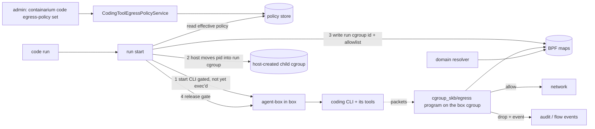

# Design: an admin-approved egress allowlist for the coding CLI's own traffic

**Date:** 2026-10-07
**Status:** proposed — **conditional on a live-host spike (PR 0 below)**; three claims this design relies on are reasoned, not yet proven on a real host
**Stack:** protobuf/gRPC (grpc-gateway) + Docker; Go (control plane) and one small BPF C program (see *Deviations*)
**Issue:** #2370. Sprint umbrella #2373, question Q12; decisions Q6 (admin-only writes) and Q7 (unrestricted until an admin configures one).
**Related:** [`guardrail-inbound-and-server-policy.md`](guardrail-inbound-and-server-policy.md) (the gateway scan), #2374 (kernel-level enforcement of guardrail checks), [`tenant-network-guard.md`](tenant-network-guard.md).

## Problem

An admin wants to say "a coding tool may only call these model endpoints",
and have that hold even if the tool, or text it was shown, tries to talk to
anything else. A general tenant allow/deny policy already exists, but it is
per box: it cannot distinguish the coding CLI's traffic from the tenant's own
work in the same box, so using it for this would restrict the whole box.

The sprint parked this issue because no layer could scope a network rule to
one tool's processes. This doc decides where that scope comes from.

## What the code establishes today

Verified by reading `origin/main`:

| Fact | Where |
| --- | --- |
| The platform's eBPF enforcer attaches **TCX hooks to each box's host-side network interface**. A packet seen there carries no process identity | `internal/netbpf/loader.go` (`AttachTCX`, ingress/egress), `docs/EBPF-CI-LOADING-LANE-DESIGN.md` |
| Its allow-list model is **IPv4 CIDR, keyed by tenant id**, with a mode enum (`LOG_ONLY` / `ENFORCE`) shared with the proto `NetworkPolicyMode` | `internal/netbpf/policymap.go`, `proto/containarium/v1/config.proto` |
| The kernel only ever sees CIDRs: `egress_domains` are validated by `netpolicy`, then resolved to addresses in user space by the daemon and folded into the same map | `internal/netpolicy/netpolicy.go` (`compileDomains`), `internal/netbpf/policymap.go` |
| **No cgroup-attached BPF program exists** in the repo (no `cgroup_skb`, `cgroup/connect`, or `sock_addr`) | repo-wide search |
| `agent-box` starts the coding CLI with `/bin/sh -c` in a `setsid`'d child. There is **no cgroup, uid or network-namespace separation** between the CLI and the rest of the box | `internal/agentbox/process.go`, `internal/agentbox/shell.go` |
| `coderun` reaches the box over ssh and never touches the network layer | `internal/coderun/session.go` |
| The TCX loader needs kernel ≥ 6.6; the `AttachTCX` call is the documented constraint | `cmd/ebpf-phase0/main.go` |
| `internal/egressproxy` is a host-side relay (SOCKS5, no authentication, no domain or SNI filtering) that a box's apps must be pointed at; it is not wired to coding runs | `internal/egressproxy/relay.go`, `socks5.go` |
| **The tenant user is created in the `sudo` group with `NOPASSWD:ALL`**, so a process running as that user can become box root | `pkg/core/container/manager.go:924,939-943`, `pkg/core/ospkg/debian.go:22` |
| A coding run starts by **two paths**: the daemon's `BoxRun` (`su - <user> -c …` through an Incus exec as root) and the CLI path (ssh as the login user, then `agent-box`). Both end in a `setsid`'d `sh -c`; neither sets a cgroup, uid or namespace | `internal/server/box_run_start.go:53-54,118-139`, `internal/coderun/session.go:33,110-116`, `internal/agentbox/process.go:272,283` |
| A **domain resolver already exists** and feeds resolved addresses into the enforcer's map: fixed 60s refresh, no TTL awareness, keeps the previous addresses when a lookup fails. The enforcer itself is **off unless a BPF object is configured**, drops only with `CONTAINARIUM_NETWORK_POLICY_ENFORCE=1`, and is **IPv4 only** (IPv6 and ARP pass) | `internal/server/domain_resolver.go:29-37`, `network_policy_enforcer.go:34,66`, `internal/config/network.go`, `docs/security/multi-tenant-isolation.md:200` |
| Boxes are unprivileged Incus LXC containers by default; the host sees a box at `lxc.payload.<name>` in the unified cgroup hierarchy. **Nothing in the repo says** whether in-box root can move out of a host-created cgroup or detach a host-attached program | `pkg/core/incus/client.go:905-915`, `pkg/core/incus/cpu_stat_test.go:90-104` |
| `internal/hostcheck` does **not** check kernel version, BPF support or cgroup v2 as prerequisites. Documented baseline: Ubuntu 24.04, Incus 6.19+, kernel ≥ 6.6 for TCX (validated on 6.8) | `README.md:814-816`, `internal/hostcheck/` |
| A gateway-credential run reaches the gateway over **plain HTTP to the daemon host** (`CONTAINARIUM_MODEL_GATEWAY_URL`); provider hostnames are **not hardcoded** anywhere, so an admin must list them for tenant-key and interactive runs. The CLIs' installers (a script download, the npm registry) also need network access | `internal/server/model_gateway_server.go:320`, `internal/coderun/engine/claude.go:31`, `codex.go:128-129` |
| The typed credential enum is `engine.Kind` (`secret`, `gateway`); interactive login is only a status probe, not a run kind | `internal/coderun/engine/credential.go:11-21`, `credential_status.go:26-40` |

## What this design assumes but has not proven

These are the reason the status is "conditional". Each becomes a test in PR 0.

| # | Claim | If false |
| --- | --- | --- |
| C1 | A `cgroup_skb/egress` program attached by the host to the box's cgroup **cannot be detached** by processes inside an unprivileged box | The enforcement point is not tamper-resistant; fall back to rejected alternative 2 |
| C2 | The program, attached at the **box's own cgroup**, sees traffic from processes in a **child cgroup** and can tell them apart by cgroup id (`bpf_skb_cgroup_id`) on the supported kernels | The scoping idea fails; the whole design is rejected |
| C3 | The **host can move a process out of the box's pid namespace view into a host-created child cgroup** by host pid, before the CLI executes | The placement handshake needs another mechanism |

Also stated rather than assumed: **a process inside the box with root can
move itself between cgroups it can write**, so cgroup membership is a
*soft* identity against box-root. The threat model below is chosen with that
in mind.

## Threat model (the decision that shapes the rest)

**The target:** a compromised or prompt-injected coding CLI, and every tool
it spawns (shell, npm, git), reaching an endpoint nobody approved.

**The uncomfortable fact:** in a default box the run user has
`NOPASSWD:ALL` sudo, so a hijacked CLI can become box root, leave any cgroup
it is placed in, and be unrestricted. **On a default box this control stops
accidental and unattended egress and any hijack that does not escalate, but it
is not a boundary against a determined one.** The design says so in the
product rather than letting an "enforced" label imply more.

It becomes a real boundary only when the run executes as a user that **cannot
become root**. The design therefore separates two things:

- **The mechanism** (this doc, PRs 1–4): host-attached, cgroup-scoped, tamper
  resistant against anything that is not box root.
- **The run identity** (decision for the product owner, PR 5): whether runs
  move to a dedicated user without sudo. Until they do, the status reported is
  `ENFORCED_ESCAPABLE` on every default box.

**Out of scope either way, stated in the product:**

- **Box root.** A process with root inside the box can leave its cgroup. A
  tenant who is root in their own box can also run a coding tool by hand,
  outside `code run`, and no rule attached to the run will see it.
- Anything that does not go through a run the platform started.

This is why the contract reports **how strong** the enforcement is for each
run, not just whether a policy exists (see `CodeEgressEnforcement`).

## Decision

**Scope the allowlist to a per-run cgroup, enforced by one host-attached
`cgroup_skb/egress` program, fed by a typed admin policy.** The proposal
that was parked (a per-process cgroup with a BPF program keyed to it) is
confirmed in shape and changed in four ways:

1. **Hook:** `cgroup_skb/egress` (IPv4 and IPv6), not `sock_addr`
   `connect4/6`. A packet-level hook covers every protocol, applies to
   sockets opened before attach, and has no inherited-fd gap; `connect()`
   hooks only see new connections. The cost, a late `EPERM`-less drop rather
   than an immediate `connect` error, is accepted.
2. **Where it attaches:** the **box's cgroup**, not the child. The program
   applies to every descendant, and the child cgroup id only selects *which
   traffic the allowlist applies to*. "Nothing below it can opt out" depends
   on the **attach mode**, so it is a requirement, not an assumption:
   cgroup BPF inheritance differs by mode (`BPF_F_ALLOW_OVERRIDE` lets a
   descendant program replace the parent's; `BPF_F_ALLOW_MULTI` runs
   descendant programs in addition; with neither, a descendant cannot attach
   a program of that type at all). The loader must use a mode in which no
   program attached in a descendant cgroup can replace or bypass this one,
   and PR 2 pins the chosen mode with a test. The expectation that a process
   inside an unprivileged box cannot attach any cgroup program (it lacks the
   needed capability in the initial user namespace) is part of claim C1 and
   is proven on the live host, not assumed.
3. **Who places the process:** the **host**, not `agent-box` — a
   *placement handshake* (below). If `agent-box` were allowed to write its
   own `cgroup.procs`, the CLI could write it too.
4. **Domains:** resolved by a daemon-side resolver and folded into the same
   map as IPs, with the honest limits of an IP-level hook stated below.

### Components



| Component | Responsibility | Language |
| --- | --- | --- |
| `proto/containarium/v1/…` | `CodingToolEgressPolicy`, its service, `CodeEgressEnforcement` | protobuf |
| `internal/codeegress` (new) | Policy store, effective-policy resolution (tenant over cluster default), compile to map entries — pure functions | Go |
| `internal/server` (`code_egress_server.go`) | gRPC + REST handlers, admin check | Go |
| `internal/netbpf` (extend) | Load and attach the new program to a box cgroup; map writers; reconcile | Go (cilium/ebpf, as today) |
| `experimental/ebpf-egress/egress.bpf.c` (new) | The egress program, ~100 lines | C (BPF) |
| `internal/server/domain_resolver.go` (extend) | TTL-aware, dual-stack refresh into the map, reusing today's resolver | Go |
| `internal/hostcheck` (extend) | New prerequisite checks: kernel ≥ 6.6, cgroup v2, `cgroup_skb` support | Go |
| `internal/coderun`, `internal/agentbox` | Placement handshake; report enforcement status | Go |
| `internal/cmd/code_egress.go` | `containarium code egress-policy get/set`; MCP wrapper is thin over the same client | Go |

### The policy

```proto
message CodingToolEgressPolicy {
  // Empty tenant = the cluster default. A tenant policy replaces it, it does
  // not merge with it.
  string tenant = 1;
  // Reuses the existing enum: LOG_ONLY records what would be dropped,
  // ENFORCE drops it.
  NetworkPolicyMode mode = 2;
  // Validated by the same rules as NetworkPolicy (netpolicy.Validate).
  repeated string egress_cidrs = 3;
  repeated string egress_domains = 4;
  int64 revision = 5;                         // server-assigned, monotonic
  google.protobuf.Timestamp updated_at = 6;
  string updated_by = 7;
}
```

- **Unset means unrestricted** (Q7): with no tenant policy and no cluster
  default, a run takes today's path and none of the machinery below runs.
- **Set with empty lists and `ENFORCE` means deny everything the tool
  calls.** An empty list is an explicit choice, never a default.
- **Always allowed, not listed by the admin:** the box's DNS resolver
  (otherwise no domain works), and for a gateway-credential run the
  platform's own gateway endpoint. Both are documented and visible in the
  effective-policy output.
- **Pattern to mirror:** `NetworkPolicyService` — `network_policy.proto`,
  `internal/server/network_policy_server.go`, a store interface with an
  in-memory and a Postgres implementation, and `internal/cmd/network_policy.go`.
  Same shape, separate service, so a coding-tool policy never changes what
  the tenant's own `NetworkPolicy` means.
- **Authorization:** `Set` and `Delete` need `auth.RoleAdmin` (`PERMISSION_DENIED`
  otherwise), via `auth.RequireRole` as the network policy server does. `Get`
  is allowed for an admin and for a caller authorized for the tenant, via
  `RequireRoleOrScope` with a new read scope. Every change writes an audit entry with revisions and counts.
- **REST:** `GET/PUT /v1/code/egress-policy[/{tenant}]` through grpc-gateway;
  the CLI and MCP tool both call the generated client.

### The run's enforcement status

```proto
enum CodeEgressEnforcement {
  CODE_EGRESS_ENFORCEMENT_UNSPECIFIED = 0;
  CODE_EGRESS_ENFORCEMENT_NONE_NO_POLICY = 1;       // Q7: nothing configured
  CODE_EGRESS_ENFORCEMENT_LOG_ONLY = 2;             // recorded, not dropped
  CODE_EGRESS_ENFORCEMENT_ENFORCED = 3;             // dropped; run user cannot escalate
  CODE_EGRESS_ENFORCEMENT_ENFORCED_ESCAPABLE = 4;   // dropped, but the run user can become box root
}
```

At run start the daemon probes (non-interactively, as the run user) whether
it can become root. If it can, the status is `ENFORCED_ESCAPABLE`: the control
is on and the run reports honestly that a hijacked CLI could leave it. With
the default box user that is **every run** until PR 5 lands. `code run` prints
the value, and it is stored with the run.

### The placement handshake

There are two start paths today (the daemon's `BoxRun`, and the CLI's ssh path
through `agent-box`); the handshake is the same on both, and both need the
gate.

1. The start path launches the CLI behind a gate (it blocks reading a FIFO)
   and reports its in-box pid. The CLI has not executed.
2. The daemon finds the matching **host** pid, and verifies its pid
   namespace is the box's, so a pid cannot be confused with another box's.
3. The daemon creates a child cgroup under the box's cgroup and writes that
   host pid into its `cgroup.procs`, then writes the child's cgroup id and the
   compiled allowlist into the BPF maps.
4. The daemon releases the gate. Every process the CLI starts afterwards is
   born in the child cgroup.

If steps 2–3 fail and the mode is `ENFORCE`, **the run does not start**
(fail closed). In `LOG_ONLY` it starts and records the failure. With no
policy, none of this happens.

### The program

For each egress packet: take `bpf_skb_cgroup_id`; if it is not in the
`restricted_cgroups` map, pass. Otherwise look the destination up in the
allowlist LPM trie (IPv4 and IPv6, plus the always-allowed set). A miss under
`ENFORCE` drops the packet and emits a flow event (destination and port,
never payload) through the existing events path; under `LOG_ONLY` it only
emits the event. The map entries for a run are removed when the run's
cgroup is removed, by the same reconcile loop the existing enforcer uses.

### Domains

IP-level enforcement cannot see a hostname. **The daemon's existing domain
resolver is reused**, not rewritten (`internal/server/domain_resolver.go`),
with three changes the existing one lacks:

- **TTL awareness and AAAA.** Today it refreshes on a fixed 60s and the
  enforcer is IPv4 only. It refreshes on `min(TTL, 60s)` and returns both
  families, since the new program covers IPv6.
- **Overlap.** A name's previous addresses are kept for two refresh intervals,
  so a rotation does not cut a live connection (it already keeps the previous
  set when a lookup *fails*; this extends that to when it *succeeds* with a
  different set).
- DNS is allowed only to the box's resolver, so the tool cannot resolve
  through a path the daemon does not see.

Stated limit: the allowlist is by **address**. A domain that shares an
address with other sites (a CDN) admits those sites too. Admins who need a
tight list should prefer CIDRs they control, or a gateway address. SNI-level
filtering is the proxy's job (`internal/egressproxy`) and is a separate
control, not part of this one.

## How this fits the guardrail work

- **The gateway scan closes the tenant-key gap only together with this.**
  The inbound-scan design leaves runs on a tenant's own provider key
  unscanned because their traffic never crosses the gateway. An admin who
  sets this allowlist to the gateway address alone makes such a run fail
  instead of going around the gateway. That turns "unscanned" into
  "blocked", for runs the platform started and subject to the threat model
  above. The gateway design's `CodeModelTrafficScanning` value stays
  `UNSCANNED_TENANT_KEY` when no such allowlist is in force.
- **#2374 (kernel-level enforcement of guardrail checks)** is a separate
  question about making guardrail *verification* non-skippable. This design
  contributes a mechanism it could reuse (host-attached, cgroup-scoped
  BPF) but changes nothing in #2374's scope.

## Language choices

| Component | Language | Why this one | Type gate in CI |
| --- | --- | --- | --- |
| Policy, store, server, resolver, placement, CLI | Go | Same as the rest of the control plane | `go vet`, `go build` |
| Egress program | C (BPF) | The kernel accepts only BPF bytecode; this repo already builds one BPF object this way (`make build-bpf`, clang) | verifier load in the existing eBPF CI lane |

## Contracts

| Boundary | Source of truth | Generated |
| --- | --- | --- |
| Policy API | `CodingToolEgressPolicyService` with `google.api.http` | Go stubs, grpc-gateway shim, OpenAPI, typed client in `internal/client/{grpc.go,http.go}` |
| Run status | `CodeEgressEnforcement` on the code-run proto | as above |
| Map layout (Go ↔ C) | One struct definition mirrored in `egress.bpf.c` and `internal/netbpf`, with a test that fails if their sizes or offsets differ (the existing loader already does this for the veth maps) | none |

## Test strategy

Tests are named before implementation.

**`internal/codeegress` (pure, no kernel)**
- `TestEffectivePolicy`: tenant replaces cluster default; unset gives
  unrestricted; set-and-empty under `ENFORCE` gives deny-all; implicit DNS and
  gateway entries appear.
- `TestCompile`: table of CIDRs and domains, including invalid forms and
  IPv6, reusing the existing `netpolicy.Validate` cases.
- `TestSetPolicy_AdminOnly`, `TestSetPolicy_Validation`, revision
  monotonicity, and an audit-entry test (counts and revisions, no secrets).
- Real Postgres in a container for the store round trip.
- Contract test: REST and gRPC agree through the generated gateway.

**Resolver (extending the existing one; its current tests keep passing)**
- Fake clock and fake DNS: refresh on `min(TTL, 60s)`, overlap of old addresses
  for two intervals when a lookup succeeds with a different set, a failed
  lookup keeps the previous set (today's behaviour), AAAA answers are returned.

**`internal/hostcheck`**
- Table: kernel below 6.6, cgroup v1, and a kernel without `cgroup_skb` each
  fail with a named reason; a supported host passes.

**BPF program and loader**
- Map layout test (Go and C agree).
- Verifier load in the existing eBPF CI lane. The lane must **fail loudly**
  if the verifier rejects the program for using `bpf_skb_cgroup_id` in a
  `cgroup_skb/egress` program on a supported kernel (claim C2), so a helper
  that is unavailable surfaces in CI instead of at the live-host spike.
- Attach-mode test: a program attached at a descendant cgroup (in a test
  cgroup tree, as root on the CI runner) does not replace or bypass the
  program at the box cgroup in the mode the loader uses.
- **Packet-level test with `BPF_PROG_TEST_RUN`** (no real network): allowed
  destination passes; denied drops under `ENFORCE`; denied passes with an event
  under `LOG_ONLY`; a packet from an unrestricted cgroup always passes; IPv6
  mirrors IPv4.

**Placement and runs**
- Fake box and fake cgroup layer: handshake order (gate, place, map, release);
  pid-namespace mismatch refuses; failure under `ENFORCE` means the run never
  starts; failure under `LOG_ONLY` starts and records.
- Status derivation: one row per `CodeEgressEnforcement` value, including the
  escapable case.

**PR 0 spike and the end-to-end slice (needs a live host)** — a real
unprivileged box on a supported kernel:
- **C1:** as the box's ordinary user and as box root, try to detach the
  program and to rewrite the maps; both must fail.
- **C2:** a process in the run's child cgroup is dropped for a disallowed
  address and passes for an allowed one; a sibling process in the box is
  untouched.
- **C3:** the placement handshake puts the process in the child cgroup before
  it executes.
- **Known-limit test (documents, does not fix):** box root moves itself out
  of the child cgroup and is then unrestricted. This test asserts the
  documented behaviour so the limit cannot change silently.
- The tool's real model call to an allowed endpoint succeeds; a call to an
  endpoint outside the list is dropped, for each credential source.

**Real vs mocked:** real Postgres, real verifier, `BPF_PROG_TEST_RUN` for
packet logic; fakes for DNS, the clock, the box and the cgroup layer. Only
the spike and e2e slice use a real host.

## Delivery plan and sizing

#2370 is labelled size L; this is larger. Recommend the PM stage splits it.

| PR | Scope | Needs a live host |
| --- | --- | --- |
| 0 | Spike proving C1–C3 and the known-limit test | **yes** |
| 1 | Proto, store, admin-only service, CLI, MCP wrapper, effective-policy resolution | no |
| 2 | BPF program, loader/attach, map reconcile | verifier lane only; behaviour needs PR 0's host |
| 3 | TTL-aware, dual-stack extension of the existing domain resolver; hostcheck prerequisites | no |
| 4 | Placement handshake on both start paths, status field, e2e | **yes** |
| 5 | **Decision for the product owner:** run the coding tool as a dedicated user without sudo, so `ENFORCED` becomes reachable | yes, and changes file ownership and credential locations for runs |

PR 1 and PR 3 can start now and are CI-provable. PR 2 and PR 4 should not
merge before PR 0 passes. Without PR 5 every run reports `ENFORCED_ESCAPABLE`. **There is no dev environment today (Q8)**, so PR 0
and the e2e slice cannot run until one exists; the sprint should expect #2370
to ship in parts or carry over.

## Known gaps

| Gap | Why it stays | What closes it |
| --- | --- | --- |
| **Box root can leave the cgroup and is unrestricted** | Cgroup membership is a soft identity against a process that can write cgroups | A separate network namespace or VM for the tool (rejected below as out of proportion); the status field makes this visible |
| **Runs not started by the platform are not covered** | The control attaches to a run, not to the box | Out of scope by definition; #2374 is the nearer home for non-skippable checks |
| **Address-level allowlist, shared CDN addresses over-permit** | An IP hook cannot see the hostname | Prefer CIDRs or a gateway address; the proxy for SNI-level control |
| **Default boxes give the run user sudo, so every run is `ENFORCED_ESCAPABLE`** | Changing the run user changes file ownership and where credentials live | PR 5 (a product decision) |
| **Tool installers and package fetches need network** | The allowlist applies from the moment the run's process is placed; an installer that runs inside the restricted window must be allowlisted, one that runs before is outside it | Run installs before the gate, or list the installer hosts; decide with PR 4 |
| **The existing enforcer is IPv4 only and off by default** | Out of this issue; the new program does cover IPv6 | Separate work on the tenant enforcer |
| **Domain refresh is fixed-interval today** | The existing resolver | PR 3 |
| **A packet-level drop gives the tool a timeout, not an immediate error** | The cost of choosing `cgroup_skb` over `connect` hooks | Optionally add the `connect4/6` program later purely for faster failure |
| **Unproven on a real host** | No dev environment (Q8) | PR 0 |

## What would change at 10x

- Per-tenant policy rows and per-run map entries scale with concurrent runs;
  the reconcile loop becomes the cost. Batch map updates and key entries by
  policy revision rather than by run.
- A tool allowlist per *engine* (one list for each coding CLI) is a field on
  the policy, not a redesign. Not built: no requirement.

## Deviations from the default stack

One C file (the BPF program). Justification: a cgroup-attached packet filter
can only be written as BPF; the repo already builds and loads one BPF object
with clang and cilium/ebpf. Containment: the program is ~100 lines with no
logic beyond a cgroup-id check and a trie lookup; all policy decisions live in
Go, and its Go↔C map layout is pinned by a test.

## Rejected alternatives

1. **Reuse the per-box host-interface policy.** It cannot tell the tool's
   traffic from the tenant's, so it restricts the whole box and duplicates the
   tenant `NetworkPolicy` the issue says this must be independent of.
2. **A firewall inside the box** (nftables rules keyed on the run's uid or
   cgroup). The tenant is root there and can flush it. Only worth reconsidering
   if C1 fails and the host-attached program turns out to be detachable.
3. **`sock_addr` `connect4/6` hooks alone.** They fire only on new
   connections, so a socket opened before attach, or one inherited across
   `exec`, is never checked.
4. **Run the tool in its own network namespace or VM.** The only option that
   survives box root, and the correct answer if that threat enters scope. It
   changes how every coding engine runs and how the workspace is shared, far
   beyond the size of this sprint.
5. **Application-layer proxy only (`internal/egressproxy`).** The client has
   to opt in, so a hijacked tool can simply not use it. It stays useful for
   SNI-level control but cannot be the enforcement point.
