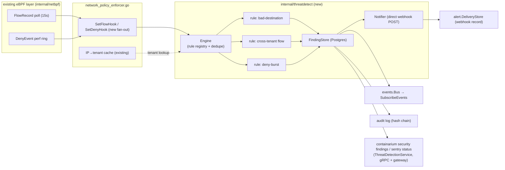

# Design: Continuous threat detection (security sentry)

**Date:** 2026-08-31
**Status:** proposed
**Stack:** protobuf/gRPC (grpc-gateway) + existing daemon; Go 1.24 (no new deployable, no new language)
**PRD:** `docs/product/continuous-threat-detection.md` — stories #1639 #1640 #1641 #1642 #1643

## Problem

The daemon already collects the signals that reveal abuse and tenant-fence
probing — eBPF per-flow records and typed deny events — but nothing
correlates or delivers them: deny events terminate in the audit log
(`internal/server/network_policy_enforcer.go`), flow records feed only the
traffic view, and no continuous loop evaluates either. This design adds a
rule-based detection engine inside the daemon that turns those streams
into typed, deduped, tamper-evident **security findings** delivered to the
event bus, the audit chain, a webhook, and a CLI. Detection-only: no
automated response in this phase.

## Design

One new Go package, `internal/threatdetect/`, wired into the existing
daemon. No new process, container, or language.



### Components

1. **Engine** (`internal/threatdetect/engine.go`) — receives flow batches
   and deny events via two hooks registered on the network-policy
   enforcer (same pattern as `Scanner.SetScanResultHook` →
   `auto_quarantine.go`, the one existing detect→act template). Fans each
   input to every registered `Rule`; a rule returns zero or more
   `RawFinding`s. The engine owns dedupe: an open finding is keyed by
   `(rule, tenant, subject)`; a repeat increments `count` and bumps
   `last_seen` instead of creating a new finding or re-alerting.
   Requires the eBPF object loaded but **not** `..._ENFORCE` — it works
   in observation mode. When eBPF is absent, `GetSentryStatus` reports
   `UNAVAILABLE` with the reason; it never silently reports "no
   findings". Enable flag: `CONTAINARIUM_THREAT_SENTRY=1` (off by
   default, consistent with the platform's opt-in convention; the fleet
   rollout note lives in the PRD).

2. **Rules** — one file each, all implementing:

   ```go
   type Rule interface {
       ID() pb.ThreatRuleId
       OnFlows(ctx RuleContext, flows []netbpf.FlowRecord) []RawFinding
       OnDeny(ctx RuleContext, ev netbpf.DenyEvent) []RawFinding
       Sweep(ctx RuleContext, now time.Time) []RawFinding // time-window rules
   }
   ```

   `RuleContext` exposes the enforcer's existing IP→tenant cache (already
   refreshed by the 10s reconcile loop) and the rule's stored config —
   rules never talk to Incus or the DB themselves, which keeps them
   pure and table-testable.

   - **bad-destination** (`rule_baddest.go`, #1641): matches flow dst IP
     against a merged matcher = embedded baseline list (`go:embed`ed
     versioned YAML, mining pools first) + operator additions persisted
     via `DaemonConfigStore`. Exact IPs in a map, CIDRs in a binary
     LPM trie. HIGH severity; subject = destination.
   - **cross-tenant flow** (`rule_crosstenant.go`, #1642): both src and
     dst IP resolve to containers with *different* tenant ids on this
     backend ⇒ CRITICAL. This is the continuous form of the one-shot
     `cmd/isolation-sentry` check.
   - **deny-burst** (`rule_denyburst.go`, #1642): per-tenant sliding
     window over deny events; ≥ N (default 20) within M minutes
     (default 5) ⇒ MEDIUM "fence probing". Window swept via `Sweep()`
     on a 30s tick. N and M operator-tunable via rule config.

3. **FindingStore** (`internal/threatdetect/store.go`) — Postgres table
   (schema below), created via the same `initSchema` idiom as
   `alert.DeliveryStore`. On every insert/update it (a) emits
   `EVENT_TYPE_SECURITY_FINDING` on the singleton `events.Bus`, and
   (b) writes an audit entry (category `security.finding`) through the
   existing audit logger, so findings ride the tamper-evident hash chain
   with zero new chain code. Without Postgres the store degrades to a
   bounded in-memory ring: events and audit entries still flow, CLI
   listing works for the current process lifetime, and `sentry status`
   reports `DEGRADED (no persistence)`.

4. **Notifier** (`internal/threatdetect/notifier.go`) — for MEDIUM+
   findings, POSTs the finding JSON **directly** to the configured
   webhook (`alert_webhook_url` + HMAC via `alert_webhook_secret`, both
   already persisted in `DaemonConfigStore`) and records every attempt in
   the existing `alert.DeliveryStore`. Deliberately bypasses the
   vmalert/alertmanager pipeline: that path requires the
   VictoriaMetrics core container and is metrics-shaped; a direct POST
   works on any backend, including minimal BYOC hosts. Bounded queue +
   retry with backoff; a dead webhook drops deliveries (recorded as
   failed) and never blocks the engine — delivery is downstream of
   persistence.

5. **API + CLI** — new `proto/containarium/v1/threatdetection.proto`
   (contract below), implemented in
   `internal/server/threatdetect_server.go`; cobra verbs in
   `internal/cmd/` calling the generated client (CLI-first); MCP tools
   in `internal/mcp/tools.go` as thin wrappers over the same client
   functions.

6. **Cloud shim (cloud repo, separate work)** — P0 is pass-through only:
   the shim forwards `ListFindings`/`GetSentryStatus` per backend, as it
   does for other OSS surfaces. Findings deliberately carry no
   cloud-org mapping in OSS; the shim maps tenant→org exactly as it does
   for containers. Aggregation UI is P1.

### Data flow (happy path and failure paths)

Flow poll (15s) → enforcer flow hook → engine → rules → new/updated
finding in store → {event bus, audit chain} synchronously, webhook
asynchronously → operator triages via `containarium security findings`.
Worst-case detection latency = 15s poll + one evaluation pass ≪ the 60s
budget in #1640; deny-burst adds ≤ 30s sweep granularity.

Failure paths: rule panic is recovered per-rule and surfaces in
`sentry status` (one broken rule never kills the engine or the
enforcer); Postgres down ⇒ degraded in-memory mode (above); webhook down
⇒ failed deliveries recorded, findings unaffected; eBPF not loaded ⇒
engine refuses to start and status says why.

### Data model

```sql
CREATE TABLE IF NOT EXISTS security_findings (
  id           BIGSERIAL PRIMARY KEY,
  rule         TEXT        NOT NULL,           -- pb.ThreatRuleId name
  severity     TEXT        NOT NULL,           -- pb.ThreatSeverity name
  tenant_id    TEXT        NOT NULL,
  container    TEXT        NOT NULL DEFAULT '',
  subject      TEXT        NOT NULL,           -- dedupe scope: dst IP / peer tenant / ''
  state        TEXT        NOT NULL DEFAULT 'open',  -- open | resolved
  count        BIGINT      NOT NULL DEFAULT 1,
  evidence     JSONB       NOT NULL,           -- marshaled typed Go struct, capped (last 10 flows / deny counts)
  first_seen   TIMESTAMPTZ NOT NULL,
  last_seen    TIMESTAMPTZ NOT NULL
);
CREATE UNIQUE INDEX IF NOT EXISTS security_findings_open_dedupe
  ON security_findings (rule, tenant_id, subject) WHERE state = 'open';
```

`evidence` is written by marshaling a named Go struct
(`threatdetect.Evidence`), never an ad-hoc map — the JSONB column is a
storage encoding, not a typing escape hatch.

## Language choices

| Component | Language | Why this one | Type gate in CI |
|-----------|----------|--------------|-----------------|
| `internal/threatdetect/` engine, rules, store, notifier | Go | Lives inside the existing Go daemon; consumes in-process eBPF structs; latency-sensitive hot path | `go build` + `go vet` (existing lanes) |
| proto contract + generated clients | protobuf → Go (+ TS/OpenAPI via existing `buf generate`) | Repo convention: one contract, three consumers | `make proto` drift = dirty tree in CI |
| CLI verbs + MCP wrappers | Go | CLI-first convention; wraps generated client | same as daemon |

No Python, no new TypeScript (no UI in MVP — the P1 cloud aggregation
view will consume the generated OpenAPI client like every other webui
surface).

## Contracts

**`proto/containarium/v1/threatdetection.proto`** (source of truth;
`make proto` generates Go server/client, gateway REST shim, swagger):

```proto
enum ThreatSeverity { THREAT_SEVERITY_UNSPECIFIED = 0; THREAT_SEVERITY_LOW = 1;
                      THREAT_SEVERITY_MEDIUM = 2; THREAT_SEVERITY_HIGH = 3;
                      THREAT_SEVERITY_CRITICAL = 4; }
enum ThreatRuleId   { THREAT_RULE_ID_UNSPECIFIED = 0; THREAT_RULE_ID_BAD_DESTINATION = 1;
                      THREAT_RULE_ID_CROSS_TENANT_FLOW = 2; THREAT_RULE_ID_DENY_BURST = 3; }

service ThreatDetectionService {
  rpc ListFindings(ListFindingsRequest) returns (ListFindingsResponse);          // GET  /v1/security/findings
  rpc ResolveFinding(ResolveFindingRequest) returns (ResolveFindingResponse);    // POST /v1/security/findings/{id}/resolve
  rpc GetSentryStatus(GetSentryStatusRequest) returns (GetSentryStatusResponse); // GET  /v1/security/sentry/status
  rpc ListBadDestinations(...) returns (...);                                    // GET  /v1/security/bad-destinations
  rpc AddBadDestination(...) returns (...);                                      // POST /v1/security/bad-destinations
  rpc RemoveBadDestination(...) returns (...);                                   // DELETE /v1/security/bad-destinations/{cidr}
  rpc UpdateThreatRuleConfig(...) returns (...);                                 // PATCH /v1/security/threat-rules/{rule}
}
```

`Finding` message mirrors the table; filters on `ListFindingsRequest`:
severity (enum, not string), tenant, since, state. `ListFindings` is
tenant-scoped by the existing RBAC interceptor; admin sees all.

**`events.proto`** — new enum value `EVENT_TYPE_SECURITY_FINDING = 50`
(next free range, 50-59 reserved for security) + `SecurityFindingEvent`
payload message carrying the `Finding`; emitted via a new
`Emitter.EmitSecurityFinding(*pb.Finding)` alongside the existing typed
emitters.

**Internal Go boundaries** — enforcer→engine hooks are typed
(`func([]netbpf.FlowRecord)`, `func(netbpf.DenyEvent)`); webhook payload
is a named struct with an HMAC-signed body (same signing scheme the
alert relay uses).

## Test strategy

| Component | Unit (table-driven) | Contract / integration | Real vs mocked |
|-----------|--------------------|------------------------|----------------|
| Engine + dedupe | `engine_test.go`: synthetic flow/deny sequences → expected finding set; dedupe cases (repeat ⇒ count++, no dup row, no re-alert); rule-panic isolation; disabled/no-eBPF ⇒ status UNAVAILABLE | wire-up test: enforcer hook fan-out fires engine on a fake flow batch | eBPF mocked (structs are plain Go); clock injected |
| bad-destination rule | exact-IP hit, CIDR hit, miss, operator-added entry, list reload | replay of the mining-incident flow shape (persistent TLS 5-tuple to a listed pool) ⇒ HIGH finding — the #1641 acceptance test | matcher real; list fixture pinned |
| cross-tenant rule | same-tenant flow ⇒ none; cross-tenant ⇒ CRITICAL; unknown IP ⇒ none (never guess) | e2e: two-org peers on one backend probe each other (reuses `cmd/isolation-sentry` scaffolding) ⇒ finding — the #1642 acceptance test | tenant cache faked in unit, real in e2e |
| deny-burst rule | N-1 denies ⇒ none; N ⇒ MEDIUM; window expiry resets; tunable N/M | covered by the same two-org e2e (denies accumulate when enforcement is on) | injected clock |
| FindingStore | upsert/dedupe SQL, state transitions, evidence cap | real Postgres in a container (existing integration lane); **audit-chain test: write findings, `VerifyChainSinceID` passes** — the #1639 acceptance test; restart ⇒ findings persist | real DB; degraded-mode path unit-tested with nil pool |
| Notifier | severity threshold, HMAC signature, retry/backoff, dead-webhook never blocks | httptest server asserting payload + `DeliveryStore` row recorded | real local HTTP server |
| Proto/API | — | generated-client round-trip for every RPC (gRPC and gateway REST); enum filters rejected as strings | generated clients only, never hand-rolled |
| CLI | flag→request mapping table | `security findings` / `sentry status` against a daemon fixture | generated client |

Type gate: `go vet` + `go build` + proto-drift check (regenerated tree
must be clean) in the existing required CI lanes.

## Deviations from the default stack

None. No new language, no new deployable, no new datastore. One
deliberate internal deviation: the Notifier bypasses the existing
vmalert/alertmanager pipeline (documented above — that path requires the
VictoriaMetrics core container; direct POST works on minimal backends).
It still reuses the same webhook URL/secret config and delivery-record
store, so operators configure alerting once.

## Rejected alternatives

- **Adopt an IDS (Falco/Tetragon/Suricata) per backend.** Real detection
  depth, but a heavy per-host dependency (kernel module/eBPF programs we
  don't own, rulesets to operate) for an MVP whose three rules need only
  data we already collect. Reconsider at P2 with measured precision data.
- **Express rules as vmalert alerts over exported metrics.** The alert
  stack exists, but exported metrics deliberately carry **no tenant
  labels** (golden-test invariant in the GCM exporter), the
  VictoriaMetrics container isn't guaranteed on BYOC hosts, and per-flow
  matching (dst IP against a list) isn't a metrics query. Wrong substrate.
- **A separate detection daemon/sidecar.** Cleaner failure isolation, but
  it would need its own access to the eBPF maps, the tenant cache, the
  audit chain, and the DB — four new contracts to keep in sync, versus
  two in-process hooks. Not justified at this scale; the per-rule panic
  isolation buys most of the safety.
- **Generic anomaly scoring from day one** (reusing
  `internal/modelgateway/anomaly.go`). Good prior art, but unfalsifiable
  precision before a baseline exists; PRD defers it to P2 deliberately.

## At 10x

10x containers per host: flow volume scales with flows, not containers —
the LRU is already 65536 entries; the engine is O(flows) per batch with
O(1) matcher lookups, headroom is fine. 10x backends: findings stay
per-backend; the cloud aggregation layer (P1) inherits the shim's
existing fan-out. The piece that would actually change: dedupe state
and deny-burst windows are in-memory per daemon — a daemon restart
reopens a still-live finding as new. Acceptable now (dedupe re-converges
in one window); at much larger scale, move window state into the store.
