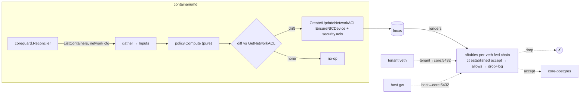

# Design: core-infra network guard (tenant → core-role isolation)

**Date:** 2026-09-27
**Status:** proposed
**Fixes:** the P0 findings in `docs/security/multi-tenant-isolation.md`
**Stack:** Go 1.26 only — no new language, no new deployable, one new read-only proto RPC

## Problem

Every backend host runs its platform services — `containarium-core-postgres`,
`containarium-core-victoriametrics` (VictoriaMetrics + Grafana),
`containarium-core-otelcollector`, `containarium-core-caddy`,
`containarium-core-security` — as LXCs on the **same Incus bridge as tenant
containers**, attached through the same default profile. Nothing at the
network layer distinguishes a tenant NIC from a core NIC, so a tenant can open
a TCP connection to any core listener. `scripts/tenant-core-infra-network-isolation-e2e.sh`
proves it on a live backend: `core-postgres:5432` and Grafana on
`core-victoriametrics:3000` both accept the connect.

The only controls in the way are application-layer: Postgres's role password
and `pg_hba.conf`, Grafana's login. The incident that surfaced this
(`docs/security/multi-tenant-isolation.md`) was exactly those controls failing
— a compiled-in default password and a `pg_hba` rule open to the whole bridge
— on every backend inspected. Fixing the credential closed that instance of
the hole; this design closes the class.

Two things make the existing per-org eBPF enforcer the wrong tool as-is:

1. It is keyed by tenant. `gather()` in `internal/server/network_policy_enforcer.go`
   derives a tenant from `user.containarium.tenant`, the `cloud_org_id`
   label, or a `-container` name suffix. Core containers have none of those,
   so they are **skipped and unmanaged** — despite comments in both
   `network_policy_enforcer.go` and `pkg/core/incus/client.go` saying they
   "stay tenant-isolated", and a unit test that passes only because it uses
   the fake name `core-postgres-container`. Tenant → core traffic is
   classified as *external* and allowed whenever the tenant's egress CIDRs
   cover the bridge (the default policy is `0.0.0.0/0`).
2. It only bites where it is armed (`CONTAINARIUM_NETWORK_POLICY_BPF_OBJECT`
   + `CONTAINARIUM_NETWORK_POLICY_ENFORCE`). Lab and BYOC hosts never arm it,
   and they run the same core services with the same exposure.

## Design

**The daemon owns one Incus network ACL per core container, attached to that
container's NIC, with ingress default-drop and an explicit, role-derived
allow-list. Egress stays default-allow.** The rules are computed from a typed
table of "who legitimately talks to this role on which port" plus the live
addresses of the host gateway, the control plane and the other core
containers, and are reconciled continuously so they follow IP changes.

This is enforced by nftables on the host side of each core container's veth
— outside any container namespace, so a privileged tenant container (which
is what tenants are today: `security.privileged: "true"`) cannot touch it.

### Why Incus NIC-level ACLs

Verified against the Incus 7.4 source the daemon already links
(`github.com/lxc/incus/v7 v7.4.0`) and the docs shipped with it:

- **Intra-bridge filtering works when the ACL is on the NIC device**, not
  the network. Bridge-level ACLs only filter at the bridge/host boundary
  (`doc/howto/network_acls.md`, "Bridge limitations"); NIC-level ACLs render
  into a per-veth `forward` chain and filter instance ↔ instance traffic,
  with `reject` converted to `drop`.
- **It is stateful.** The per-NIC chains put `ct state established,related
  accept` before any ACL rule (`drivers_nftables_templates.go`), so a core
  container's own outbound connections (apt, ACME, metrics export, Caddy →
  tenant upstreams) are unaffected by ingress default-drop.
- **Unmatched ingress defaults to drop** (`security.acls.default.ingress.action`,
  default `drop`) and can be logged (`security.acls.default.ingress.logged`),
  which gives rollout evidence for free.
- **Every backend can run it today.** All four reachable backends report
  `firewall: nftables` (required for bridge ACLs), Incus 7.1–7.4, and zero
  existing network ACLs — nothing to collide with.
- **The helpers exist.** `pkg/core/incus/acl.go` already wraps
  `CreateNetworkACL`/`UpdateNetworkACL`/`AttachACLToContainer` (used today
  for the per-user `acl-<username>` feature), and
  `coreStaticIPHostOffsets` in `core_services.go` already pins core-caddy to
  a deterministic IP (#240). This design generalises both.

Blast radius is five NICs per host — the core containers — not the 48+
tenant NICs. No tenant create path changes, no tenant retrofit.

### Components

All Go, all inside the existing `containariumd` binary.

| Component | Responsibility |
|-----------|----------------|
| `internal/coreguard/policy.go` (**pure**) | The role → listener table and `Compute(Inputs) (map[container]incus.ACLConfig, error)`. No I/O. |
| `internal/coreguard/reconciler.go` | Gather live inputs from `incus.Backend`, compute, diff against the ACLs Incus has, write only on drift, ensure each core NIC carries `security.acls` + default-action keys. Runs at startup, on container bus events, and every 60 s. |
| `internal/server/core_services.go` (change) | Extend `coreStaticIPHostOffsets` to every core role; give postgres/victoriametrics/security/otel an explicit instance-level `eth0` (today they inherit the profile's, which `AttachACLToContainer` cannot address). |
| `pkg/core/incus` (change) | Add `EnsureNICDevice`, `GetNetworkACL`, `UpdateNetworkACL`, `AttachACLToContainer` to the `Backend` interface (+ `UnavailableBackend` stubs) so the reconciler is testable against a fake. |
| `proto/containarium/v1/network.proto` (add) | `GetCoreGuardStatus` — read-only. |
| `internal/cmd/core_guard.go` + `internal/mcp/tools.go` | `containarium core-guard status`; MCP `core_guard_status` wraps the same client call. |

### The policy table

Sources are always one of: the host gateway `/32`, a specific core or
control-plane container `/32`, or the bridge CIDR (only where tenants are
*meant* to reach the port). `0.0.0.0/0` never appears as an ingress source.

| Core role | Port(s) | Allowed sources | Why |
|-----------|---------|-----------------|-----|
| `core-postgres` | tcp/5432 | host gateway; `core-victoriametrics` | daemon connection pool; Grafana's datastore. Matches the live `pg_stat_activity` client set observed during the incident. |
| `core-victoriametrics` | tcp/8428 (VM), 8880, 9093–9094 (alertmanager) | host gateway; `core-controlplane` (if present) | daemon + control plane write/query metrics |
| `core-victoriametrics` | tcp/3000 (Grafana) | host gateway; `core-caddy` | dashboards are fronted by Caddy; never tenants |
| `core-otelcollector` | tcp/4317, 4318 | **bridge CIDR** | tenants with `monitoring=true` push OTLP by design (`core_otel_collector.go`) |
| `core-otelcollector` | tcp/13133, 8888 | host gateway | health + self-metrics |
| `core-caddy` | tcp/80, 443 | **bridge CIDR** | the base domain resolves in-bridge (split-horizon dnsmasq); tenants and agent boxes reach the platform API through it |
| `core-caddy` | tcp/2019 | host gateway | Caddy admin API — **currently reachable from tenants**, which lets a tenant rewrite routes. Not exercised by the e2e script yet; added to its port table below. |
| `core-security` | — | none | no listeners; default-drop everything |
| `core-guacamole` | tcp/8080 | host gateway; `core-caddy` | fronted by Caddy |
| *unknown core role* | — | none | fail closed; status reports it so the table gets extended deliberately |

Per-NIC keys set alongside `security.acls`:
`security.acls.default.ingress.action=drop`,
`security.acls.default.ingress.logged=true`,
`security.acls.default.egress.action=allow`.

Egress is deliberately left open. Core services need outbound (package
installs, ACME, cloud metrics export, Caddy → tenant upstreams), and
constraining core egress is a separate concern with its own baseline work
(`/security-network`).

### Data flow

Failure paths:

- `ListContainers` fails → **no writes**; last-applied ACL stays in force
  (fail-safe toward "keep denying"). Status reports `stale_since`.
- A core container has no IPv4 yet (booting) → its rules are omitted from
  *other* containers' ACLs for that pass; re-rendered on the next event/tick.
  With static IPs (below) this is a startup-only window.
- Incus rejects an ACL write → logged, counted, retried next tick; the
  previously attached ACL keeps enforcing.
- Firewall driver is not `nftables` → reconciler refuses to attach, status
  reports `unsupported_firewall_driver`, daemon logs at startup. The
  operator is not left believing they are guarded.

### Static IPs for every core role

Rules reference core IPs as `/32`s, so churn in core IPs means churn in
ACLs. Extend `coreStaticIPHostOffsets` (currently caddy → `.241`) to:

| Container | Host offset |
|-----------|-------------|
| `containarium-core-caddy` | 241 (unchanged) |
| `containarium-core-postgres` | 242 |
| `containarium-core-victoriametrics` | 243 |
| `containarium-core-otelcollector` | 244 |
| `containarium-core-security` | 245 |
| `containarium-core-guacamole` | 246 |

Incus reserves a NIC's `ipv4.address` out of the DHCP pool, so these cannot
collide with a tenant lease going forward. On an existing host one of these
addresses may currently be held by a *dynamic* lease (any container's); the
static assignment is therefore applied only on core-container **create /
recreate** (exactly how #240 rolled out), never hot-swapped onto a running
container. The reconciler always renders rules from **live** addresses, so
correctness never depends on the pin — the pin only removes churn.

### Mode and rollout

`CONTAINARIUM_CORE_GUARD=off|enforce`, read once at startup like the other
enforcement guards (`internal/config/network.go`).

- **Release N:** ships with default `off`. Nothing changes on upgrade.
- **Spike on a lab host** (the only step that touches a real host before
  code is trusted): enable, run both e2e scripts (below), read the
  `default.ingress.logged` kernel log lines, and answer the one question the
  Incus source does not settle — whether adding an instance-level `eth0`
  override to a running container re-plugs the veth (brief connection drop)
  or is applied in place. Either answer is fine; it decides whether rollout
  is "any time" or "low-traffic window, Postgres clients reconnect".
- Enable host by host on the managed backends; each host is "done" when the
  negative script passes and the positive script passes.
- **Release N+1:** default flips to `enforce`. Fresh installs are guarded
  from first boot.

### Contracts

| Boundary | Contract | Source of truth | Generated |
|----------|----------|-----------------|-----------|
| CLI / MCP → daemon | `GetCoreGuardStatus` → `CoreGuardStatus{mode, firewall_driver, repeated CoreGuardEntry{container, role, ip, acl_name, attached, rules_applied, last_error}, stale_since}` | `proto/containarium/v1/network.proto`, `GET /v1/core-guard` | `pkg/pb`, `.pb.gw.go`, swagger, typed client (`make proto`) |
| reconciler → Incus | `api.NetworkACL` / `api.NetworkACLRule` (`Action`, `Source`, `Destination`, `Protocol`, `DestinationPort`, `State`) | Incus v7 `shared/api` | n/a (vendored types) |
| reconciler ↔ policy | `coreguard.Inputs{BridgeCIDR netip.Prefix, HostGateway netip.Addr, Core map[incus.Role]netip.Addr, ControlPlane []netip.Addr}` → `map[string]incus.ACLConfig` | `internal/coreguard/policy.go` | n/a (Go types; `netip`, not strings) |

`incus.ACLRule.State` is hard-wired to `"enabled"` in `convertRuleToAPI`
today; it stays that way — logging is done via the NIC default-action key,
not per-rule `logged` state.

### Language choices

| Component | Language | Why this one | Type gate in CI |
|-----------|----------|--------------|-----------------|
| all of the above | Go 1.26 | lives inside the daemon that already owns core-container lifecycle and links the Incus client | `go vet`, `go build ./...` (both tag sets), `golangci-lint` |

## Test strategy

Named before implementation; every one of these is an acceptance criterion
for `/engineer-implement`.

### `internal/coreguard/policy_test.go` (pure, table-driven)

- `TestCompute_RoleTable`: for each role, exact expected rule set given fixed
  inputs. Pins the table above; a change to the table is a change to this
  test, on purpose.
- `TestCompute_TenantCIDRNeverReachesDataPlane`: property over all roles —
  the bridge CIDR appears as a source **only** on `core-otelcollector`
  4317/4318 and `core-caddy` 80/443. Any other occurrence fails.
- `TestCompute_NoWildcardSources`: no rule's `Source` is `0.0.0.0/0`,
  `@internal`, `@external` or empty.
- `TestCompute_UnknownRoleFailsClosed`: an unrecognised core role yields an
  ACL with zero ingress rules and a status flag, never a permissive one.
- `TestCompute_MissingPeerOmitsRule`: no control-plane container → no CP
  rule on victoriametrics; no victoriametrics → postgres has only the host
  rule. No panics, no half-rendered rules.
- `TestCompute_RejectsBadInputs`: IPv6 bridge, gateway outside the bridge,
  core IP outside the bridge → error.
- **Mutation check** (done once, by hand, recorded in the PR): delete the
  `core-postgres` row from the table and confirm `TestCompute_RoleTable`
  fails.

### `internal/coreguard/reconciler_test.go` (fake `incus.Backend`)

Fake embeds `*incus.UnavailableBackend`, overrides only `ListContainers`,
`GetNetworkACL`, `CreateNetworkACL`, `UpdateNetworkACL`, `EnsureNICDevice`,
`AttachACLToContainer`, and counts every write.

- `TestReconcile_CreatesMissingACLsAndAttaches`
- `TestReconcile_IdempotentSecondPassWritesNothing` — the key
  property; write count must be exactly 0 on pass two.
- `TestReconcile_UpdatesOnlyOnDrift` — change one core IP, exactly the
  ACLs that reference it are updated, no others.
- `TestReconcile_ListErrorWritesNothing` — fail-safe.
- `TestReconcile_ModeOffWritesNothingButReportsStatus`.
- `TestReconcile_UnsupportedFirewallDriverRefuses`.
- `TestReconcile_CoreWithoutIPIsSkippedThisPass`.

### Contract

- `internal/server/core_guard_server_test.go`: `GetCoreGuardStatus` via the
  generated gRPC client and via the grpc-gateway REST path, asserting on
  typed fields (`resp.Entries[0].Attached`), never on a map.
- `internal/cmd/core_guard_test.go`: the cobra handler renders the typed
  response; MCP tool test asserts it calls the same client function.

### Integration / e2e (real host — the acceptance gate)

- `scripts/tenant-core-infra-network-isolation-e2e.sh` (exists, currently
  red) must go **green**. Extend its port table to: caddy 2019,
  victoriametrics 8428/8880/9093, otelcollector 13133/8888.
- New `scripts/core-guard-legit-flows-e2e.sh` (the positive path — a guard
  that breaks the platform is not a fix): host → postgres:5432 **ok**;
  victoriametrics → postgres:5432 **ok**; tenant → caddy:443 **ok**;
  tenant → otelcollector:4318 **ok**; tenant → postgres:5432 **drop**;
  tenant → victoriametrics:3000 **drop**; tenant → caddy:2019 **drop**;
  and a kernel-log line for each drop (proves `logged=true` works).
- Both scripts run in the lab-host spike before any managed backend is
  enabled, and again per host during rollout.

What is mocked vs real: the policy and reconciler are unit-tested against a
fake; nftables rendering is Incus's code and is exercised only on a real
host by the two scripts — there is no meaningful way to unit-test the
kernel's opinion.

## Deviations from the default stack

None. Go only, no new deployable, no Docker change, config via env.

## Follow-ups (separate issues, not in this design's critical path)

1. **eBPF enforcer, layer two.** Give core-role containers a reserved
   platform tenant id in `gather()` so tenant → core is a cross-tenant drop
   on armed hosts too — *after* adding a per-port allow map, because today
   an `ip_tenant` hit never consults any allow-list and this would sever
   tenant → caddy:443 and tenant → otel. Also replace
   `TestGather_ExcludesControlPlaneFromTenantTagging`'s fake
   `core-postgres-container` name with the real one so the test stops
   asserting something the code doesn't do.
2. **Application-layer companion, immediately:** Grafana
   `auth.anonymous.enabled=false`. Cheap, independent, and worth doing
   before the guard lands. (Caddy's admin API on `:2019` can *not* simply be
   bound to loopback — the daemon drives it over the bridge from the host
   gateway; the observed live client set is host-only. Closing it to
   tenants is the guard's job, via the host-gateway-only rule above.)
3. **Cloud isolation sentry:** add a tenant → core probe so the required CI
   gate also catches a regression of this boundary.

## Rejected alternatives

- **eBPF-only (tag core containers as a platform tenant).** Only protects
  hosts where the enforcer is armed; lab/BYOC hosts run the same exposure
  unarmed. Needs a C change (per-port allow map), a verifier round, and
  the `ebpf-load` lane. Kept as the follow-up second layer, not the fix.
- **ACLs on tenant NICs (egress deny toward core IPs).** Touches the tenant
  create path, needs a retrofit of every existing tenant NIC on every host,
  and — because NIC ACLs default-drop egress once attached — would force
  re-expressing tenant egress policy in ACL form, duplicating the eBPF
  egress model. Two competing egress policy systems is worse than none.
- **A dedicated bridge for core services.** The cleanest end state (and
  what "10×" looks like: core on its own L2, host-routed, ACL at the
  network level instead of per NIC). But it changes the IP plan, the
  split-horizon dnsmasq record, Caddy's upstream reachability and the
  `coreBridgeName` constant on every live host — a migration, not a fix for
  a live P0. Revisit once the guard is in and the e2e scripts exist to prove
  the migration didn't regress it.
- **Status quo, application-layer only (`pg_hba` + Grafana auth).** Already
  failed once, fleet-wide, and would fail the same way on the next
  credential mistake.
