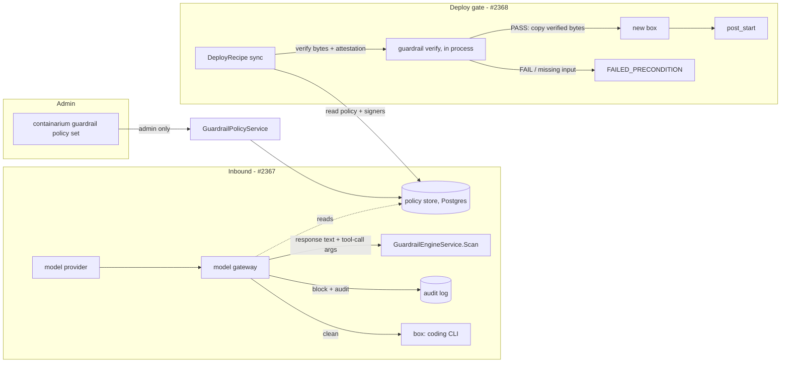

# Design: inbound guardrail scan at the model gateway, and a server-side guardrail policy

**Date:** 2026-10-07
**Status:** proposed
**Stack:** protobuf/gRPC (grpc-gateway) + Docker; Go only (no new language)
**Issues:** #2367 (inbound scan), #2368 (server-side, non-skippable policy). Sprint umbrella #2373, decisions Q10 and Q11.
**Builds on:** [`guardrail.md`](guardrail.md) (the local scan → redact → gate → attest flow).

## Problem

Today's guardrail is a local CLI flow for data going **out**: scan, redact,
gate, attest, verify. Two gaps remain.

1. **Nothing scans what comes back.** Text a model returns, and the tool
   calls a coding CLI executes from it, enter a box unchecked. The issue
   asked for the scan "in `internal/coderun`". That cannot work:
   `coderun` starts the coding CLI inside the box over ssh and tails its
   log. The CLI receives the model response and applies its own edits;
   no step hands the platform a diff to apply. The only platform component
   that handles model responses on their way into a box is the model
   gateway (`internal/modelgateway`).
2. **The policy is a local flag and the gate is optional.** `apply` takes
   `--policy` from whoever runs it, and `verify` runs only when a recipe
   author remembers to put it in `post_start`. Nothing on the server
   decides which policy counts, or refuses a deploy that skipped the check.

## Decisions taken (from the sprint's open questions)

| # | Decision |
| --- | --- |
| Q3 | On an inbound hit: **block** and write an audit entry. |
| Q6 | The server-side policy is writable by the existing **admin role only**. |
| Q10 | Enforce the inbound scan in the **model gateway**, failing **closed** for the new kinds. Split into two PRs (kinds and rules; enforcement and audit). `code run` reports whether a run's traffic is scanned. |
| Q11 | Admin-only policy service with Get/Set and a CLI. `verify` requires the attestation's policy hash to equal the server policy's. A typed `Recipe.guardrail_gate` is verified server-side by a synchronous `DeployRecipe` before `post_start`; async is refused. |
| Q1 | Kernel-level enforcement is out of scope (#2374). |

This doc adds four design points those decisions leave open. Each is
marked **(new)** where it appears: trusted signers, the tool-call
buffering rule, the dataset input to the gate, and the typed scan status.

## Trust-model change

Before: the **data owner** chooses the policy and holds the signing key; the
consumer trusts whatever public key it is handed.

After:

- The **platform admin** owns the policy. A data owner can still run
  `apply` locally, but only an attestation made under the server's policy
  hash is accepted by a gated deploy.
- **(new)** The verifier trusts **keys an admin registered**, never a key
  the deploy request carries. If the request supplied its own public key,
  anyone could sign their own input and pass. The server policy therefore
  holds a list of trusted signers (`key_id` + public key).
- The model gateway becomes an **enforcement point** with an availability
  cost: for tenants under a policy, an unreachable engine blocks model
  calls. That is the price of failing closed on a shared path.

This does **not** make the guardrail kernel-enforced. A box that holds its
own provider key can call the provider directly and skip the gateway; that
residual gap is #2374 and #2370 (see *Known gaps*).

## Design



### Components

| Component | Responsibility | Language |
| --- | --- | --- |
| `proto/containarium/v1/guardrail.proto` | New kinds; policy messages; `GuardrailPolicyService` | protobuf |
| `internal/guardrail` | Reference rules for the new kinds; typed block decision; hash and verify against a server policy | Go |
| `internal/guardrailpolicy` (new) | Policy store (get/set, revision) and the `PolicyProvider` interface the gateway and deploy path read | Go |
| `internal/server` (`guardrail_policy_server.go`) | gRPC + REST handlers, admin check | Go |
| `internal/modelgateway` | Inbound enforcement; audit sink | Go |
| `internal/server/recipe_server.go` | Gate step in `deploy`, before `post_start` | Go |
| `internal/cmd/guardrail.go`, `internal/cmd/code.go` | `guardrail policy get/set`; scan status in `code run` output | Go |
| `internal/mcp/tools.go` | Thin wrappers over the same client functions (no new transport) | Go |

## Part 1 — inbound scan (#2367)

### New finding kinds (PR A)

Add to `GuardrailKind`:

```proto
GUARDRAIL_KIND_UNSAFE_CODE = 3;       // e.g. download-and-execute, destructive shell, credential exfiltration shapes
GUARDRAIL_KIND_PROMPT_INJECTION = 4;  // instruction-override signatures embedded in returned content
```

The existing `Scan` RPC is reused unchanged: only the kinds are new. The
reference engine gains a small set of signature rules for each, and says so
on stderr like it does today (it is a starting point, not a detector to rely
on). An engine that cannot scan a requested kind already answers
`FAILED_PRECONDITION`; that behaviour is what makes the gateway fail closed.

A typed block decision in `internal/guardrail`:

```go
type InboundDecision struct {
    Blocked  bool
    Kinds    []pb.GuardrailKind // kinds with at least one finding, sorted
    Findings int
    Gaps     int
    EngineID string
    Reason   InboundReason // typed enum below
}

type InboundReason int
const (
    InboundReasonClean InboundReason = iota
    InboundReasonFinding            // a BLOCK-action kind matched
    InboundReasonCoverageGap        // engine could not scan a unit
    InboundReasonEngineError        // unreachable, timeout, or unsupported kind
)
```

`Findings`/`Gaps` are counts, never text. The decision never carries the
flagged span.

### Enforcement in the gateway (PR B)

A response is **scanned** when the server policy has at least one rule with
action BLOCK for an inbound kind. No such rule means the gateway behaves
exactly as today (this keeps existing deployments unchanged until an admin
opts in).

What gets scanned. **(new)** A coding CLI writes into a box through **tool
calls** (edit, write, shell), not through assistant prose. The scan units
are therefore:

- assistant text content, and
- every tool call's name and **argument string**, after the arguments are
  reassembled across streamed chunks.

Buffering rule. **(new)** A blocked response must never have been partially
delivered, so in scanned mode the gateway holds back:

- **Non-streaming JSON:** the whole body is already read in
  `ModifyResponse`; scan before restoring it.
- **Streaming (SSE):** text chunks may flow through a bounded hold-back
  window only if the window covers the longest signature; tool-call chunks
  are **held until that tool call's arguments are complete**, then scanned
  and released together. The simplest correct first cut, and the one this
  design specifies, is to hold the whole assistant message until
  `finish_reason`, scan it once, then flush or block. It costs time to
  first token for scanned tenants only; a windowed refinement is a later
  optimisation, not part of the contract.

On a block the gateway:

1. delivers **no** model output for that response (a typed error body,
   HTTP 502-class for non-streaming; for a stream that has not started, the
   same error before any event; the stream is never half-opened),
2. writes an audit entry (below),
3. increments a counter labelled by kind.

Fail-closed scope, stated precisely:

| Condition | Result |
| --- | --- |
| Policy has no inbound BLOCK rule | Passes through, unchanged |
| Finding of a BLOCK kind | Blocked |
| Engine reports a coverage gap | Blocked (`CoverageGap`) |
| Engine unreachable / times out / does not support a requested kind | Blocked (`EngineError`) |
| Response is compressed or an unrecognised content type | **Blocked** in scanned mode. Today these pass through unmetered; an unscannable body cannot be allowed through a gate that claims to scan |
| Existing prompt-leak output filter | Unchanged: still fail-open. The new scan does not touch it |

There is no "fail open" switch. The break-glass for an engine outage is an
admin clearing the inbound rules, which is itself an audited `Set`.

### Audit entry

Written through a new, optional gateway interface so the gateway keeps no
dependency on `internal/audit`:

```go
type InboundAuditSink interface {
    RecordInboundBlock(ctx context.Context, b InboundBlock) error
}

type InboundBlock struct {
    Tenant, SkillID, Provider, Model string
    Reason   guardrail.InboundReason
    Kinds    []pb.GuardrailKind
    Findings int
    EngineID string
    PolicyRevision int64
}
```

The daemon adapts it onto `audit.Store.Log` with action
`guardrail.inbound.block`, resource type `model-gateway-response`, and a
`Detail` of kind names and counts. **No flagged text, no response body.** If
the audit write fails, the response is still blocked and the failure is
logged and counted: blocking must not depend on the audit store being up.

### Scanned or not, made visible **(new)**

Runs on the tenant's own provider key bypass the gateway, so they cannot be
scanned. `code run` (and its status) reports this as a typed field rather
than letting "no alert" read as "clean":

```proto
enum CodeModelTrafficScanning {
  CODE_MODEL_TRAFFIC_SCANNING_UNSPECIFIED = 0;
  CODE_MODEL_TRAFFIC_SCANNING_SCANNED = 1;              // gateway credential, inbound policy active
  CODE_MODEL_TRAFFIC_SCANNING_UNSCANNED_NO_POLICY = 2;  // gateway credential, no inbound rule
  CODE_MODEL_TRAFFIC_SCANNING_UNSCANNED_TENANT_KEY = 3; // tenant's own key, traffic does not cross the gateway
}
```

The value is derived from the credential source `coderun` already knows
plus the current policy; it is computed once at run start and printed by the
CLI.

## Part 2 — server-side policy and the deploy gate (#2368)

### Policy service

New in `guardrail.proto`:

```proto
message GuardrailTrustedSigner {
  string key_id = 1;        // SHA-256 of the public key, hex (matches GuardrailAttestation.key_id)
  bytes  public_key = 2;    // ed25519
  string label = 3;         // reviewer-readable, no personal data
}

message ServerGuardrailPolicy {
  GuardrailPolicy policy = 1;                       // the rules; THIS is what policy_hash covers
  repeated GuardrailTrustedSigner trusted_signers = 2;
  int64 revision = 3;                               // server-assigned, monotonic
  google.protobuf.Timestamp updated_at = 4;
  string updated_by = 5;                            // authenticated subject
}

service GuardrailPolicyService {
  rpc GetGuardrailPolicy(GetGuardrailPolicyRequest) returns (GetGuardrailPolicyResponse) {
    option (google.api.http) = { get: "/v1/guardrail/policy" };
  }
  rpc SetGuardrailPolicy(SetGuardrailPolicyRequest) returns (SetGuardrailPolicyResponse) {
    option (google.api.http) = { put: "/v1/guardrail/policy" body: "*" };
  }
}
```

`policy_hash` stays the hash of the inner `GuardrailPolicy` only, so
rotating a trusted signer does not invalidate every attestation ever made.

Authorization: `Get` needs any authenticated caller (a data owner needs the
policy to run `apply` against it); `Set` needs `auth.RoleAdmin`, checked the
same way the other admin-only servers check it, and answers
`PERMISSION_DENIED` otherwise. Every `Set` writes an audit entry
(`guardrail.policy.set`, old and new revision and hash, not the key bytes).

`Set` validates before storing: every rule has a kind and an action that are
not `UNSPECIFIED`; no duplicate kind; `max_residual >= 0`; every signer's
`key_id` equals the hash of its `public_key`. An invalid policy is
`INVALID_ARGUMENT` and the stored policy is untouched.

Storage: one row (a singleton with a monotonic revision) in Postgres,
following the existing per-package `store.go` pattern. A daemon with no
database has no server policy, and every consumer treats that as "no policy"
(inbound scan off, no gate), which is today's behaviour.

### CLI

```
containarium guardrail policy get [--json]
containarium guardrail policy set --file policy.json
```

The CLI is the canonical interface and the MCP tools are thin wrappers over
the same client functions. `guardrail apply` fetches the server's policy
when it can reach the daemon. `--policy` is **refused unless it hashes to
the server's policy**: a local policy can no longer weaken the gate
silently. With no reachable daemon the existing local behaviour is kept and
the CLI says on stderr that the result is not server-attested.

`verify` gains the server check: it requires the attestation's
`policy_hash` to equal the server policy's hash and the signer's `key_id` to
be in `trusted_signers`. Offline `verify` keeps working with an explicit
`--public-key`, and prints that the result is not server-trusted.

### The gate **(new: dataset input)**

`DeployRecipeRequest` has no way to supply a dataset, and a freshly created
box is empty, so a gate cannot verify "a dataset in the box". The design:

```proto
message GuardrailGate {
  // Where the verified bytes are placed in the new box before post_start.
  string dataset_path = 1;
  // Kinds the attestation must have covered, in addition to the server
  // policy's own. Enum, not strings.
  repeated GuardrailKind require_kinds = 2;
}
// on Recipe:
GuardrailGate guardrail_gate = N;          // when set, the deploy is gated

// on DeployRecipeRequest:
GuardrailGateInput guardrail_input = M;    // the dataset to check
message GuardrailGateInput {
  string staging_ref = 1;                  // a directory on the daemon host's staging area
  GuardrailAttestation attestation = 2;
}
```

Order inside `deploy`, for a recipe with `guardrail_gate` set:

1. **Refuse async** with `FAILED_PRECONDITION` before anything is created.
2. **Refuse if there is no server policy or no trusted signer**
   (`FAILED_PRECONDITION`, message names which). A gate with nothing to
   check against must not pass.
3. **Refuse if `guardrail_input` is absent.** Leaving the field out does not
   bypass the gate: the recipe, not the caller, decides whether a gate
   applies.
4. Verify **before creating the container**, in process: signature against a
   trusted signer, `policy_hash` equal to the server's, verdict PASS,
   `kinds_scanned` covering the policy's and `require_kinds`, and the digest
   recomputed over the staged bytes. Any failure is `FAILED_PRECONDITION`
   and **no box is created**, so a refused deploy leaves nothing behind.
5. Copy exactly the bytes that were hashed into the new box at
   `dataset_path` (read-only is a recipe concern, see *Known gaps*), from a
   single snapshot taken during verification, so the verified bytes and the
   delivered bytes cannot differ.
6. Run `post_start`.

Verifying before creation, rather than after, is deliberate: the existing
failure mode for a gated `post_start` is a box that exists with a workload
that never started.

## Contracts

| Boundary | Source of truth | Generated |
| --- | --- | --- |
| Engine plug point | `GuardrailEngineService.Scan` (unchanged; two new enum values) | Go client/server stubs |
| Policy API | `GuardrailPolicyService` in `guardrail.proto` with `google.api.http` | Go stubs, grpc-gateway shim, OpenAPI, typed client in `internal/client/{grpc.go,http.go}` |
| Recipe gate | `Recipe.guardrail_gate`, `DeployRecipeRequest.guardrail_input` in `recipe.proto` | as above |
| Scan status | `CodeModelTrafficScanning` in the code-run proto | as above |
| Gateway audit | `InboundAuditSink` (Go interface, in-process) | none; a wire type is not needed |

All through `make proto`; nothing generated is edited by hand. The block
reason and the scan status are enums, not strings.

## Delivery plan

Each is one reviewable PR; the order is the dependency order.

| PR | Scope | Issue | Needs |
| --- | --- | --- | --- |
| A | New kinds, reference rules, `InboundDecision` | #2367 | nothing |
| B1 | `GuardrailPolicyService`, store, admin check, CLI `policy get/set`, MCP wrapper | #2368 | nothing |
| B2 | Gateway enforcement, buffering, audit sink, scan-status field | #2367 | A, B1 (`PolicyProvider`) |
| C | `apply`/`verify` server-policy checks, `GuardrailGate`, deploy gate | #2368 | B1 |

A and B1 can run in parallel.

## Language choices

| Component | Language | Why this one | Type gate in CI |
| --- | --- | --- | --- |
| Every component above | Go | The repo's services, CLI and gateway are Go; nothing here needs another ecosystem | `go vet`, `go build`, existing lint |

## Test strategy

Tests are named before implementation; table-driven in Go.

**`internal/guardrail` (PR A)**
- `TestReferenceEngine_NewKinds`: each new signature rule matches its
  positive fixtures and not its hard negatives (ordinary shell, a README that
  discusses injection).
- `TestScan_UnsupportedKind_FailedPrecondition`: an engine without a kind
  rejects the request rather than scanning the rest.
- `TestInboundDecision`: findings, gaps, engine error and clean map to the
  right `InboundReason`; the decision type has no field that can hold text
  (checked by reflection so a future field fails the test).

**`internal/guardrailpolicy` and the server (PR B1)**
- `TestSetPolicy_AdminOnly`: admin succeeds; a non-admin gets
  `PERMISSION_DENIED`; an unauthenticated caller is rejected.
- `TestSetPolicy_Validation`: table of invalid policies (unspecified kind,
  duplicate kind, negative residual, signer whose `key_id` does not match its
  key) each give `INVALID_ARGUMENT` and leave the stored revision unchanged.
- `TestSetPolicy_RevisionMonotonic` and an audit-entry test that asserts the
  entry carries hashes and revisions and no key bytes.
- Integration (real Postgres in a container): set/get round trip, restart
  keeps the revision.
- Contract test: REST `PUT/GET /v1/guardrail/policy` through the generated
  gateway agrees with the gRPC result.

**Gateway (PR B2)**, extending the existing `gateway_test.go` harness with a
fake engine
- Table: for **non-streaming** and **streaming**, and for **text** and
  **tool-call arguments**, a hit is blocked and **zero bytes of model output
  reach the client**. The streaming rows assert nothing was written before
  the block.
- Tool-call arguments split across several chunks are reassembled before the
  scan (a signature straddling a chunk boundary is still caught).
- Fail-closed rows: engine error, timeout, unsupported kind, coverage gap,
  and a compressed body each block when a BLOCK rule is active, and each
  pass through unchanged when no rule is active.
- The existing prompt-leak filter tests pass unchanged (still fail-open).
- A failing audit sink still blocks.
- Audit assertion: the recorded `InboundBlock` has kinds and counts and the
  fixture's flagged string appears nowhere in it or in logs.
- `code run` scan-status: three rows, one per enum value.

**Gate (PR C)**
- `TestDeployGate`: async refused; no server policy refused; no signer
  refused; missing `guardrail_input` refused; wrong `policy_hash`, untrusted
  signer, FAIL verdict, uncovered kind, and a tampered byte (digest
  mismatch) each refused. In every refusal case **no container is created**
  (assert on the fake container backend).
- A passing case: the bytes in the box equal the verified bytes, and
  `post_start` runs after.
- A property test: mutating a staged file between verification and copy
  cannot change what is delivered (the copy is from the verification
  snapshot).
- `apply --policy` refused when its hash differs from the server's; accepted
  when equal.

**Real vs mocked:** real Postgres for the store; a fake engine and a fake
provider for the gateway (the response shapes are the real provider shapes
from the existing fixtures); a fake container backend for the gate.

## Known gaps

| Gap | Why it stays | What closes it |
| --- | --- | --- |
| **Tenant-key runs are unscanned** | Their model traffic goes straight to the provider; nothing on the platform sees it. `code run` now says so instead of staying silent | #2370 / #2374 forcing the traffic through the gateway; a TLS-intercepting proxy was rejected (below) |
| **A box can skip the gateway** with a key of its own | The gateway is an enforcement point, not a kernel boundary | #2374 (kernel-level enforcement) and #2370 |
| **Datasets `post_start` downloads itself** get past the gate | The gate checks what the deploy request stages, not what the workload later fetches | The `ship` verb and a recipe convention that forbids fetching data after the gate (an open item in `guardrail.md`) |
| **No platform path to stage a dataset on the daemon host** | `staging_ref` assumes an operator or `ship` put it there; a remote control plane cannot yet | The `ship` verb |
| **Dataset read-only in the box** | Recipes have no read-only mount field | A typed recipe field, separate change |
| **Reference engine is not a production detector** | Unchanged from `guardrail.md` | A production engine behind the same `Scan` contract |
| **Gateway availability for scanned tenants** | Fail-closed is the decision (Q10) | Engine redundancy; the audited break-glass is clearing the inbound rules |

## What would change at 10x

- Holding the whole assistant message until `finish_reason` becomes the
  latency cost. Move to the windowed hold-back for text and per-tool-call
  release, behind the same decision type, once the signature set is stable
  enough to bound the window.
- One singleton policy becomes per-tenant policy with a cluster default
  (the schema leaves room: add a tenant key to the row and a field to the
  Get request). Not built now; no requirement for it.
- Scan latency per response is bounded by one engine round trip; at volume,
  batch or cache by response hash.

## Deviations from the default stack

None.

## Rejected alternatives

1. **Scan in `internal/coderun`** (the issue's original wording). `coderun`
   never holds the model output: the coding CLI inside the box receives it
   and applies edits itself. There is no step at which `coderun` could scan
   "before it is written into the box". Making it possible means the
   platform would own the edit-apply loop, a change to how every coding
   engine runs, which is far larger than the gap it closes.
2. **TLS-intercepting proxy to scan tenant-key traffic.** It would reach the
   runs the gateway cannot, but it requires a platform CA trusted inside
   every box, breaks certificate pinning in provider SDKs, and turns the
   platform into a reader of traffic that carries the tenant's own provider
   key. The cost to tenant trust is higher than the coverage it buys; the
   typed `UNSCANNED_TENANT_KEY` status is the honest alternative.
3. **Take the verification key from the deploy request.** Simpler, and
   useless: the caller could sign their own input. Hence admin-registered
   trusted signers.
4. **Run `guardrail verify` inside `post_start`** (today's mechanism). It
   leaves a box behind on failure, only logs on async deploys, and depends
   on the recipe author remembering the line. The typed field, checked
   before creation, removes all three.
