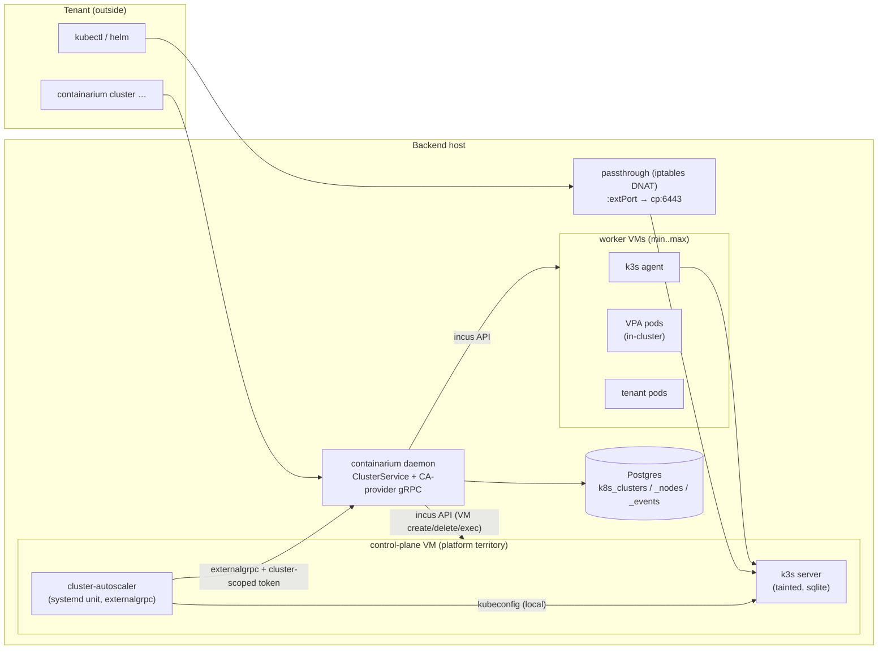

# Design: Managed Kubernetes clusters on Containarium VMs

**Date:** 2026-08-17
**Status:** proposed
**Stack:** protobuf/gRPC (grpc-gateway) + Go (daemon-side, no new languages); k3s (pinned) inside Incus VMs; upstream cluster-autoscaler + VPA
**PRD:** [`docs/product/managed-k8s-clusters.md`](../product/managed-k8s-clusters.md) (PR #1412)

## Problem

The PRD commits to: a tenant runs `containarium cluster create`, gets a
kubeconfig in ≤10 min, and never operates a control plane or sizes a
node — worker nodes are Containarium VMs added on pending pods and
removed when idle; pod resources right-size via VPA. This doc settles
the PRD's open technical questions (distribution, node-provisioning
path, control-plane placement, autoscaler wiring, credential shapes)
into one buildable design.

## Design

### Topology

Trust boundaries, explicitly:

- **The control-plane VM is platform territory.** No tenant SSH route,
  not listed in the tenant's `containarium list`, and the k3s server
  node is tainted (`node-role.kubernetes.io/control-plane:NoSchedule`)
  so tenant pods never land on it. The cluster-autoscaler binary and
  its platform credential live here as a systemd unit — *outside* the
  Kubernetes API surface the tenant controls. A tenant with
  cluster-admin can read every in-cluster Secret and exec into every
  pod; therefore **no platform credential ever exists as a Kubernetes
  object**.
- **Worker VMs are tenant-workload territory** with a kernel boundary
  (Incus VM, not LXC) between the tenant's cluster and the host.
- **The CA's platform credential is minimal**: a per-cluster machine
  token whose only scope is `clusters:scale` and whose subject is the
  cluster identity — it can resize its own node pool within
  server-enforced min/max and nothing else.

### Distribution: k3s, pinned

k3s over kubeadm/k0s (see Rejected alternatives): single static binary
(one artifact to place in a VM), embedded sqlite datastore (single
server — the MVP has no HA claim), built-in containerd, CNCF-conformant,
and an auto-apply manifests directory
(`/var/lib/rancher/k3s/server/manifests/`) that gives us add-on
installation (VPA) with zero extra machinery. Precedent in-tree: the
kubeflow recipe already runs k3s.

Version and checksum are pinned in code
(`pkg/core/cluster/artifacts.go`: `K3sVersion`, `K3sSHA256`,
`VPAManifestSHA256`, `CAVersion`, `CASHA256`) and golden-tested — the
billed/attack surface a release ships is reviewable in one file, same
rule as the metrics-export allowlist.

Artifacts (k3s binary, CA binary, VPA manifests, airgap image tarball)
are cached on the backend host under
`/var/lib/containarium/artifacts/k8s/<version>/`, fetched-and-verified
on first use by the daemon. Cluster create never downloads inside the
VM; everything enters the guest via `incus file push`.

### Create flow

1. `CreateCluster` handler: `RequireScope(clusters:write)` →
   `AuthorizeTenant` → validate `ClusterSpec` (typed sizes, min ≤ max,
   caps vs daemon config) → `admitCPUCapacity` for control-plane +
   `nodes_min` workers → probe VM capability (fail fast with a typed
   error if the host cannot run Incus VMs) → insert `k8s_clusters` row
   in state `PROVISIONING` → return; the reconciler does the rest
   asynchronously (create is not a 10-minute-blocking RPC).
2. Reconciler provisions the control-plane VM via the existing
   incus-client seam, the same shape `provisionWindowsVM` proved:
   `CreateContainer{InstanceType: VM}` → `StartContainer` →
   `WaitForNetwork` → `WriteFile`/`Exec` in-guest bootstrap (push k3s
   binary + rendered install script; start `k3s server --disable
   traefik --node-taint ... --tls-san <external endpoint>`; install CA
   unit + its token file 0600; drop pinned VPA manifests into the
   auto-apply dir).
3. Publish the API endpoint: allocate an external port from the
   configured range and create a durable passthrough route
   (`AddPassthroughRoute` invoked with `auth.ContextWithSystemIdentity`)
   `:extPort → <cp VM IP>:6443/tcp` — Postgres-backed, reapplied by the
   existing passthrough sync job across daemon restarts.
4. Provision each node group's `min_nodes` worker VMs: same VM path;
   bootstrap = push k3s
   binary + join script (server URL + node token read from the
   control-plane VM at provision time, pushed 0600, never stored in
   Postgres).
5. When the k3s API reports all expected nodes `Ready` (checked via a
   `client-go` client built from the admin kubeconfig — the
   `clientcmd`-driven construction `pkg/core/box/k8s` already uses),
   flip the cluster row to `READY`.

Failure path: any step that errors moves the row to `ERROR` with a
reason string surfaced by `GetCluster`; the reconciler retries with
backoff; `DeleteCluster` from any state tears down VMs, passthrough
route, rows, and minted tokens.

### Scale flow (the loop that must not be bespoke)

- **Up:** pods Pending → in-VM cluster-autoscaler (upstream binary,
  `--cloud-provider=externalgrpc`) fit-simulates each advertised node
  group (small/medium/large templates) and expands the one whose
  template fits the pending pods — so a pod whose VPA-raised request
  outgrew the small template lands on a new larger node instead of a
  refusal → the shim handler checks token scope + cluster ownership +
  that group's `max_nodes` + `admitCPUCapacity` → provisions one worker
  VM of that class (target ≤ ~90 s to `Ready`: VM boot + pushed binary,
  no in-guest downloads) → CA sees the node join.
- **Down:** CA decides a node is surplus (its own utilization logic,
  not ours), drains it via the K8s API, then calls `DeleteNodes` →
  daemon deletes the VM and marks the `k8s_cluster_nodes` row.
- **Refusals are loud:** a scale-up beyond `nodes_max` or past the CPU
  admission gate returns a typed gRPC error; the daemon records it in
  `k8s_cluster_events` so `cluster status` shows *why* the cluster
  stopped growing (PRD Story 5: refused, not silently clamped).
- **Pod vertical:** upstream VPA in `InPlaceOrRecreate` mode, shipped
  via the manifests dir. No daemon involvement; the composition with
  node scale-up (resized pod no longer fits → Pending → CA) is exactly
  the upstream contract and is covered by the e2e, not by custom code.

### Who decides what (decision ownership)

| Decision | Owner | Signal (and its currency) |
|---|---|---|
| Grow/shrink a pod's resources | VPA (upstream, in-cluster) | observed usage, converted into the pod's *requests* |
| Add a node, and at which size | cluster-autoscaler (upstream, on the CP VM) | Pending pods + fit simulation against the advertised size-class templates — never node utilization |
| Remove a node | cluster-autoscaler | sustained low commitment (requests/allocatable) with all pods relocatable |
| Refuse any of the above | daemon | per-group `min/max_nodes`, `CONTAINARIUM_CLUSTER_MAX_*`, and the host CPU-admission gate — every refusal recorded as a `ScaleEvent` |

Two ratios, two jobs. The **node commitment ratio** (Σ pod requests /
node allocatable — the scheduler's currency) is what creates and
resolves scaling pressure. The **host overcommit ratio** (committed
cores / physical cores — already computed by `admitCPURequest` and
`PickLeastCommittedInPool`) bounds what any scale-up may consume.
Measured utilization triggers no scale-up anywhere in the system:
Kubernetes schedules on requests, and VPA is the single component
licensed to turn usage into requests.

**Deferred (P2) — in-place node grow.** Mechanically feasible: Incus
grows a running VM's CPU (hotplug) and memory (grow-only), and a
k3s-agent restart — not a VM reboot; pods keep running — re-registers
the node at its new capacity. Deferred until the size classes prove
insufficient (e.g. a host with room to grow VMs but not to add them).
If promoted, the trigger is the same two ratios — a
commitment-saturated node whose Pending pods would fit if it grew,
admitted by the host overcommit gate — with guards: grow-only, capped
at the largest size class, anti-thrash window, and a node annotation so
the autoscaler doesn't drain a just-grown node. Never usage-triggered.

### Components

| Component | Responsibility |
|---|---|
| `proto/containarium/v1/cluster.proto` | `ClusterService` contract: Create/List/Get/Delete cluster, `GetClusterKubeconfig`, `UpdateClusterNodePool`, `GetClusterStatus`. Enums `ClusterState`, `ClusterNodeRole`; node pool as `repeated NodeGroup{name, size ResourceLimits, min_nodes, max_nodes}` — typed size classes (platform presets small/medium/large) rather than one fixed template, so the autoscaler can pick the node size that fits pending pods; `ScaleEvent`. REST via `google.api.http` + openapiv2 annotations, house style. |
| `proto/thirdparty/externalgrpc/` | Vendored copy of the upstream cluster-autoscaler `externalgrpc` provider proto (generated via buf like everything else). The daemon implements the server side; the contract test compiles the *client* side from the same file. |
| `pkg/core/cluster/` | The core. `spec.go` (typed specs, `Validate`, naming), `bootstrap.go` (pure renderers for server/agent/CA-unit scripts — golden-tested), `reconcile.go` (pure `Decide(desired, observed) []Action` — the autosleep `decide.go` house pattern), `manager.go` (drives the incus client + k8s readiness checks), `artifacts.go` (pins + fetch-and-verify). No pb imports; runtime-neutral types like `pkg/core/box`. |
| `internal/cluster/store.go` | pgxpool store, `CREATE TABLE IF NOT EXISTS` in constructor (house pattern): `k8s_clusters`, `k8s_cluster_nodes`, `k8s_cluster_events`. |
| `internal/server/cluster_server.go` | gRPC handlers: per-handler `RequireScope`/`AuthorizeTenant`, caps, admission; registration = one line in `dual_server.go` + one in `gateway.go`. |
| `internal/server/ca_provider_server.go` | externalgrpc `CloudProvider` server: one node group per size class per cluster, each advertising its truthful template (CPU/memory) and `min/max_nodes`; `IncreaseSize`/`DeleteNodes`/`TargetSize` mapped onto `pkg/core/cluster` ops; authenticated by the `clusters:scale` machine token. |
| `internal/cmd/cluster.go` | Cobra group `containarium cluster {create,list,get,delete,kubeconfig,status,node-pool}` calling the generated client; MCP tool in `internal/mcp/tools.go` thin-wraps the same client function (CLI-first per CLAUDE.md). |

### Naming, labels, configuration

- VM names: `<tenant>-k8s-<cluster>-cp`,
  `<tenant>-k8s-<cluster>-<group>-<N>` (e.g. `…-small-1`).
- Labels: `user.containarium.cluster=<name>`,
  `user.containarium.cluster_role=control-plane|worker`,
  `user.containarium.node_group=<group>`,
  `user.containarium.workload_class=k8s-node` (composes with the
  existing capacity-policy workload-class exclusions), owner-tenant
  label. Tenant-facing `containarium list` filters these out; operator
  tooling sees them attributed (PRD Story 5).
- Daemon config (env, namespaced to avoid the existing box-backend
  `CONTAINARIUM_K8S_*` space): `CONTAINARIUM_CLUSTER_ENABLED`,
  `CONTAINARIUM_CLUSTER_PORT_RANGE` (external API ports),
  `CONTAINARIUM_CLUSTER_MAX_NODES`, `CONTAINARIUM_CLUSTER_MAX_NODE_SIZE`
  — the server-side caps behind Story 5.
- Placement, MVP: all of a cluster's VMs on one backend host, chosen by
  the existing `resolvePoolPlacement` local-first logic. Workers count
  against the CPU admission gate like any container.

### Credentials (each one named, none stored loosely)

| Credential | Lives where | Scope | Persisted? |
|---|---|---|---|
| Tenant kubeconfig | k3s server VM (`/etc/rancher/k3s/k3s.yaml`) | cluster-admin of that cluster | **No** — `GetClusterKubeconfig` reads it via `Exec` on demand and rewrites the server URL to the external endpoint. Never in Postgres. |
| k3s node join token | server VM; pushed to workers 0600 at provision | join this cluster | No |
| CA machine token | control-plane VM file 0600, systemd-loaded | `clusters:scale`, subject = cluster id | Minted by `TokenManager.GenerateAccessToken`; daemon reconciler re-mints and re-pushes before expiry (the `serviceTokenSource` renewal shape, applied across the VM boundary). Revoked on cluster delete. |
| `_system` identity | in-process only | internal RPC reuse (passthrough route) | n/a |

## Language choices

| Component | Language | Why this one | Type gate in CI |
|-----------|----------|--------------|-----------------|
| All daemon-side components above | Go | Extends the existing single-language daemon; concurrency (reconciler) and the incus/pgx/client-go seams are all Go | `go vet` + `go build`, `buf lint`/`buf breaking` |
| In-guest bootstrap scripts | rendered shell | Only language available at VM first-boot; contained: generated by Go templates in `bootstrap.go`, golden-tested, never hand-edited in place | golden tests pin rendered output |
| Autoscaling logic | none (upstream binaries) | cluster-autoscaler + VPA are consumed as pinned artifacts, not linked as Go deps — "inherit, don't invent" | checksum pins + contract test |

No new language lanes. The `k8s.io/client-go` dependency already exists
(v0.36.x, used by `pkg/core/box/k8s`).

## Contracts

| Boundary | Contract | Source of truth | Generated consumers |
|---|---|---|---|
| CLI / MCP / REST ↔ daemon | `ClusterService` | `proto/containarium/v1/cluster.proto` | Go gRPC client (`internal/client/grpc.go` wrappers), grpc-gateway REST, swagger JSON — all via `make proto` |
| cluster-autoscaler ↔ daemon | externalgrpc `CloudProvider` | vendored upstream proto (version-stamped in the file header) | server stubs (daemon) + client stubs (contract test); the *running* client is the upstream CA binary itself |
| daemon ↔ tenant cluster | Kubernetes API | upstream k8s v0.36.x types via client-go | readiness checks, drain verification in e2e |
| daemon ↔ Postgres | `k8s_clusters(id, tenant, name, state, k3s_version, external_port, created_at, …)`, `k8s_cluster_nodes(id, cluster_id, vm_name, role, state, cpu, memory_bytes, disk_bytes)`, `k8s_cluster_events(cluster_id, at, kind, reason)` | `internal/cluster/store.go` DDL | store methods only; no ORM (house rule) |

## Test strategy

### `pkg/core/cluster` (unit, table-driven, no infra)

- `spec_test.go` — `Validate`: per-group min>max, duplicate group
  names, zero sizes, name syntax, cap breaches; naming determinism.
- `reconcile_test.go` — `Decide` scenarios: below-min after node loss →
  create action; at-max + increase request → typed refusal; delete
  ordering (drain-marked nodes first); anti-thrash (no create+delete of
  the same node in one pass). Pure function, exhaustive tables — this
  is the file that pins the loop's correctness.
- `bootstrap_test.go` — golden files for rendered server/agent/CA-unit
  scripts; `artifacts_test.go` — golden pin of versions+checksums.
- Incus interactions: `manager_test.go` against a fake
  `incus.Client`-shaped interface recording calls (the nodevm `Runner`
  seam precedent) — asserts call sequence create→start→wait→push→exec.

### `internal/cluster/store.go` (integration, real Postgres)

`store_integration_test.go`, `//go:build integration`, using the
existing `testPool`/`freshSchema` harness and CI lane
(`store-integration.yml`): CRUD round-trips, state transitions,
event append + read-back ordering. Fails (not skips) without a DSN —
per the harness's own rule, and it must be in the lane's package list
(a green lane is not evidence the test ran).

### `internal/server/cluster_server.go` (unit + authz)

- Scope-gate and IDOR tables mirroring `scope_gate_test.go` /
  `rbac_phase_1_4_tenant_test.go`: tenant A cannot `Get`/`Kubeconfig`/
  `Delete` tenant B's cluster; `clusters:read` cannot write.
- Caps: create/update beyond `CONTAINARIUM_CLUSTER_MAX_*` → typed
  error; admission-gate refusal surfaces as an event.

### `internal/server/ca_provider_server.go` (contract)

The test dials an in-process server with a client **generated from the
same vendored proto** — proto drift fails this test, not production.
Tables: `NodeGroups` returns exactly the cluster's size-class groups,
each with its template and min/max (the template must equal the typed
`NodeGroup.size` — the truthfulness the fit simulation depends on);
`IncreaseSize` past a group's max → error; `IncreaseSize` within bounds
→ exactly N create actions in that class; `DeleteNodes` on an unknown
node → error; wrong-cluster token → PermissionDenied. Plus a version-bump tripwire:
the vendored proto's upstream commit is pinned and asserted, so a CA
artifact upgrade forces re-verifying the contract.

### End-to-end (gated lane, real everything)

Runs on a self-hosted runner with Incus + KVM (this lane cannot run on
kind — and per the kindnet lesson (#1234), we do not fake it where the
behavior under test cannot occur). Script:
`cluster create` → kubeconfig works from outside → apply a deployment
sized to overflow the initial nodes → assert Pending→Running **via a
new `Ready` node** within the bound → apply a pod whose request exceeds
the small template → assert it schedules onto a newly created
larger-class node → apply a VPA'd workload under load →
assert request raised without restart-looping → scale deployment to
zero → assert surplus node drained and VM gone → `cluster delete` →
assert no VMs, no passthrough rule, no rows. Each assertion is against
observed cluster/incus state, never against our own SQL or logs. Prove
the lane can fail once (break the join token) before trusting it.

### What runs real vs. faked

| Dependency | Unit | Contract | e2e |
|---|---|---|---|
| Incus | fake interface | — | real VMs |
| Postgres | — | real (container) | real |
| k3s / CA / VPA | — | generated client stand-in for CA | real pinned binaries |
| Clock/backoff | injected | injected | real |

### CI gates

`go vet`, `go build`, unit suite on every PR; `buf lint` + `buf
breaking` on proto changes; store-integration lane (existing); new
gated e2e lane on the VM-capable runner (nightly + release-blocking,
not per-PR).

## Deviations from the default stack

- **No Docker/compose for the deliverable** — inherited repo shape: the
  deliverable is the host daemon + Incus, not a container fleet. Not
  introduced by this design.
- **Upstream binaries (CA, k3s) consumed as pinned artifacts rather
  than typed Go dependencies** — deliberate: linking
  `k8s.io/autoscaler` would drag a huge module graph to reimplement a
  binary we want stock. Containment: checksum pins + the externalgrpc
  contract test are the typed boundary.
- **Rendered shell at VM first-boot** — no alternative exists at that
  layer; contained in golden-tested Go templates.

## Rejected alternatives

- **kubeadm or k0s** — kubeadm is multi-component with its own upgrade
  choreography (exactly the ops burden the product removes); k0s is
  viable but k3s has in-tree precedent (kubeflow recipe), the manifest
  auto-apply dir we use for VPA, and the smallest single-binary story.
- **Reusing the `containarium node` scaffold for workers** — its
  documented rationale (day-0 host carve, pre-daemon, deliberately
  CLI-only/no-proto) does not fit daemon-served tenant resources, and
  it has a known bootstrap gap (nodes come up sentinel-unhealthy). We
  reuse its *primitive* (incus VM launch + exec/push bootstrap), not
  its package.
- **cloud-init seeding** — the incus client has no cloud-init seam
  today and both existing VM paths (Windows, nodevm) bootstrap via
  exec/push; adding a second bootstrap mechanism for the same job is
  cost without benefit. Revisit only if first-boot needs grow beyond
  push+exec.
- **CA inside the tenant cluster holding a platform token** — a tenant
  with cluster-admin reads every in-cluster Secret; any platform
  credential stored as a Kubernetes object is tenant-readable by
  construction. Hence the systemd-unit placement on the platform-owned
  control-plane VM.
- **A bespoke scaling loop** — contradicts the standing
  inherit-don't-invent position; upstream CA's drain/utilization logic
  is the part we least want to own.
- **A usage-driven VM resizer** ("measure the VM's workload, resize
  accordingly") — Kubernetes schedules on requests, not usage, so
  growing a VM on measured load adds capacity the scheduler isn't
  asking for; and a second controller acting on node size from a
  different signal fights the autoscaler's drain logic (one grows what
  the other wants to delete). Usage enters the system in exactly one
  place: VPA converting it into pod requests. The legitimate version —
  pressure-triggered in-place grow — is specified under "Who decides
  what" as P2.
- **LXC worker nodes** — kubelet+containerd inside a shared-kernel LXC
  is a known pile of cgroup/apparmor exceptions and weakens the
  isolation story the PRD sells. VM capability is a hard create-time
  requirement (typed error otherwise); an LXC degraded mode stays out
  unless adoption data demands it.
- **Storing kubeconfig / join tokens in Postgres** — read-on-demand
  from the VM keeps tenant cluster-admin material out of the platform
  DB entirely; the DB stores topology and events, not secrets.

## What has to change at 10x

- **Multi-host clusters**: placement per-worker via
  `PickLeastCommittedInPool` instead of cluster-per-host; needs
  cross-host pod networking (flannel VXLAN over the existing peer
  network) — deliberately absent from MVP.
- **HA control plane**: k3s embedded etcd, 3 CP VMs, endpoint moves
  from host passthrough to sentinel-level routing.
- **Cold-start**: prebaked VM images (VM image-bake is a new lane —
  `bake.go` is container-only today) to cut worker join below ~30 s.
- **Port range exhaustion**: SNI-routed API endpoints instead of
  one host port per cluster.

## Consequences for the sprint's issues

Maps 1:1 onto the PRD's P0 stories: Story 1 = proto + store + server +
CLI; Story 2 = `pkg/core/cluster` manager/bootstrap + reconciler;
Story 3 = vendored proto + CA provider server + CA unit; Story 4 = VPA
manifests + pins (small); Story 5 = caps + events + `cluster status`.
Story 3 depends on 2; 4 and 5 are parallel after 1. The gated e2e lane
is its own issue and blocks calling the feature done. The open PRD
question about sharing the shim with #857 resolves to **no sharing
now**: #857 scales Containarium's fleet *using* someone's cluster
autoscaler; this design *implements* a provider — different sides of
the same protocol.

## History

- 2026-08-17 — initial design, from PRD `managed-k8s-clusters.md`
  (PR #1412) and a seam survey of nodevm, incus client, proto/server/
  client conventions, store harness, capacity/admission, passthrough,
  and auth token machinery.
- 2026-08-17 — replaced the single fixed node template with typed size
  classes (CA picks by fit simulation); added "Who decides what"
  (decision ownership, the two ratios); corrected the in-place-grow
  feasibility note (agent restart, grow-only) and pinned its trigger to
  scheduling pressure, rejecting usage-driven resizing.
