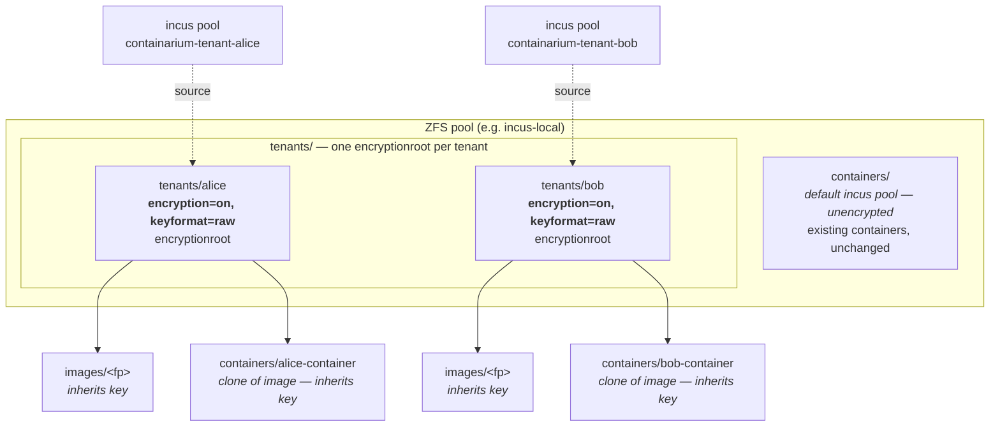
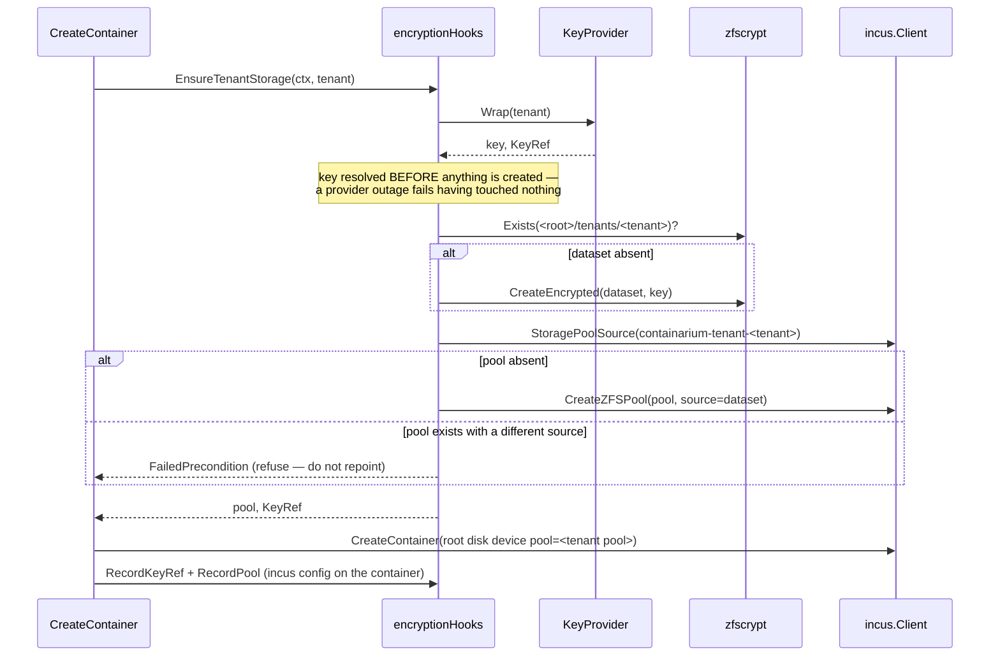

# Design: per-tenant encrypted storage pools

**Date:** 2026-08-13
**Status:** proposed
**Supersedes:** hook row 1 ("pre-create") of `docs/ZFS-PER-CONTAINER-ENCRYPTION-DESIGN.md` §3
**Stack:** Go 1.26 only — no new language, no new contract, no new deployable

## Problem

Per-tenant ZFS encryption is finished except for its create path, and the
create path cannot be built the way it was designed. The original design's
pre-create hook says: make the ZFS dataset with `encryption=on`, then tell
Incus to build the instance on that pre-existing dataset. Incus will not do
that, and the reason is structural rather than a missing option (#1199, proven
in #1335 against Incus 6.0.0):

```
Failed creating instance from image: Failed to run: zfs clone \
  incus-local/containers/images/343e93…@readonly \
  incus-local/containers/containers/enc8375-container: dataset already exists
```

Incus builds an instance volume by **cloning the image snapshot**. Two
consequences, and the second is the one that matters:

1. The volume is created *by* the clone operation, so there is nothing for it
   to adopt — the pre-created dataset is a name collision, not an input.
2. **A ZFS clone inherits encryption from its origin, not from its location.**
   Even if Incus tolerated the collision, cloning an unencrypted image would
   produce an unencrypted instance. No amount of wiring fixes this.

So an instance-level encryptionroot is unreachable while Incus owns volume
creation. The encryptionroot has to sit *above* the level Incus manages.

Everything else already works and is merged: `KeyProvider`, the in-memory key
cache, `CreateEncrypted`/`LoadKey`/`UnloadKey` proven against a real pool
(#1200), and `PreStart`/`PostStop` (#1232). Today `--encrypted` refuses rather
than lying (#1294) — safe, and incomplete.

## Design

**One Incus storage pool per tenant, sourced at that tenant's encrypted
dataset.** Incus lets a pool's `source` be an arbitrary ZFS dataset, and
everything the pool holds — images *and* instances — is created underneath it.
Clone the image within the tenant's encryptionroot and the instance is
encrypted by inheritance, which is the only way encryption can reach a dataset
Incus creates.

Verified end to end through the daemon's own create path in #1335:

```
instance dataset  incus-local/tenant8194/containers/tnt8194-container
encryptionroot    incus-local/tenant8194
```

### Topology



The daemon's default pool is untouched. An unencrypted create is
byte-identical to today's; only `encrypted=true` routes to a tenant pool.

### Create flow



### Components

| # | Component | Change |
|---|---|---|
| 1 | `pkg/core/zfscrypt` | **None.** `CreateEncrypted` now makes the tenant root instead of a container dataset — same call, different argument. |
| 2 | `pkg/core/zfskey` | **None.** `KeyProvider` is already per-tenant; `Wrap(tenant)` was always the right shape. |
| 3 | `pkg/core/incus` | **New, small:** `CreateZFSPool(name, source)`, `StoragePoolSource(name) (string, bool, error)`, `DeleteStoragePool(name)`. No key material enters this package. |
| 4 | `pkg/core/container` + `pkg/core/box` | **Thread an explicit pool per create:** `BoxSpec.StoragePool` → `CreateOptions.StoragePool` → the root disk device. |
| 5 | `internal/server` | Hooks change shape: `PreCreate` → `EnsureTenantStorage`; `datasetResolver` → `encryptionRootResolver`. |

#### 4 is the one that is not a rename

Today the storage pool is a **process-global**: `--storage-pool` →
`incus.SetDefaultStoragePool` → an `atomic.Value` read by
`Client.StoragePool()`. Per-tenant pools need a per-*request* pool, so the
value has to be threaded through the create path instead of read from a global.

There is a second trap in the same place. `Manager.Create` only emits a root
disk device when a disk size was requested:

```go
if diskSize != "" {
    config.Disk = &incus.DiskDevice{Path: "/", Pool: m.incus.StoragePool(), Size: diskSize}
}
```

With no disk size, the container inherits the **default profile's** root disk —
the default pool. An encrypted create that forgot to set a size would land
unencrypted while reporting success. So: **an encrypted create always emits an
explicit root disk device naming the tenant pool**, with or without a size, and
a create that resolves `encrypted=true` to an empty pool name is a programming
error that fails loudly rather than falling through to the default.

### Naming and configuration

| Thing | Value |
|---|---|
| Tenant dataset | `<tenant-root>/<tenant>` |
| `<tenant-root>` | `--zfs-tenant-root`, default `<zpool of the default pool's source>/tenants` |
| Incus pool | `containarium-tenant-<tenant>` |
| KeyRef storage | `user.containarium.zfs_key_ref` on the container (unchanged, #1201) |
| Pool storage | `user.containarium.zfs_pool` on the container (**new**) |

`user.containarium.zfs_pool` is new because `PreStart` must resolve the
*encryptionroot* — the pool's source dataset — and recomputing it from a naming
convention would break every container the day the convention changes. The
container records where it actually lives; the daemon reads it back.

### Rollback semantics change, and the old rule becomes wrong

`PreCreate` today destroys the dataset if the KeyRef cannot be stored, because
a dataset with no recorded ref is unopenable and blocks its own name on retry.

**That rule must not be carried over.** The tenant dataset is now shared by
every container the tenant owns. Destroying it on one container's failed create
would destroy a running tenant's storage. The corrected rules:

| Stage | On failure |
|---|---|
| `Wrap` fails | Nothing created. `Unavailable`. (unchanged) |
| `CreateEncrypted` fails | Nothing to undo — the dataset is what failed. |
| `CreateZFSPool` fails, dataset was created **by this call** | Destroy the dataset. It is unreferenced and unopenable. |
| `CreateZFSPool` fails, dataset **already existed** | Leave it. It is another container's encryptionroot. |
| Container create fails after the pool exists | **Leave the pool and dataset.** They are tenant-scoped and reusable; the next create reuses them. |

The asymmetry is the design: per-container resources are rolled back,
per-tenant resources are not, and the hook must know which it just created.

### Tenant offboarding

Not in v1, and named rather than omitted. Destroying a tenant means: delete the
tenant's containers → `DeleteStoragePool` → `zfs destroy` the dataset, in that
order. Nothing does this today; it becomes an operator runbook plus a follow-up
issue. Skipping the ordering is how an operator ends up with an Incus pool
pointing at a destroyed dataset, which breaks daemon startup for everyone.

## Language choices

| Component | Language | Why this one | Type gate in CI |
|---|---|---|---|
| all of the above | Go | Every touched package is existing daemon Go. Nothing here is ML, browser, or IO-glue. | `go build` + `go vet` + `golangci-lint` |

No new language. No new deployable. No new build lane.

## Contracts

| Boundary | Contract | Source of truth | Change |
|---|---|---|---|
| Client → daemon | `CreateContainerRequest{encrypted, tenant_id}` | `proto/containarium/v1/*.proto` | **None.** The wire shape was designed for this and does not move. |
| Daemon → daemon (migration) | `AdoptMigratedContainerRequest` | same proto | **Deferred to #1203** — see below. |
| Container → daemon (durable state) | `user.containarium.zfs_key_ref`, `user.containarium.zfs_pool` | Incus instance config | One new key. Typed through `keyRefStore`; JSON only inside the ref, which already has a Go struct. |
| Server ↔ hooks | `tenantStorage`, `encryptionRootResolver`, `keyRefStore` | Go interfaces in `internal/server` | Renamed/reshaped; still interfaces at the seam, so the hooks stay unit-testable without ZFS or Incus. |

**No `map[string]interface{}` anywhere in this design.** The one string→string
map is Incus's own instance config, which is Incus's type, at the edge.

## Test strategy

Named before implementation, per component. The `incus` lane from #1332 is the
gate for everything marked *integration*; it fails rather than skips
(`CONTAINARIUM_REQUIRE_INCUS=1`).

### `pkg/core/incus` — pool operations

| Test | Kind | Pins |
|---|---|---|
| `TestCreateZFSPool_PassesTheSourceThrough` | unit, fake `InstanceServer` | the `source` config reaches Incus verbatim |
| `TestStoragePoolSource_ReportsAbsentDistinctlyFromEmpty` | unit, table-driven | "no such pool" ≠ "pool with no source" — the difference decides create-vs-refuse |
| `TestIntegrationIncus_PoolSourcedAtAnEncryptedDataset` | **integration** | a pool created this way accepts instances at all |

### `internal/server` — hooks

| Test | Kind | Pins |
|---|---|---|
| `TestEnsureTenantStorage_ResolvesTheKeyBeforeCreatingAnything` | unit, fakes | provider outage leaves zero ZFS/Incus calls |
| `TestEnsureTenantStorage_IsIdempotentForASecondContainer` | unit | second call creates nothing, returns the same pool |
| `TestEnsureTenantStorage_RollsBackOnlyADatasetItCreated` | unit, table-driven | the asymmetry above — the case that destroys a live tenant's data if wrong |
| `TestEnsureTenantStorage_RefusesAPoolPointingSomewhereElse` | unit | a name collision fails closed, never repoints |
| `TestPreStart_LoadsTheKeyOnThePoolRootNotTheContainer` | unit | the encryptionroot moved; the hook must follow |

### Create path — end to end

| Test | Kind | Pins |
|---|---|---|
| `TestIntegrationIncus_EncryptedCreateLandsUnderTheTenantEncryptionroot` | **integration** | AC1. The whole feature in one assertion. |
| `TestIntegrationIncus_TwoTenantsCannotUnlockEachOther` | **integration** | AC1's real content — distinct roots *and* tenant A's key refused against B's dataset. Comparing `encryptionroot` strings alone passes for two datasets sharing key material. |
| `TestIntegrationIncus_SecondContainerForATenantSharesItsEncryptionroot` | **integration** | the per-tenant (not per-container) key contract |
| `TestIntegrationIncus_UnencryptedCreateIsUnchanged` | **integration** | the load-bearing negative: default pool, no encryptionroot, no tenant pool created |
| `TestCreateContainer_EncryptedWithoutAResolvedPoolFails` | unit | the silent-default trap in component 4 — never fall through to the default pool |

`TestIntegrationIncus_InstanceOnAPreExistingEncryptedDataset` (merged in
#1335) stays as the executable record of *why* this design exists: it asserts
Incus's refusal, so if Incus ever gains the capability the lane says so.

### What runs real vs. faked

- **Real**: ZFS and Incus, in the `incus` lane, on a file-backed pool. Every
  claim about encryption inheritance is a property ZFS computes — asserting it
  against a fake asserts the fake.
- **Faked**: `KeyProvider` (outage paths), `InstanceServer` (pool-API
  arguments), the clock. Fakes cover *orchestration*: what runs, in what order,
  what happens on failure.
- **Never mocked**: `zfs` itself in any test that claims an encryption
  property. That distinction is what #1200 established and #1335 confirmed was
  worth the cost.

### CI gates

`go vet` + `go build` + `golangci-lint` (existing), the `zfs-encryption` lane,
and the `incus-create` lane. The last one needs `internal/server/**` added to
its path filters when the hooks change, or the wiring lands untested by it.

## Deviations from the default stack

**None.** Go only, existing protos unchanged, no new deployable, no new
dependency.

## Rejected alternatives

**1. Pre-create the instance dataset and have Incus adopt it** — the original
design. Empirically disproved (#1335): Incus clones the image, and a clone
inherits encryption from its origin. Not a missing option; a structural one.

**2. Encrypt the single shared pool root** — one `encryption=on` dataset above
the default pool. Simple, and defeats the purpose: one key unlocks every
tenant, so AC1 ("distinct from another tenant's") is unmeetable. This is
pool-level encryption (PR #177), which already exists and is a different
control.

**3. Per-tenant dataset inside one pool, instances nested under it** — Incus
chooses instance placement as `<pool root>/containers/<name>`; it is not
configurable per instance. There is no way to ask for a deeper path.

**4. `zfs send | zfs recv` the image into a per-container encrypted dataset,
then register it with Incus** — would give a true per-container encryptionroot.
Rejected: the daemon would own volume lifecycle that Incus expects to own, and
every downstream Incus operation that assumes it created the volume (snapshot,
copy, refresh, migrate, delete) becomes ours to reimplement. A per-container
key is not worth reimplementing a storage driver, and #1198 already resolved
the key scope as per-tenant.

**5. fscrypt or per-container LUKS** — different threat model (in-kernel
filesystem encryption vs. ZFS native at-rest), and discards the merged,
real-pool-proven `zfscrypt` layer. Reconsider only if ZFS is dropped.

## What has to change at 10x

**Image duplication is the real cost, and it is linear in tenants.** Each
tenant pool holds its own copy of every image its containers use — 100 tenants
on `ubuntu/24.04` means 100 copies. On the default pool those containers share
one image dataset and clone from it. Roughly: one base image is ~500 MB
uncompressed, so 100 tenants ≈ 50 GB of images that used to be 500 MB.

This is inherent, not incidental: sharing an image across encryptionroots is
exactly what ZFS clones forbid, and that prohibition is the isolation the
feature sells. Options at that scale, none needed now:

- Accept it — disk is cheap next to a per-tenant key guarantee.
- Bake a minimal base image (#1037's machinery already exists) to cut the
  per-copy size.
- Reserve encrypted pools for tenants who ask, leaving the rest on the shared
  default pool. The design already supports this: `encrypted` is per-request.

Two smaller ones: pool count makes `GetStoragePoolNames` O(tenants) on the
daemon's startup checks (fine to thousands), and per-tenant pool creation adds
a one-off cost to a tenant's *first* encrypted create, not to later ones.

**In the OSS build the visible effect is one pool**, because `validateTenantID`
accepts only `""`/`"default"` — OSS is single-tenant by construction. The
per-tenant structure is what makes the cloud build work, and building it into
OSS keeps one code path instead of two.

## Consequences for the sprint's other issues

| Issue | Effect |
|---|---|
| **#1199** | Remaining work is this design, not the old wiring. Its ACs are unchanged and still the right ones. |
| **#1202** (pre-snapshot) | Unaffected in substance — "ensure key loaded" now targets the pool root. |
| **#1203** (MoveContainer) | **Scope grows.** `ExecRunner.CopyInitial` runs `incus copy` with no `--storage`, so a migrated container lands on the destination's *default* pool — silently losing tenant encryption. The destination needs the tenant pool provisioned and the copy targeted at it, before the KeyRef pre-flight the issue already describes. |
| **#1204** (RewrapContainer) | **Gets simpler.** Rotation is `zfs change-key` on one dataset per tenant, not per container. |
| **#1294** | The `FailedPrecondition` refusal stays until the create path genuinely encrypts, and the earlier safe-ordering warning on #1199 still binds: **wire a `KeyProvider` last**. |

## History

| Date | Author | Change |
|---|---|---|
| 2026-08-13 | drafted with Claude (`agent-c9aced4b`) | Initial draft, replacing the disproved pre-create mechanism after #1335 established Incus's clone-from-image behaviour on a real Incus 6.0.0. Status: proposed. |
