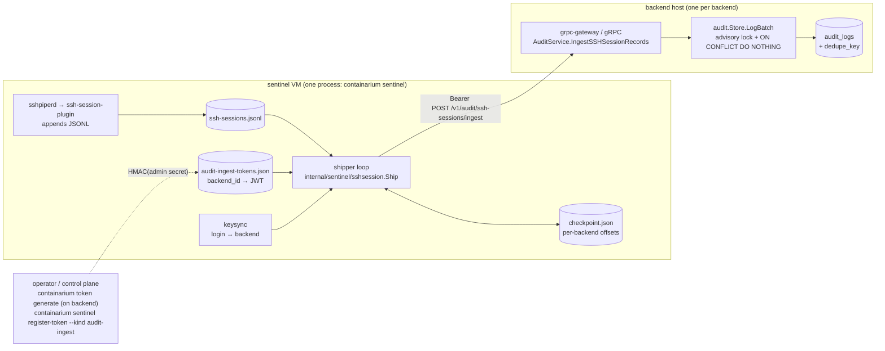

# Design: sentinel SSH session records → per-backend audit store (ingest RPC + audit-ingest token)

**Date:** 2026-10-09
**Status:** proposed
**Decides:** the two open design points on #2415 — how the sentinel authenticates to a backend's audit store, and how a batch of session records is written idempotently into the hash chain
**Stack:** Go only — one new proto file, one new scope, one new column; no new language, no new deployable, no new dependency

Out of scope here (already specified on #2415 and mechanical): logrotate, the plugin's SIGHUP reopen, the compliance-doc update.

## Problem

The sentinel's `ssh-session-plugin` (#1980) writes one JSONL record per accepted SSH session open/close to a local file. That file is the only record of the platform's front-door logins, and it is outside the tamper-evident audit chain (`internal/audit`, #1706).

Two facts shape everything below:

1. **The audit store is per backend.** `audit.NewStore` runs inside each backend daemon on that backend's own Postgres. The sentinel has no database credentials and fronts several backends at once. The only way a record reaches a chain is through that backend's API.
2. **The sentinel has no credential a backend would accept for a write.** Sentinel→daemon calls today (`/authorized-keys`, `/certs`) are gated by a shared HMAC secret that every daemon holds. That secret authenticates "a sentinel", not "a sentinel allowed to append to this backend's audit log", and reusing it for a write path would let a compromised daemon forge audit rows on its peers.

So the design has two components: a narrowly scoped **audit-ingest token** per backend, and an **`IngestSSHSessionRecords` RPC** whose batch semantics let a crash-restarted shipper replay safely.

## Design



### Component 1 — audit-ingest token

**What it is.** An ordinary Containarium access JWT (HS256, signed with the *target backend's* `CONTAINARIUM_JWT_SECRET`), carrying exactly one scope: a new `audit:ingest`. Nothing else is new about the token itself.

**Why that is enough for backend scoping.** Each backend verifies tokens with its own secret. A token minted on backend A does not verify on backend B. The "backend-scoped" requirement in #2415 therefore comes for free; no `backend_id` claim is needed, and adding one would only invite a claim-vs-secret mismatch.

**Minting (on the backend host, existing command):**

```
containarium token generate \
  --username sentinel-shipper --roles service \
  --scopes audit:ingest --expiry 2160h \
  --secret-file /etc/containarium/jwt.secret
```

`--username` is a service principal, not a person; it lands in `audit_logs.username` on the per-call API row (see "What rows an ingest call produces").

**Enforcement (in the RPC handler):** `auth.RequireExplicitScope(ctx, auth.ScopeAuditIngest)` — a new helper over the existing `HasExplicitScope`. It differs from `RequireScope` in one way that matters here: a token with **no** `scopes` claim is denied even when strict-scope mode is off. `RequireScope`'s backwards-compatible "unscoped = unrestricted" path exists so pre-scope admin tokens keep working for reads and container operations; it must not quietly unlock a write into the tamper-evident log. The wildcard scope `*` still passes, as everywhere else.

Revocation is enforced by the daemon's existing per-request `IsRevoked(jti)` check (`internal/auth/revocation.go`), so no new revocation plumbing is required.

**Registration on the sentinel (extends `sentinel register-token`, #799):**

```
containarium sentinel register-token --kind audit-ingest \
  --backend <backend-id> --token <jwt> --url http://<sentinel>:8888
```

- `--kind` is a Go enum (`cmd.SentinelTokenKind`: `tunnel-join` default, `audit-ingest`); an unknown value fails flag parsing, not the request.
- `--kind audit-ingest` POSTs `{"backend_id": "...", "token": "..."}` to a new route `/sentinel/audit-ingest-tokens` on the sentinel's binary server, behind the same `auth.SentinelHMACMiddleware(adminSecret)` that gates `/sentinel/tunnel-tokens`. `DELETE` on the same route with `{"backend_id": "..."}` deregisters (`sentinel deregister-token --kind audit-ingest --backend <id>`).
- The handler upserts into a **separate** store file, `/etc/containarium/audit-ingest-tokens.json`, mode 0600, written atomically (tmp + rename) with the same `Save…Store` pattern as `tunnel_token_store.go`. Keyed by `backend_id`; an upsert for an existing key replaces the token. Persist failure → HTTP 500 "retry", exactly as #1772 fixed for tunnel tokens.
- The shipper re-reads the store file at the start of every pass, so a rotation takes effect on the next batch without a restart.

The existing tunnel-token file is deliberately not reused: its entries are `{token, pools}`; mixing kinds into one file would require a schema migration of a credential file for no benefit.

**Rotation.** Mint a new token on the backend → `register-token --kind audit-ingest` (upsert) → `containarium token revoke --jti <old>` on the backend. Order matters: register before revoke, or the shipper fails closed for one pass. The shipper parses `exp` locally and logs a warning once per day when fewer than 14 days remain; it never refreshes a token itself (it holds no refresh token and no secret).

**Revocation / compromise.** `token revoke` on the backend is sufficient and immediate for that backend. `deregister-token` on the sentinel is housekeeping. A token stolen from the sentinel can do exactly one thing: append `ssh_session_*` rows to one backend's chain. It cannot read the chain, cannot delete, cannot touch any other scope, and cannot verify on any other backend.

### Component 2 — `IngestSSHSessionRecords` RPC

**Contract** lives in a new `proto/containarium/v1/audit.proto` (the first proto-defined audit endpoint; the legacy `/v1/audit/logs` read route stays where it is):

```proto
service AuditService {
  // Append sentinel SSH session records to this backend's audit chain.
  // Idempotent per (session_id, phase). Requires scope audit:ingest.
  rpc IngestSSHSessionRecords(IngestSSHSessionRecordsRequest)
      returns (IngestSSHSessionRecordsResponse) {
    option (google.api.http) = {
      post: "/v1/audit/ssh-sessions/ingest"
      body: "*"
    };
    option (grpc.gateway.protoc_gen_openapiv2.options.openapiv2_operation) = { ... };
  }
}

enum SSHSessionPhase    { SSH_SESSION_PHASE_UNSPECIFIED = 0; SSH_SESSION_PHASE_OPEN = 1; SSH_SESSION_PHASE_CLOSE = 2; }
enum SSHAuthMethod      { SSH_AUTH_METHOD_UNSPECIFIED = 0; SSH_AUTH_METHOD_CERTIFICATE = 1; SSH_AUTH_METHOD_PUBLICKEY = 2; SSH_AUTH_METHOD_UNKNOWN = 3; }
enum SSHCloseReason     { SSH_CLOSE_REASON_UNSPECIFIED = 0; SSH_CLOSE_REASON_NORMAL = 1; SSH_CLOSE_REASON_UPSTREAM_GONE = 2;
                          SSH_CLOSE_REASON_PROXY_SHUTDOWN = 3; SSH_CLOSE_REASON_ERROR = 4; SSH_CLOSE_REASON_UNKNOWN_ORPHAN = 5; }

message SSHSessionCredential { string key_id = 1; uint64 serial = 2; string ca_key_fingerprint = 3; string key_fingerprint = 4; }

message SSHSessionRecord {
  string session_id = 1;
  SSHSessionPhase phase = 2;
  google.protobuf.Timestamp occurred_at = 3;
  string client_ip = 4;
  int32  client_port = 5;
  string login = 6;
  string target = 7;
  SSHAuthMethod auth_method = 8;
  SSHSessionCredential credential = 9;
  SSHCloseReason close_reason = 10;   // set only when phase == CLOSE
}

message IngestSSHSessionRecordsRequest {
  repeated SSHSessionRecord records = 1;   // 1..500, in file order
  string sentinel_id = 2;                  // informational; lands in Detail
}

enum IngestOutcome { INGEST_OUTCOME_UNSPECIFIED = 0; INGEST_OUTCOME_INSERTED = 1; INGEST_OUTCOME_DUPLICATE = 2; }

message IngestSSHSessionRecordsResponse {
  repeated IngestOutcome outcomes = 1;     // same length and order as request.records
  int32 inserted = 2;
  int32 duplicates = 3;
}
```

`SSHSessionRecord` mirrors `sshsession.Record` field for field; the three Go string-typed enums (`SessionPhase`, `AuthMethod`, `CloseReason`) map to proto enums through two table-driven conversion functions in `internal/sentinel/sshsession/pb.go` (`ToProto`, `FromProto`). `CloseReasonUnknownOrphan` is added to `record.go` alongside the enum value. Generated code (`pkg/pb`, `.pb.gw.go`, swagger) is never edited; `internal/client/{grpc,http}.go` get the typed method.

**Batch semantics: all-or-nothing storage, per-record idempotency.**

| Situation | Behaviour |
|---|---|
| Any record fails validation (empty `session_id`, `phase` unspecified, `occurred_at` unset, `close_reason` set on an `open`, unknown enum value, >500 records) | `InvalidArgument` naming the record index. **Nothing is written.** |
| Caller lacks explicit `audit:ingest` | `PermissionDenied` (or `Unauthenticated`). Nothing written. |
| Storage succeeds | `OK`; `outcomes[i]` is `INSERTED` or `DUPLICATE` for every `i`. |
| Storage fails at any record (Postgres down, lock timeout, serialization error) | transaction rolled back, `Unavailable`. **Nothing is written**, including the records before the failure. |

Validation runs before the transaction opens, so an `InvalidArgument` never costs a lock. Because the whole batch is one transaction, the shipper has only one rule to follow (below), and there is no "partial success" state to reason about in the chain.

**Store change.** `initSchema` adds, idempotently in the existing `ADD COLUMN IF NOT EXISTS` style:

```sql
ALTER TABLE audit_logs ADD COLUMN IF NOT EXISTS dedupe_key TEXT NULL;
CREATE UNIQUE INDEX IF NOT EXISTS idx_audit_logs_dedupe_key
  ON audit_logs (dedupe_key) WHERE dedupe_key IS NOT NULL;
```

`dedupe_key` is **not** an input to `computeRowHash` at any hash version. Existing rows keep `NULL`; `Log` keeps writing `NULL`; `VerifyChain` is untouched. A tampered `dedupe_key` therefore cannot be detected by the chain — acceptable, because the column has no evidentiary value; it exists only to make replays no-ops. Key format is namespaced: `sshsession:<session_id>:<phase>`.

New store method:

```go
type BatchEntry struct { Entry AuditEntry; DedupeKey string }
type BatchOutcome int // BatchInserted | BatchDuplicate

// LogBatch appends entries in order inside ONE transaction, holding the
// chain's advisory lock once for the whole batch. Returns one outcome per
// entry. On any error nothing is committed.
func (s *Store) LogBatch(ctx context.Context, entries []BatchEntry) ([]BatchOutcome, error)
```

Inside the transaction, for each entry in order:

1. compute `rowHash = computeRowHash(entry, prev, CurrentHashVersion)` where `prev` is the chain tail read once at the start, then updated locally after every successful insert;
2. `INSERT ... ON CONFLICT (dedupe_key) WHERE dedupe_key IS NOT NULL DO NOTHING RETURNING id`;
3. a returned `id` → `BatchInserted`, `prev = rowHash`; no row → `BatchDuplicate`, `prev` unchanged.

Step 3 is why the ordering is safe: a duplicate is skipped *before* it can become anyone's `prev_hash`, so a replayed batch never forks the chain, and the advisory lock (`pg_advisory_xact_lock`) held for the whole transaction keeps concurrent `Log` callers from interleaving between two of the batch's rows. `Log` itself is refactored to call the same per-row helper with a single-entry batch so there is one insert path, not two.

Holding the lock for up to 500 inserts is a few milliseconds on the daemon's own Postgres; the HTTP middleware and gRPC interceptor already queue their own rows through an async writer and are not on the caller's critical path.

**Row mapping** (one audit row per record):

| `AuditEntry` field | value |
|---|---|
| `Timestamp` | `record.occurred_at` (sentinel clock; `Log` truncates to µs before hashing as today) |
| `Username` | `record.login` |
| `Action` | `ssh_session_open` / `ssh_session_close` (matches the existing `ssh_login` naming) |
| `ResourceType` | `ssh_session` |
| `ResourceID` | `record.session_id` |
| `SourceIP` | `record.client_ip` — the real downstream client |
| `Detail` | JSON of a typed `sshSessionDetail{Target, AuthMethod, Credential, CloseReason, SentinelID, ClientPort}` struct, through `SanitizeDetail` |
| `TokenID` | the ingest token's `jti`, from context (same as the gRPC interceptor) |
| `Actor`, `DelegationChain`, `OrgID`, `RunID` | empty |

**What rows an ingest call produces.** The daemon's existing HTTP audit middleware (or gRPC interceptor, deduplicated by the gateway-forward metadata key) logs **one** API row per call, action `http_request`/`grpc_unary`, resource `/v1/audit/ssh-sessions/ingest`, username `sentinel-shipper`. That row is wanted: it is the evidence that the shipper ran and under which token. It is not deduplicated, so the #2415 acceptance criterion "re-running adds 0 rows" must be read, and should be reworded, as "adds 0 `ssh_session_*` rows".

### The shipper's side of the contract

The shipper is **a goroutine inside `containarium sentinel`**, not a separate process (this amends #2415 Step 3, which proposed a systemd unit). Reason: everything the shipper needs already lives in that process — the backend pool (backend id → address and HTTP port, the same values keysync uses), keysync's `login → backend` routing (so a record is attributed to a backend by exact login match, not by parsing `target`), and the token store file. A separate process would have to be told all three. The exported loop is `sshsession.Ship(ctx, ShipDeps)` where `ShipDeps` is an interface bundle (`RecordSource`, `BackendResolver`, `TokenSource`, `IngestClient`, `Checkpoint`) so every piece is fakeable; `containarium sentinel ssh-sessions ship --once --backend-url … --token-file …` wraps the same function with single-backend fakes of the resolver and token source, for tests, CI and manual replay.

**Checkpoint rule — the only rule:** the checkpoint for backend B advances to the byte offset *after the last record in a batch* only when the `IngestSSHSessionRecords` call for that batch returned `OK`. Any error leaves the offset where it was; the batch is retried with backoff (1s → 60s, jittered) and re-read from the file. Combined with server-side dedupe, this gives at-least-once delivery with exactly-once rows.

- Checkpoint file: `/var/lib/containarium/ssh-session-shipper/checkpoint.json`, typed `Checkpoint{Inode uint64; Offsets map[backendID]int64}`, written atomically after each `OK`.
- Per-backend offsets mean one unreachable backend does not stall the others; each pass scans the file from `min(offsets)` and skips records already past a backend's own offset.
- A record whose login resolves to no backend is **counted and skipped**; the offset still advances. (A backend with no registered token is *not* skipped; see "As built" below.)
- A line that fails to parse into `sshsession.Record` is counted and skipped the same way. Server-side `InvalidArgument` is therefore a contract bug (test gap), not a runtime path; the shipper treats it as fatal for the batch and logs it loudly.
- Inode change (rotation) → read the old file to EOF via its rotated name if still present, then reset all offsets to 0 on the new inode. Rotation mechanics themselves are out of scope here.

## Language choices

| Component | Language | Why this one | Type gate in CI |
|---|---|---|---|
| `audit:ingest` scope + `RequireExplicitScope` (`internal/auth`) | Go | existing package | `go vet`, `go build`, existing scope tests |
| audit-ingest token store + handler (`internal/sentinel`) | Go | sibling of `tunnel_token_store.go` | `go vet`, `go build` |
| `register-token --kind` (`internal/cmd`) | Go | existing cobra command | `go vet`, `go build` |
| `audit.proto` + generated client/server/gateway/swagger | protobuf → Go | one contract, two transports, generated TS client is free for the web UI later | `buf lint`, `buf breaking`, `make proto` diff-clean in CI |
| `AuditService` handler (`internal/server`) | Go | existing daemon | `go vet`, `go build` |
| `Store.LogBatch` + `dedupe_key` (`internal/audit`) | Go | existing package | `go vet`, store-integration lane |
| shipper loop + checkpoint (`internal/sentinel/sshsession`) | Go | same package as the reader and record types | `go vet`, `go build` |

No second language. No new deployable: the shipper rides in the sentinel process, the RPC in the daemon.

## Contracts

| Boundary | Source of truth | Format | Generated |
|---|---|---|---|
| shipper → backend | `proto/containarium/v1/audit.proto` | gRPC + REST (`POST /v1/audit/ssh-sessions/ingest`) | `pkg/pb`, `.pb.gw.go`, swagger, `internal/client` typed method |
| JSONL ↔ proto | `sshsession.Record` ↔ `pb.SSHSessionRecord` via `pb.go` | table-driven, both directions | — (hand-written, tested round-trip) |
| operator → sentinel | `sentinel.AuditIngestTokenRequest{BackendID, Token}` | JSON over the binary server, HMAC(admin secret) | — (legacy-style sentinel admin endpoint; see Deviations) |
| token | JWT claims (`internal/auth.Claims`), new scope constant `ScopeAuditIngest = "audit:ingest"` in `AllScopes` | HS256 | — |
| storage | `audit_logs` + `dedupe_key` + partial unique index, `initSchema` | SQL, idempotent DDL | — |
| checkpoint | `sshsession.Checkpoint` struct | JSON, atomic write, 0600 | — |

## Test strategy

Written per component, before implementation. Real Postgres (the existing `store-integration.yml` lane with `CONTAINARIUM_TEST_DSN`) for anything that touches the chain; fakes only at the seams named above.

**1. Scope (`internal/auth`)** — unit, table-driven in `require_explicit_scope_test.go`:
- `audit:ingest` is in `AllScopes`; `IsKnownScope` true.
- `RequireExplicitScope` with: scope present → nil; wildcard → nil; other scopes only → `PermissionDenied`; **no scopes claim, strict mode off → `PermissionDenied`** (the case that distinguishes it from `RequireScope`); no subject → `Unauthenticated`.
- Integration (existing `revocation_store_integration_test.go` harness): a revoked `jti` holding `audit:ingest` is rejected by the request path.

**2. Token store + handler (`internal/sentinel`)** — unit, mirrors `tunnel_token_store_test.go` / `tunnel_token_handler_test.go`:
- load/save round-trip; missing file → empty, no error; file mode 0600; upsert for an existing `backend_id` replaces the token (rotation); delete removes it.
- handler: no HMAC → 401 (via the shared middleware); missing `backend_id` or `token` → 400; persist failure → 500 and the in-memory entry still applied; registration survives a simulated restart (reload from file).

**3. CLI (`internal/cmd`)** — unit with `httptest.Server`:
- `--kind audit-ingest` posts the right route, body and HMAC headers; `--kind tunnel-join` (default) is byte-identical to today's request (regression); unknown `--kind` fails at parse; `--backend` required only for `audit-ingest`.

**4. Proto mapping (`internal/sentinel/sshsession/pb.go`)** — unit, table-driven over *every* enum constant:
- `FromProto(ToProto(r)) == r` for each phase/auth-method/close-reason value and for a record with/without credential; `_UNSPECIFIED` phase → error; unknown numeric enum → error; `close_reason` on an `open` → error.
- Contract test: the Go constant set and the proto enum set have the same cardinality (fails when someone adds a `CloseReason` and forgets the proto).

**5. `Store.LogBatch` + `dedupe_key` (`internal/audit`)** — integration (`//go:build integration`, real Postgres, existing `auditTestStore` helper):
- `initSchema` on a table that already has rows: column added, rows keep `NULL`, `VerifyChainSinceID` still reports 0 bad.
- batch of N fresh entries → N `Inserted`, `MaxRowID` +N, chain verifies.
- replay the identical batch → N `Duplicate`, `MaxRowID` unchanged, chain verifies.
- mixed batch (some new, some replayed, interleaved) → outcomes in order, only the new ones inserted, chain verifies; the row after a duplicate has `prev_hash` of the last *inserted* row.
- failure mid-batch (inject via a context cancelled after the k-th insert, or a fake `pgx.Tx` that errors on the k-th `Exec`) → error returned, **zero** rows committed, chain verifies.
- concurrency: `LogBatch` and plain `Log` from goroutines in parallel → final chain verifies with no fork (the advisory lock test that already exists for `Log`, extended).
- `Log` still writes `dedupe_key = NULL` and two plain `Log` rows with identical content do **not** collide (NULLs are excluded from the index).

**6. `AuditService` handler (`internal/server`)** — unit with a fake `batchLogger` interface, then contract:
- scope denied → `PermissionDenied`, logger never called.
- each validation case → `InvalidArgument` with the offending index, logger never called.
- outcomes array has request length and order; `inserted`/`duplicates` counts match.
- row mapping: every `AuditEntry` field in the mapping table above, asserted on the struct the fake received (not on a `map`).
- logger error → `Unavailable`.
- contract test (integration lane): generated gRPC client **and** generated REST client via grpc-gateway both ingest a fixture into the real store; the two transports produce byte-identical rows; the swagger file in the repo matches `make proto` output.

**7. Shipper (`internal/sentinel/sshsession`)** — unit with a temp JSONL, fake `IngestClient`, fake resolver/token source, `t.TempDir()` checkpoint:
- `--once` over the golden fixture (`testdata/ssh-sessions.jsonl`, hand-anonymised) ships every record; checkpoint equals file length.
- fake client returns `Unavailable` on batch 2 → checkpoint stays at end of batch 1, batch 2 is re-sent verbatim on retry; after `OK`, checkpoint advances.
- kill-and-restart: run to a mid-file checkpoint, construct a new shipper over the same files → resumes from the offset, no record sent twice to the fake.
- per-backend: records for backend B with an unreachable fake do not block backend A's offset.
- unresolvable login / missing token / malformed line → skipped, counted, offset advances; `InvalidArgument` from the fake → batch marked fatal, offset does not advance.
- rotation: inode change with the old file still present under the rotated name → old tail shipped first, then offsets reset to 0.
- token `exp` within 14 days → one warning per day (fake clock).

**8. End-to-end slice** (integration lane, one test): real Postgres → in-process daemon with `AuditService` → shipper `--once` over the fixture with a minted `audit:ingest` token → `containarium audit query --action ssh_session_open` finds them → `containarium audit verify` exits 0 → run `--once` again → row count unchanged except exactly one additional API-call row. This is the executable form of #2415's acceptance criteria 1, 3 and the dedupe criterion.

Tests 5, 6 (contract) and 8 run in the existing `store-integration.yml` lane; everything else in the unit lane.

## Deviations from the default stack

- **Sentinel registration endpoint is JSON-over-HTTP with HMAC, not proto.** It extends the existing `/sentinel/tunnel-tokens` admin route on the sentinel's binary server, which is sentinel infrastructure plumbing rather than product API (CLAUDE.md's "legacy or internal-only endpoints" carve-out). Moving sentinel admin routes to proto is a separate decision that should cover all of them at once, not one. Contained to `internal/sentinel/*_handler.go` + the one cobra command.
- Nothing else: no new language, process, or dependency.

## Rejected alternatives

1. **Reuse the sentinel HMAC auth secret for the ingest call.** Every daemon holds it; a compromised daemon could then append forged front-door login rows to every peer's chain. Rejected on blast radius. The audit-ingest token is per backend by construction (that backend's JWT secret) and per capability by scope.
2. **Per-record partial success (results for rows before a storage failure, `NOT_ATTEMPTED` after).** Forces the shipper to advance a checkpoint to the middle of a batch and to reason about which rows exist; gRPC cannot return a body *and* an error, so the failure would have to be smuggled into an `OK` response. Rejected for all-or-nothing batches plus server dedupe, which makes replaying the whole batch the correct recovery in every case.
3. **Pre-insert `SELECT` instead of a unique index.** Correct under the advisory lock, but it doubles the round-trips per row and provides no protection if a future writer forgets the lock. The partial unique index is enforced by Postgres regardless of caller discipline. Rejected.
4. **Putting `dedupe_key` into the row hash.** Would change `CurrentHashVersion` to 3 and make every pre-existing row's recomputation depend on a column it never had. The key has no evidentiary value; keeping it outside the hash leaves #1678's versioning untouched.
5. **Shipper as a separate systemd unit** (as #2415 Step 3 first proposed). It would need the backend address, the login→backend mapping and the token for each backend passed in from outside, duplicating state the sentinel process already holds and reconciles. Rejected for an in-process loop; the CLI one-shot form keeps CLI-first intact.
6. **A `backend_id` claim in the token.** Redundant with the per-backend signing secret and a second source of truth that could disagree with it. Rejected.

## Amendments this design makes to #2415

- Step 3: drop `containarium-ssh-session-shipper.service`; the loop runs inside `containarium sentinel`. The logrotate stanza and SIGHUP reopen stay.
- Acceptance criterion 1: "re-running adds 0 rows" → "re-running adds 0 `ssh_session_*` rows" (the API-call audit row per ingest is expected and wanted).
- Add: `IngestSSHSessionRecords` rejects a token with no `scopes` claim even when strict-scope mode is off.

## What would have to change at 10×

Nothing structural. At thousands of sessions per minute per backend, the only pressure point is the advisory lock held per batch; batch size (500) and pass interval are the knobs, and the audit chain is already a single-writer design by intent. A sentinel fronting dozens of backends would want the per-backend passes run concurrently, which the per-backend checkpoint already permits.

## As built (deviations from the text above)

Implementation of #2415 followed this design, with these deliberate differences, each found while building and testing it.

1. **A backend with no registered token blocks; it is not skipped.** The design said such records are counted and skipped. That would lose every record shipped before an operator registers the token, which is the first-deploy case. Now the backend is treated as failed: its offset holds, an error is logged on the loop's backoff, and the records ship once the token exists. Only a login that routes to no backend (and no `--ssh-session-default-backend`) is skipped.
2. **Orphan closes have their own dedupe key** (`sshsession:<id>:close:orphan`). With the shared close key, an orphan close would have swallowed the session's genuine close if it arrived later. Both rows now coexist, and re-running `--reconcile` stays a no-op.
3. **Token expiry warnings run every pass, even an idle one**, through `TokenSource.Backends()`, and the once-a-day bookkeeping is persisted in the checkpoint. The design only checked tokens at the moment a batch was sent.
4. **No Prometheus counter.** Skips and shipped counts are in `ShipStats`, printed by `ship --once` and logged by the loop. A metric can follow with the sentinel's other metrics; nothing here depends on it.
5. **Checkpoint shape.** A single `base` offset (everything before it is shipped for every backend) plus per-backend offsets ahead of it. A record skipped as unroutable while another backend is failing is recounted on the retry, because the scan restarts at `base`.
6. **Gaps in `audit_logs.id`.** `ON CONFLICT DO NOTHING` consumes a sequence value per skipped duplicate, as a rolled-back insert already does. The chain links by `prev_hash` and the verifier reads `id > fromID`, so gaps do not affect verification; row counts, not max id, are the right measure.
7. **`AuditService` is registered only when the audit store exists.** Without Postgres the RPC is absent (Unimplemented) instead of a stub that errors.
8. **The standalone `ship` command is single-backend** (`--url`, one token), the form the design described for tests, backfill and replay. The multi-backend routing lives in the in-process loop.
9. **The gce startup script reads its retention from the instance metadata attribute** `ssh-session-log-retention-days` (default 90), because that script is not rendered with a template variable. The module script takes the Terraform variable.
10. **`deregister-token --kind audit-ingest --backend <id>`** was added alongside register, as designed, and both validate their flags per kind.
11. The auth-coverage backstop test now lists `AuditService` and accepts `RequireExplicitScope` as a guard.
