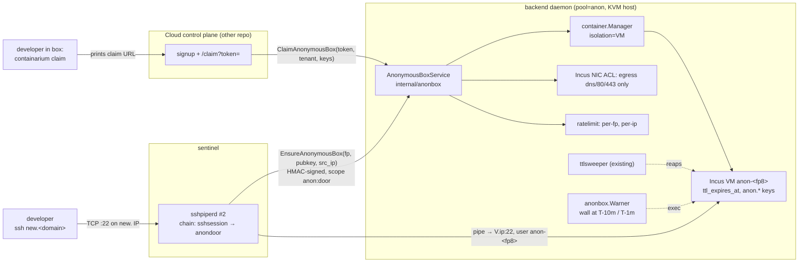

# Design: `ssh new.<cloud-domain>` — anonymous VM boxes

**Date:** 2026-10-01
**Status:** proposed
**PRD:** [`../product/ssh-new-anonymous-box.md`](../product/ssh-new-anonymous-box.md)
**Stack:** protobuf/gRPC (grpc-gateway) + Docker; Go 1.26.7. No new language, no new deployable binary — one new sshpiperd plugin subcommand, one new daemon package, one new proto service.

## Problem

A developer should be able to run `ssh new.<cloud-domain>` with any SSH
key and land in a fresh Linux box, keep it by signing up, and lose it at
TTL otherwise. The hard constraint from the PRD: anonymous tenants never
touch the shared-kernel LXC substrate — every anonymous box is an Incus
**VM**. The design has to deliver that on the pieces that already exist
(sshpiperd on the sentinel, the daemon's create path, `ttlsweeper`, network
policies, `sandbox/ratelimit`) rather than a second SSH stack or a second
state store.

## Design

Two new pieces, both Go, plus small generalisations of existing ones:

1. **`anondoor`** — a sshpiperd plugin running in a *second* sshpiperd
   instance on the sentinel, bound to the dedicated `new.` IP. It accepts
   any public key, asks the daemon for "the box for this fingerprint", and
   returns an upstream pipe to it. sshpiper does the proxying, host keys,
   and (via the existing `sshsession` plugin chained first) the audit
   record.
2. **`anonbox`** — a daemon-side manager behind a new
   `AnonymousBoxService`. It owns the fingerprint → box mapping, the
   caps, rate limits, global cap, kill switch, bans, the claim token, and
   the expiry warner. Its state lives in the box's own labels
   (`anon.*`, i.e. `user.containarium.label.anon.*` in Incus), the same
   mechanism every other per-box fact rides on — no new database.



### Request flow — first connect (cold)

1. Client connects to the `new.` IP. sshpiperd #2 runs `PublicKeyAuth`:
   `sshsession` stashes the fingerprint (existing behaviour), then
   `anondoor` gets the key.
2. `anondoor` calls `EnsureAnonymousBox{fingerprint, public_key,
   source_ip}` on the daemon over the sentinel's HMAC-signed HTTP path
   (same helper as keysync, `internal/sentinel/sentinel_auth.go`).
3. `anonbox.Ensure`:
   - kill switch off? → `FailedPrecondition` → `anondoor` rejects auth with
     the operator's message.
   - fingerprint banned? → `PermissionDenied`.
   - existing live box for this fingerprint (by the `anon.fingerprint`
     label)? → return it (reconnect).
   - rate limits (per-fp, per-ip) and global cap → `ResourceExhausted`
     with the "slow down" / "we're full" message.
   - otherwise create: `container.Manager.Create` with `Isolation: VM`,
     `pool: anon`, fixed CPU/RAM/disk, `ttl_seconds`, the user's key as
     the only authorized key, labels
     `anon.fingerprint`, `anon.created_at`, `anon.claim_token_id`;
     then attach the **Incus NIC egress ACL** (allow DNS, 80, 443; the
     NIC's default egress action drops the rest — see Guardrails for why
     not `SetNetworkPolicy`); then write `/etc/containarium/claim-url`
     and the banner (`/etc/update-motd.d/50-containarium-anon`) into the
     guest via the existing `WriteFile` exec path.
4. `anondoor` returns an upstream pipe `host=<vm-ip>:22
   user=<ssh_user from the response>` with the sentinel upstream key —
   identical shape to the yaml pipes `renderSSHPiperConfig` emits today.
   `ssh_user` is the box's tenant-named login (`anon-<fp8>`), seeded by
   the normal create path like every other box (decision on #2197: no
   `ubuntu` special case). The VM is seeded with the sentinel upstream
   public key exactly like LXC boxes are.
5. The SSH client prints nothing during step 3 (auth is in flight); the
   cold VM boot is what the PRD's p50 ≤ 30 s measures. The warm pool is
   P1 and slots in at step 3's "create" without changing any contract.

**Failure paths.** Every non-OK status from `Ensure` becomes a *rejected
auth* with a one-line reason the SSH client shows; `anondoor` never
returns a pipe to a half-created box (create is synchronous; a create
error deletes the partial instance before returning). A daemon that is
unreachable rejects auth with "try again in a minute" — not a hang —
because `anondoor` applies a 90 s call deadline, under sshpiperd's login
grace.

### Request flow — claim

1. At create time the daemon mints a **claim token**: `base64url(box_id ||
   fp_hash || exp)` + HMAC under
   `TokenManager.DeriveSharedSecret("anon-claim", box_id)`. It is stored
   nowhere except inside the guest (`/etc/containarium/claim-url`) and as
   a token *id* label on the instance. The daemon can always re-verify it
   from the instance alone.
2. `containarium claim` inside the box reads that file and prints the URL
   `https://<cloud-domain>/claim?token=…`. It needs no daemon credential —
   the token *is* the credential, and it is only good for this box.
3. The user signs up on the Cloud CP (other repo). The CP, holding the
   new tenant's identity, calls `ClaimAnonymousBox{token, tenant,
   authorized_keys}` on the daemon through its ossshim.
4. `anonbox.Claim` verifies the HMAC and expiry, then does a
   compare-and-set on the `anon.claimed_at` label (empty → now):
   a second redeem fails with `AlreadyExists`. On success it sets
   `user.containarium.tenant=<tenant>`, clears `ttl_expires_at`, detaches
   the anon egress ACL (the plan's default takes over), creates the
   jump-server account via the normal path, and emits `claim_completed`.
   The box keeps its name and disk.

### Guardrails (P0 story 4) — where each one lives

| Guardrail | Mechanism | Already exists? |
|---|---|---|
| vCPU / RAM / disk caps | fixed `AnonymousBoxConfig` in daemon config; passed to `Create` | config plumbing yes, values new |
| TTL | `ttl_seconds` at birth + `ttlsweeper` (lists `InstanceTypeAny`, so VMs are reaped) | yes |
| Egress deny-by-default | One shared Incus network ACL (`containarium-anon-egress`: allow `udp/53, tcp/53, tcp/80, tcp/443`) attached to the VM's instance-local NIC with `security.acls.default.egress.action=drop` (+ logged) — the same `EnsureNICDevice`/`SetDeviceConfig` path the core-infra guard uses. **Not** `SetNetworkPolicy`: that model allows by CIDR/domain only (no port allow-list, one deny slot per CIDR) and hooks container veths, so it can neither express this rule nor see a VM NIC. Requires the nftables firewall driver on the anon host (`coreguard.ErrUnsupportedFirewall`; checked by the spike) | yes (`pkg/core/incus/acl.go`) |
| No expose / routes | `ExposePort`, route RPCs check `anon.fingerprint` label and return `FailedPrecondition` until claimed | new guard, 1 check |
| Per-fp / per-ip rate limit | `internal/sandbox/ratelimit.Limiter`, two instances keyed by fp hash and source IP | yes, reused |
| Global cap | count of live instances with `anon.fingerprint` label ≥ cap → reject | new |
| Kill switch, bans | `SetAnonymousDoorConfig` RPC (admin scope) → persisted to `/var/lib/containarium/anon-door.json`, in-memory copy; CLI `containarium anon disable|enable|ban|unban` | new |
| Isolation | `Isolation: VM` hard-coded in `anonbox`; a test asserts the created instance type | new |
| Placement | `pool: "anon"`; only daemons started with `--pool=anon` (KVM-capable, no core LXCs) accept these creates. Decision on #2204: the anon pool is a dedicated cloud spot VM with nested virtualization on an Intel family, VM root disks on their own data disk, a startup-script version pin, and a place on the sentinel's `--watch-spot-vm` list. A preemption destroys every live anonymous box — accepted for a 4 h trial tier; the banner says so and the funnel counts it (`ANON_LOST_PREEMPTION`) | yes (`pool` field) |

### VM generalisation

`pkg/core/container/manager.go:235` sets `InstanceTypeVM` only when
`isWindows`. This design lifts that into an explicit, typed request field:

- proto: `enum IsolationType { ISOLATION_TYPE_UNSPECIFIED; ISOLATION_TYPE_CONTAINER; ISOLATION_TYPE_VM; }` and
  `IsolationType isolation = 27;` on `CreateContainerRequest` (23 was
  already `gpus`), `isolation = 29` on `Container`.
  `UNSPECIFIED` keeps today's behaviour (Windows → VM, else container);
  Windows + `CONTAINER` is `InvalidArgument`; the K8s backend rejects `VM`.
- `CreateOptions.Isolation`; the Windows branch becomes "Windows implies
  VM" plus the shared VM branch (no nesting, no privileged podman;
  Windows keeps its minimum resources, Linux VMs keep the caller's).
  Shipped in #2196.
- Linux VM image: `images:ubuntu/24.04/cloud` (the `cloud` variant ships
  the `incus-agent`, which the identity-seeding `Exec`/`WriteFile` path
  depends on). `bake.go` already produces per-host baked images; a baked
  VM image is the first thing to do once boot time is measured.

### Deployment shape

- **Sentinel:** a second `sshpiperd` systemd unit, `sshpiperd-anon`,
  `--address <new. IP>:22`, plugin chain `containarium sentinel
  ssh-session-plugin` → `containarium sentinel anon-door-plugin`. Env:
  `CONTAINARIUM_ANON_DAEMON_URL`, `CONTAINARIUM_SENTINEL_AUTH_SECRET`
  (already present), `CONTAINARIUM_ANON_UPSTREAM_KEY` (defaults to the
  existing `/etc/sshpiper/upstream_key`). The unit is installed only when
  the operator sets `anon_door_ip` in the sentinel config; absent = no
  door, no listener. DNS `new.<cloud-domain> → <that IP>` is the
  operator's (Cloud's) job.
- **Backend:** a daemon flag group `--anon-door` (enable),
  `--anon-cpu/mem/disk/ttl`, `--anon-max-boxes`, `--anon-rate-*`; the
  daemon must be `--pool=anon`. Secrets stay in env; nothing baked into
  images.
- **Cloud CP (other repo):** the `/claim` page, DNS and the IP
  allocation, and the ossshim passthrough for `ClaimAnonymousBox`. Tracked
  as a cloud issue; the contract is this doc's `anonbox.proto`.

## Language choices

| Component | Language | Why this one | Type gate in CI |
|-----------|----------|--------------|-----------------|
| `internal/sentinel/anondoor` (sshpiperd plugin) + `internal/cmd/sentinel_anon_door_plugin.go` | Go | sshpiper's `libplugin` is Go; sibling of the existing `sshsession` plugin | `go vet`, `go build` |
| `internal/anonbox` (manager, claim token, warner, door config) | Go | daemon-side control logic next to `ttlsweeper` and `sandbox/*` | `go vet`, `go build` |
| `proto/containarium/v1/anonbox.proto` + `container.proto` change | protobuf | the contract; gRPC + grpc-gateway + swagger generated by `make proto` | `buf lint`, `buf breaking` |
| `internal/server/anonbox_server.go` | Go | gRPC handler, same shape as every other service | `go vet` |
| `internal/cmd/anon.go`, `internal/cmd/claim.go` | Go | CLI-first; `anon` admin verbs and in-box `claim` | `go vet` |
| `pkg/core/container` isolation change | Go | existing package | `go vet` |

One language. The Cloud CP side is Go too (other repo), consuming the
generated client.

## Contracts

### `proto/containarium/v1/anonbox.proto` (new, source of truth)

```proto
service AnonymousBoxService {
  // Sentinel-only: resolve or create the box for a key fingerprint.
  rpc EnsureAnonymousBox(EnsureAnonymousBoxRequest) returns (EnsureAnonymousBoxResponse) {
    option (google.api.http) = { post: "/v1/anon/boxes:ensure" body: "*" };
  }
  // Cloud CP / admin: bind a box to a tenant via its claim token.
  rpc ClaimAnonymousBox(ClaimAnonymousBoxRequest) returns (ClaimAnonymousBoxResponse) {
    option (google.api.http) = { post: "/v1/anon/boxes:claim" body: "*" };
  }
  rpc GetAnonymousDoorConfig(GetAnonymousDoorConfigRequest) returns (AnonymousDoorConfig) {
    option (google.api.http) = { get: "/v1/anon/door" };
  }
  rpc SetAnonymousDoorConfig(SetAnonymousDoorConfigRequest) returns (AnonymousDoorConfig) {
    option (google.api.http) = { put: "/v1/anon/door" body: "config" };
  }
  rpc ListAnonymousBoxes(ListAnonymousBoxesRequest) returns (ListAnonymousBoxesResponse) {
    option (google.api.http) = { get: "/v1/anon/boxes" };
  }
}

message EnsureAnonymousBoxRequest {
  string fingerprint = 1;   // "SHA256:<base64>" as ssh.FingerprintSHA256
  string public_key  = 2;   // authorized_keys line
  string source_ip   = 3;
}
message EnsureAnonymousBoxResponse {
  string box_name = 1;
  string ssh_host = 2;      // VM IP reachable from the sentinel
  int32  ssh_port = 3;
  string ssh_user = 4;
  google.protobuf.Timestamp ttl_expires_at = 5;
  bool   reused = 6;        // true on reconnect
  bool   previous_expired = 7; // a prior box for this fp expired → banner says so
}

message ClaimAnonymousBoxRequest {
  string claim_token = 1;
  string tenant = 2;                 // new owner username
  repeated string authorized_keys = 3; // tenant's keys to add (fp key stays)
}
message ClaimAnonymousBoxResponse { string box_name = 1; string tenant = 2; }

message AnonymousDoorConfig {
  bool enabled = 1;
  string disabled_message = 2;
  repeated string banned_fingerprints = 3;
  AnonymousBoxLimits limits = 4;   // read-only echo of daemon flags
}
message AnonymousBoxLimits {
  string cpu = 1; string memory = 2; string disk = 3;
  int64 ttl_seconds = 4; int32 max_boxes = 5;
  double per_fingerprint_rps = 6; int32 per_fingerprint_burst = 7;
  double per_ip_rps = 8; int32 per_ip_burst = 9;
}
```

Authorization: `EnsureAnonymousBox` requires the sentinel HMAC (same
middleware as `/authorized-keys/sentinel`) **or** scope `anon:door`;
`Claim*`/`Set*`/`List*` require `admin` or scope `anon:admin`. New scopes
are registered in `internal/auth/scopes.go`. Generated: `pkg/pb`, the
`.pb.gw.go` shim, `api/swagger/containarium.swagger.json`, and the typed
client methods in `internal/client/{grpc.go,http.go}`.

### `container.proto` change

`IsolationType` enum + `isolation = 27` on `CreateContainerRequest`, as
above. `Container` gains `IsolationType isolation = 29` so `list` and
the e2e assertion can read it back without inspecting Incus.

### `events.proto` change

`EventType` gains `ANON_CONNECT, ANON_SHELL_READY, ANON_RECONNECT,
ANON_CLAIM_LINK_ISSUED, ANON_CLAIM_COMPLETED, ANON_EXPIRED,
ANON_KILLED_ABUSE, ANON_REJECTED_CAPACITY, ANON_REJECTED_RATELIMIT,
ANON_LOST_PREEMPTION`, and
`Event` carries `fingerprint_hash` (sha256 of the fingerprint, never the
raw key) for the anon events. Prometheus counters
`containarium_anon_<event>_total` and a histogram
`containarium_anon_time_to_shell_seconds` are emitted from the same
call sites; the dashboard query for the PRD's three metrics is a
VictoriaMetrics query over those, no join needed.

### Box labels (daemon ↔ Incus, the state store)

Ordinary labels (`user.containarium.label.<key>` in Incus), so
`BoxStatus.Labels` carries them back on every List/Get with no new read
path. Constants in `internal/anonbox`.

| label key | value |
|---|---|
| `anon.fingerprint` | `SHA256:…` (the lookup key; one live instance per value) |
| `anon.fp_hash` | sha256 hex of the fingerprint (what events carry) |
| `anon.created_at` | RFC3339 |
| `anon.claim_token_id` | random 16 B hex, embedded in the token |
| `anon.claimed_at` | empty until claimed; CAS target |
| `anon.source_ip` | retained for abuse handling, dies with the box |

The login name is `anon-<first 8 hex of sha256(fingerprint)>` — stable,
a valid Linux username, not reversible to the key.

### Claim token

`v1.<box_name>.<fp_hash>.<exp_unix>.<token_id>.<hmac>` where `hmac =
HMAC-SHA256(DeriveSharedSecret("anon-claim", box_name), the first five
fields)`. Verifiable from the instance labels alone; invalid if the box
is gone, `exp` passed, `token_id` mismatches, or `claimed_at` is set.

### Sentinel ↔ daemon

`anondoor` calls `POST /v1/anon/boxes:ensure` through grpc-gateway with
the sentinel HMAC headers. The sentinel does **not** get a new secret.

### In-box

`/etc/containarium/claim-url` (0644, root-owned) and
`/etc/update-motd.d/50-containarium-anon` (banner: expiry absolute +
remaining, limits, `containarium claim`, and "your previous box expired"
when `previous_expired`). `containarium claim` is a cobra subcommand
that reads the file; `--json` prints `{url, expires_at}`.

## Test strategy

Each component names its tests first. Go: table-driven, interfaces at
seams, no live Incus in unit tests.

### `internal/anonbox`

- **Unit (`manager_test.go`)**, fake `Backend` (list/create/delete/
  set-config/exec) and fixed clock:
  - `TestEnsure_NewFingerprint_CreatesVM` — asserts `InstanceType == VM`,
    `pool == "anon"`, caps, `ttl_seconds`, labels, network policy
    applied, banner + claim-url written.
  - `TestEnsure_ExistingLiveBox_Reuses` — same fp twice → one create,
    `reused=true`.
  - `TestEnsure_ExpiredPrevious_SetsPreviousExpired`.
  - `TestEnsure_KillSwitch_FailedPrecondition`,
    `TestEnsure_Banned_PermissionDenied`.
  - `TestEnsure_RateLimit_PerFingerprint`, `_PerIP`,
    `TestEnsure_GlobalCap_ResourceExhausted` (N live → N+1 rejected).
  - `TestEnsure_CreateFails_NoPartialInstance` — backend create error →
    delete called, error surfaced.
  - `TestClaim_Valid_BindsTenantClearsTTLRemovesPolicy`.
  - `TestClaim_Twice_AlreadyExists` (CAS), `TestClaim_Expired`,
    `TestClaim_BadHMAC`, `TestClaim_TokenIDMismatch`.
- **Unit (`token_test.go`)**: encode/decode round-trip, tamper → fail,
  derived key differs per box.
- **Unit (`warner_test.go`)**: table of `(expires_at, now)` → which wall
  message fires once and only once.
- **Unit (`doorconfig_test.go`)**: load/save/hot-reload of the JSON state;
  malformed file poisons to "disabled" (fail closed).

### `internal/sentinel/anondoor`

- **Unit (`plugin_test.go`)**, fake daemon over `httptest`:
  - OK response → pipe host/port/user match; private key path set.
  - Each non-OK status → auth rejected with the daemon's message,
    `UpstreamNextPluginAuth` never called (there is no next).
  - Daemon timeout → rejected within the 90 s deadline (tests use a
    shortened deadline).
  - Non-key auth (password/keyboard-interactive) → rejected with the
    "use an SSH key" message.
- **Integration (`anondoor_integration_test.go`, build tag
  `integration`)**: real `sshpiperd` binary with the two-plugin chain in
  front of a dockerised sshd; a client with a fresh key reaches a shell;
  reconnect lands in the same container; `sshsession` still records
  the session. Runs in the existing sentinel e2e lane
  (`scripts/k8s-sentinel-e2e.sh` pattern).

### Proto / server / client

- `buf lint` + `buf breaking` against `main` in the proto CI lane.
- **Contract (`anonbox_server_test.go`)**: handler → fake manager; authz
  table: sentinel HMAC ok, `anon:door` ok, plain tenant token denied,
  `Set*` needs admin. Uses the existing `authz_test_helpers_test.go`.
- **Contract (`internal/client`)**: generated gRPC and HTTP clients call
  the same handler through an in-process grpc-gateway (existing pattern)
  and decode `EnsureAnonymousBoxResponse` identically.
- Guard tests: `ExposePort`/route RPCs on a box with `anon.fingerprint`
  → `FailedPrecondition`; after claim → allowed.

### `pkg/core/container` isolation

- Table test over `(os_type, isolation)` → `InstanceType`, nesting,
  privileged, minimum CPU/mem/disk: Windows+unspecified → VM;
  Ubuntu+unspecified → container; Ubuntu+VM → VM with the VM minimums;
  Ubuntu+CONTAINER explicit → container; Windows+CONTAINER →
  `InvalidArgument`.

### CLI

- `anon.go`: `enable|disable|status|ban|unban|list` call the typed
  client; golden-output tests with a fake client.
- `claim.go`: reads the file; missing file → "not an anonymous box";
  `--json` shape pinned.

### E2E (the PRD's happy path, for `/qa-e2e-test`)

Against a KVM-capable backend in `pool=anon` and a sentinel with the
door enabled: fresh key → shell within budget (time-to-shell recorded);
banner shows expiry; `echo x > f`; reconnect sees `f`; `incus list` from
the host asserts type `virtual-machine`; `curl https://` ok, `nc -z
<ip> 25` fails; `containarium claim` prints a URL; `ClaimAnonymousBox`
via the admin CLI binds the box; it appears in the tenant's `list`; a
second claim fails; a box with a 2-minute TTL is gone after the sweeper
tick with no leftover volume. Metrics endpoint shows each counter
incremented once.

What is mocked vs real: unit tests fake Incus and the clock; the
plugin integration test runs a real sshpiperd and real sshd; the e2e
runs real Incus VMs. Nothing mocks the HMAC or the token math.

## Deviations from the default stack

None. No new language, no new datastore, no new deployable image — the
second sshpiperd is the same binary with a different plugin chain.

## Rejected alternatives

- **Hand-rolled SSH server in the sentinel (`golang.org/x/crypto/ssh`).**
  Would need its own host-key management, session proxying, PTY/exec
  forwarding, and audit hooks — all of which sshpiperd plus the existing
  `sshsession` plugin already provide. A plugin is a few hundred lines
  and inherits fail2ban, proxy-protocol and audit for free.
- **Username-routed door on the existing :22 (`ssh new@<domain>`).**
  Avoids a dedicated IP, but puts an anonymous-eligible path in front of
  every tenant login on the same listener and reserves a username in the
  tenant namespace. The dedicated IP matches the one-command UX the PRD
  asks for and keeps the blast radius of a door bug on its own listener.
- **LXC with hard caps.** Faster and cheaper; rejected by the PRD because
  it widens the shared-kernel gap `SECURITY-FAQ.md` already admits.
- **Database-backed claim tokens / fingerprint map.** Incus instance
  config is already the daemon's durable per-box state (TTL, auto-sleep,
  tenant). A table would be a second source of truth that drifts when a
  VM is deleted out of band; the label CAS gives single-use for free.
- **Warm pool in the MVP.** The `sandbox/pool` reconciler could be
  reused, but the PRD defers it until boot-time data exists. The design
  keeps `Ensure`'s create step as the single seam a pool claim replaces.

## What changes at 10×

A global cap in the hundreds is one backend; thousands means several
`pool=anon` daemons and the `Ensure` lookup by label must fan out across
them (the existing peer/pool placement does this for create, not yet for
"find by label"). The per-ip limiter also becomes per-sentinel, so a
multi-sentinel Cloud needs the limiter moved daemon-side (it already is
in this design) and shared across daemons — the point at which a small
shared store for fp → box earns its place.
