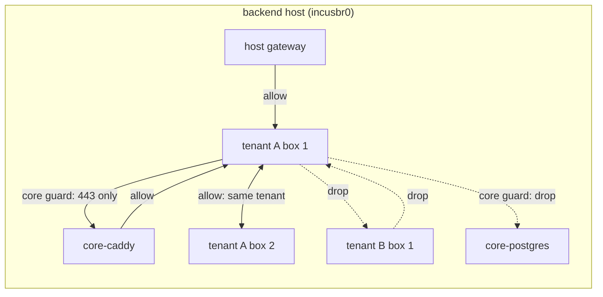

# Design: tenant network guard

**Date:** 2026-10-06
**Status:** proposed
**Stack:** protobuf/gRPC (grpc-gateway) + Docker; Go 1.26 (daemon, CLI, MCP); bash for the host-run e2e probes (existing convention, see Deviations)
**Closes:** #2347 (P0), #2348, #2349. Also flips the core-infra guard (#2084) to default-on.

## Problem

On a shared backend every tenant container sits on one Incus bridge, and
nothing on the data path distinguishes tenants: the only control that can
drop tenant → tenant traffic is the eBPF enforcer, which is opt-in twice
over, per-tenant, sender-side and IPv4-only (`docs/security/multi-tenant-isolation.md`,
second assessment). The tenant → core-infra guard already exists
(`docs/architecture/core-infra-network-guard.md`) but ships off. The
platform therefore has, by default, no network boundary between tenants
and an optional one between tenants and its own core services.

This design adds a **tenant guard**: an Incus NIC ACL on every tenant
container with ingress default-drop and a small, computed allow table, and
makes both guards default-on with an explicit opt-out.

## Design

Two reconcilers, one shape, one knob each:

| Guard | Subject NICs | Ingress allow table | Default |
|-------|--------------|---------------------|---------|
| core guard (exists) | core-role containers | host gateway, named core peers, tenant bridge on tenant-facing ports | `CONTAINARIUM_CORE_GUARD` missing → **enforce** (was: off) |
| tenant guard (new) | every tenant container | host gateway, core initiators (caddy, control plane), same-tenant container addresses | `CONTAINARIUM_TENANT_GUARD` missing → **enforce** |

Both leave egress `allow`: egress policy stays the eBPF enforcer's job
(`NETWORK-ISOLATION-DESIGN.md`), so there is still exactly one egress
policy system.

### Components

1. **`internal/tenantguard` — policy (`policy.go`)**. Pure function
   `Compute(Inputs) (Policy, error)`. `Inputs` carries the bridge prefix,
   the host gateway, the core initiator addresses by role, and every
   tenant container as `{Name, Tenant, IPv4, IPv6[]}`. Output is one
   `incus.ACLConfig` per tenant, named `containarium-tenant-<id>` where
   `<id>` is the first 12 hex chars of `sha256(tenant)` (tenant ids are
   org UUIDs or free-form names; the ACL name must be a stable, Incus-safe
   identifier). Rules, in order: allow from host gateway `/32`; allow from
   each core initiator `/32`; allow from each same-tenant address (`/32`
   and `/128`); everything else falls to the NIC's default ingress
   `drop`. A tenant with one box gets a table with no sibling entries,
   which is already the safe state. No I/O, no Incus types beyond
   `ACLConfig`, so it is table-testable.

2. **`internal/tenantguard` — reconciler (`reconciler.go`)**. Same
   lifecycle as `coreguard.Reconciler`: `NewReconciler(incus.Backend,
   Config)`, `Run(ctx, kick)`, `ReconcileOnce`, `Status()`. Each pass:
   list containers, resolve each tenant container's tenant with the same
   precedence the eBPF enforcer uses (`user.containarium.tenant` label,
   then `cloud_org_id`, then the `<tenant>-container` suffix), skip core
   roles and unresolvable containers (reported in status, never guarded
   under a guessed tenant), `Compute`, then per tenant `ensureACL`, and per
   container `EnsureNICDevice` + `SetDeviceConfig` with `security.acls`,
   `default.ingress.action=drop`, `default.ingress.logged=true`,
   `default.egress.action=allow`. ACLs for tenants that no longer have a
   container on the host are deleted. Kicked by the event bus and every
   minute, like the core guard. Requires the nftables driver **and** the
   `network_bridge_acl` API extension (NIC-level `security.acls`; Incus 7.x
   from the Zabbly repository has it, Ubuntu's packaged Incus 6.0 LTS does
   not) and reports the host as `Unsupported` otherwise.

3. **ACL-at-birth hook in `pkg/core/container` (`manager.go`)**. The
   reconciler alone leaves a window between a container starting and the
   next pass in which a new box is reachable by co-tenants. The manager
   therefore takes a `NICGuard` interface (`Prepare(ctx, name, tenant)
   error`) and calls it after the instance is created and before it is
   started. `tenantguard` implements it by ensuring the tenant's ACL
   exists and attaching it to the instance-local NIC. **Fail-closed on a
   capable host:** if `Prepare` fails while the guard is `enforce`, create
   returns `FAILED_PRECONDITION` with the reason, mirroring how
   `--encrypted` refuses rather than silently producing an unguarded box.
   **Fail-open on an incapable host:** when the host cannot carry bridge
   NIC ACLs at all (wrong firewall driver, Incus without
   `network_bridge_acl`), `Prepare` lets the create proceed, the daemon
   logs the gap once and the guard's status reports `Unsupported`. A
   missing capability is an operator finding, not an outage. Existing
   containers found unguarded by a pass on a capable host are fail-open
   with an `ERROR` log and a red status entry, so an upgrade cannot take
   running tenants down.

4. **`pkg/core/incus/acl.go` fixes (#2348)**. `AttachACLToContainer`
   becomes `EnsureNICDevice` + `SetDeviceConfig`, so a profile-inherited
   `eth0` is shadowed by an instance-local copy before the key is set.
   `NetworkServer.UpdateContainerACL` applies `ACL_PRESET_CUSTOM` rules
   as given and rejects `ACL_PRESET_UNSPECIFIED` with `INVALID_ARGUMENT`;
   the silent fallback to `full-isolation` in `protoToPreset` is removed.
   A per-user ACL and the tenant guard on the same NIC compose by Incus
   semantics (`security.acls` is a comma list); the server appends rather
   than overwrites.

5. **Daemon wiring and config (`internal/config/network.go`,
   `internal/server/dual_server.go`)**. `EnvTenantGuard =
   "CONTAINARIUM_TENANT_GUARD"`. Both guards parse with `ParseMode`, where
   `""` → `enforce` and only the literal `off` disables. The tenant guard
   is constructed next to the core guard, subscribed to the same event
   bus, and injected into the container manager as its `NICGuard`.
   `CONTAINARIUM_CORE_GUARD`'s missing-value default changes from `off`
   to `enforce` in the same change.

6. **Status surface (proto-first)**. `GetNetworkGuardStatus` on
   `NetworkService` returns `NetworkGuardStatus{core: GuardStatus, tenant:
   GuardStatus}` with `GuardMode` as an enum (`GUARD_MODE_OFF`,
   `GUARD_MODE_ENFORCE`), the firewall driver, last pass time, last error,
   and per-subject entries. REST at `GET /v1/network/guard`. The CLI adds
   `containarium network-guard status`; `containarium doctor` calls the
   same client function and fails its check when either guard is not
   `enforce` or has a last error; the MCP server wraps the client
   function (`network_guard_status`). No hand-rolled gateway handler.

7. **e2e probes and CI (#2349)**. `scripts/tenant-tenant-network-isolation-e2e.sh`
   (exists; must turn green) plus a new
   `scripts/tenant-guard-legit-flows-e2e.sh` asserting the flows that must
   survive: same-tenant box → box, host → tenant sshd, core-caddy → tenant
   exposed port, tenant → caddy 443, a DHCP renew inside a guarded box, and
   a kernel-log line for every expected drop. The Incus-host CI lane that
   already builds a real daemon for the fence-probe test runs all four
   guard scripts (the two tenant scripts and the two existing core
   scripts) with the daemon at its defaults, so both guards are exercised
   default-on. The fence-probe lane stops depending on the packet getting
   through: it keeps asserting the CRITICAL finding from the eBPF
   observation, which sees the flow at the sender's veth before the
   destination NIC's ACL drops it.

### Data flow

Create: `CreateContainer` → manager creates the instance → `NICGuard.Prepare`
(ensure tenant ACL, shadow `eth0`, set keys) → start → event bus → both
reconcilers run a pass and converge sibling tables (the new box's address
is added to its tenant's ACL, which every sibling NIC already references).
Failure: `Prepare` error → create fails `FAILED_PRECONDITION`, instance is
deleted, nothing is reachable.

Delete: event → pass → the tenant's ACL loses the address; when the tenant
has no containers left, the ACL is removed.

Address change (DHCP renew to a new lease, static pin): event → pass →
table updated. Until the pass runs the sibling is denied, never a stranger
allowed: every unknown source is a drop.

### Rollout

- **Default-on with explicit opt-out.** `NETWORK-ISOLATION-DESIGN.md`'s
  decision log says zero-trust rollouts default off so no upgrade degrades
  a deployment. This design deviates deliberately: #2347 is a missing
  boundary, not optional hardening, and the thing an upgrade would
  "degrade" is a tenant's ability to reach a co-tenant. The release that
  ships it carries a breaking-change entry naming the two env values and
  the one legitimate flow that changes (tenants that reached their own
  sibling boxes by bridge address keep working; tenants that reached a
  co-tenant's box do not).
- **First pass is loud.** The reconciler logs the count of containers it
  guarded, the tenants it could not resolve, and the firewall driver.
  On a host that cannot carry NIC ACLs (iptables driver, or Incus without
  `network_bridge_acl`) nothing is guarded, creates keep working, and
  doctor goes red with the reason rather than the guard silently looking
  on. The README's recommended Zabbly Incus has the extension; Ubuntu's
  packaged Incus 6.0 does not, which is also why the CI lane installs
  the Zabbly build.
- **`off` is the only escape hatch** and it is per-host, so an operator
  who needs cross-tenant reachability on a lab host sets it knowingly.
  Per-tenant cross-tenant allow (a tenant sharing a service with another)
  is not in scope; see "at 10x".
- **Order of landing:** 4 (ACL fixes) → 1+2 (policy, reconciler, status
  proto) → 3+5 (birth hook, wiring, defaults) → 7 (CI lane). The CI lane is
  red on purpose until step 5 merges; it is added last so `main` stays
  green.

## Language choices

| Component | Language | Why this one | Type gate in CI |
|-----------|----------|--------------|-----------------|
| `internal/tenantguard` policy + reconciler | Go | daemon-internal, long-running, shares `incus.Backend` and the event bus with the core guard | `go vet` / `go build` / `golangci-lint` |
| `pkg/core/incus/acl.go` fixes | Go | existing package | same |
| container manager birth hook | Go | existing package | same |
| `NetworkService.GetNetworkGuardStatus` + CLI + MCP wrapper | Go, generated from proto | one contract, three consumers | `buf generate` diff check + `go build` |
| host-run e2e probes | bash | existing convention for scripts that must run on the backend host with `incus` and read `dmesg`; no business logic | `bash -n` + `shellcheck` in the lane |

## Contracts

- **`proto/containarium/v1/network.proto`**: `rpc GetNetworkGuardStatus(GetNetworkGuardStatusRequest) returns (NetworkGuardStatus)` with `google.api.http` `GET /v1/network/guard`; messages `NetworkGuardStatus`, `GuardStatus`, `GuardEntry`, enum `GuardMode`. Regenerated into `pkg/pb`, the gateway shim, the swagger doc, and `internal/client/{grpc,http}.go`. Generated code is never edited.
- **`internal/tenantguard.Inputs` / `Policy`**: Go structs; the policy's only output type is `incus.ACLConfig`, the same one the core guard writes.
- **`pkg/core/container.NICGuard`**: `Prepare(ctx context.Context, name, tenant string) error`; the manager depends on the interface, the daemon injects the implementation, tests inject a fake.
- **Incus**: NIC keys `security.acls`, `security.acls.default.ingress.action|logged`, `security.acls.default.egress.action`; ACL names `containarium-tenant-<12hex>`. The core guard's names stay `containarium-core-<role>`.
- **Env**: `CONTAINARIUM_TENANT_GUARD=enforce|off`, `CONTAINARIUM_CORE_GUARD=enforce|off`, both default `enforce` when unset.

## Test strategy

**`tenantguard/policy.go`** (table-driven, no I/O):
- one tenant, one box → ACL with host + initiators, no sibling rule
- one tenant, three boxes (one IPv4-only, one dual-stack, one with no
  address yet) → siblings get `/32` and `/128` entries; the addressless box
  contributes nothing and is reported
- two tenants → two ACLs, no cross entries; rule order host → initiators →
  siblings is asserted literally
- address outside the bridge prefix → error naming the container
- unresolvable tenant → excluded from every ACL and listed in
  `Policy.Unresolved`
- ACL name is stable across input order and is a valid Incus name

**`tenantguard/reconciler.go`** (fake `incus.Backend`, same fake the core
guard uses):
- first pass on a host with two tenants creates two ACLs and shadows every
  tenant `eth0` once; second pass issues zero `UpdateInstance` calls
- a container appearing between passes: next pass adds its address to
  exactly one ACL
- last container of a tenant deleted → ACL deleted
- firewall driver `iptables` → `ErrUnsupportedFirewall`, status red,
  no writes
- `ensureACL` failing for one tenant does not stop the others; status
  carries the first error
- mode `off` → no writes, status says off

**`pkg/core/incus/acl.go`**:
- `AttachACLToContainer` on an instance whose `eth0` is only in
  `ExpandedDevices` writes an instance-local copy carrying the profile's
  keys plus `security.acls`
- `UpdateContainerACL` with `CUSTOM` applies the given rules verbatim;
  `UNSPECIFIED` returns `INVALID_ARGUMENT`; the `protoToPreset` fallback
  case no longer exists (a test enumerates the enum)

**container manager birth hook**:
- `Prepare` is called after create and before start, with the resolved
  tenant
- `Prepare` error under `enforce` → create returns `FAILED_PRECONDITION`
  and the instance is deleted; under `off` the guard is not called

**proto / client / CLI / MCP**:
- contract test: the generated Go client's `GetNetworkGuardStatus` round-
  trips an enum-bearing status through the grpc-gateway REST path (JSON
  enum names, not ints)
- `containarium network-guard status` renders both guards; `doctor` fails
  when either mode is not enforce or `last_error` is set
- the MCP tool calls the same client function as the CLI (no HTTP endpoint
  without a CLI verb)

**e2e, on the Incus-host CI lane, daemon at defaults**:
- `tenant-tenant-network-isolation-e2e.sh` A↔B both directions: green
- `tenant-guard-legit-flows-e2e.sh`: same-tenant box → box, host →
  tenant, caddy → tenant, tenant → caddy 443, DHCP renew: all succeed;
  one `dmesg` line per expected drop
- `tenant-core-infra-network-isolation-e2e.sh` and
  `core-guard-legit-flows-e2e.sh`: green with no env set (core guard now
  default-on)
- fence-probe lane: CRITICAL finding still raised with the destination
  NIC dropping the packet

**Hardware spike before step 2 lands** (one lab host, recorded in the
PR): Incus's implicit ACL rules for DHCP, DNS and NDP toward the host
hold under ingress default-drop on a tenant NIC; `security.acls` is
hot-applied to a running container without a restart; a guarded box's
Docker-in-LXC workload still reaches the internet and is still reachable
through Caddy.

## Deviations from the default stack

- **bash for the host-run e2e probes.** The repository already proves
  network boundaries with bash scripts executed on the backend host
  (`tenant-core-infra-network-isolation-e2e.sh`, `core-guard-legit-flows-e2e.sh`).
  They need `incus exec` and `dmesg` on the host, carry no business logic,
  and are contained to `scripts/` and the CI lane. Writing them in Go would
  add a host-side binary for no gain.
- **Default-on for a zero-trust control**, against the decision log in
  `NETWORK-ISOLATION-DESIGN.md`. Justification above (Rollout).

## Rejected alternatives

- **`security.port_isolation=true` on tenant NICs** (the option named in
  #2347). The kernel bridge "isolated" flag is simpler and also blocks ARP
  and link-local IPv6, but it cannot express "same tenant": isolated ports
  never talk to each other, so a tenant's web box and database box would
  be cut off. Restoring that needs a per-tenant bridge or a second NIC per
  box, which changes addressing, DNS, Caddy routing and the core guard's
  inputs. The NIC ACL reaches the same tenant ↔ tenant boundary with no
  topology change and the same mechanism the core guard already runs. What
  it leaves open, L2 neighbour discovery between tenants, is an
  information leak rather than reachability and is recorded as a follow-up
  in the isolation doc.
- **Make the eBPF enforcer default-deny for policy-less tenants.** Closes
  the gap only at the sender, stays IPv4-only, and has no connection
  tracking, so a tenant's replies to Caddy and the sentinel would be
  evaluated as egress and dropped unless every tenant's allow-list names
  the host and core addresses. Keeping the eBPF program as the egress
  layer and the NIC ACL as the ingress layer gives each one job.
- **Per-tenant bridges** (the cloud repo's Layer 4 model). The right
  long-term topology for a multi-org host, but it is a migration of every
  existing backend's addressing. The tenant guard is the boundary that can
  ship now and stays correct when per-tenant bridges arrive (an ACL on a
  per-tenant bridge is simply shorter).

## At 10x

- Hundreds of tenants per host: one ACL per tenant and one nftables chain
  per NIC is linear; the reconciler's per-pass `ListContainers` is the same
  cost the core guard already pays. Beyond that, move sibling membership
  into an nftables set per tenant instead of per-address rules.
- Cross-tenant sharing (tenant A exposes a service to tenant B): a typed
  `allow_from_tenants` on the existing `NetworkPolicy` proto, consumed by
  `Compute` as extra initiator addresses. Not needed to close #2347.
- Per-tenant bridges: `Compute` keeps working; `Inputs.BridgeCIDR` becomes
  per tenant.
