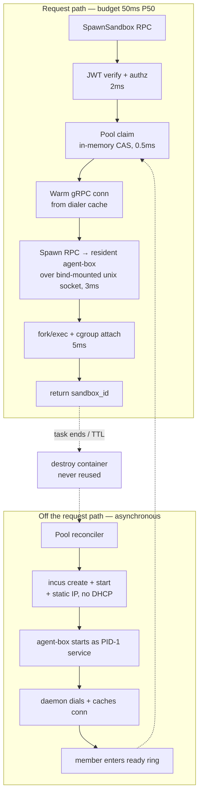

# Design: two-digit-millisecond sandbox spawn

**Date:** 2026-08-21
**Status:** proposed
**Supersedes:** the performance budget in [`../EPHEMERAL-SANDBOX-DESIGN.md`](../EPHEMERAL-SANDBOX-DESIGN.md), which explicitly declined this target ("not aiming for CubeSandbox's `<60ms`"). The rest of that note — threat model, verb shape, TTL sweeper — still stands.
**Stack:** protobuf/gRPC (grpc-gateway) + Docker; Go 1.26.6. No new language, no new deployable.
**Scope:** the LXC backend. K8s inherits warm pools from `kubernetes-sigs/agent-sandbox` (#1226) — we do not build a second one.

## Problem

An agent inner loop needs an isolated Linux process in tens of milliseconds. Containarium's create path takes **30–90s** cold, **~3–7s** with a baked image. The prior design note treated the gap as substrate-inherent — "the LXC-vs-MicroVM gap, not a Containarium implementation gap" — and set a `<5s` target.

That framing is wrong, and it is the reason this doc exists.

**MicroVMs do not reach two-digit ms by booting quickly.** Firecracker's *cold boot* is ~125ms — already above the target we are chasing. The `<60ms` figures come from **snapshot restore of an already-booted VM**: no kernel init, no userland init, no device probe on the request path. The mechanism is "don't boot during the request," and that mechanism is substrate-neutral. An LXC container that is already running can host a new isolated task in single-digit milliseconds.

So the goal is not a faster boot. It is **removing boot and provisioning from the request path entirely**, and then removing the per-call orchestration overhead that remains.

## Where the time actually goes

Derived from the code, not from a profiler — **no per-stage instrumentation exists today**, which is why Phase 0 is measurement and not optimization. `pkg/core/container/benchmark.go` benchmarks guest CPU/memory, not create latency.

| # | Stage | Cost | Location |
|---|---|---|---|
| 1 | Validation, authz, bounds, image-registry checks | ~1–5ms | `internal/server/container_server.go:344` |
| 2 | `incus.CreateContainer` — ZFS clone + instance record | ~200–800ms | `pkg/core/container/manager.go:253` |
| 3 | `incus.StartContainer` + `op.Wait()` — **full systemd boot** | ~1–3s | `pkg/core/incus/client.go:864` |
| 4 | `SetLabels` | ~20–50ms | `manager.go:277` |
| 5 | `CreateJumpServerAccount` — host `useradd` | ~100–300ms | `manager.go:301` |
| 6 | `WaitForNetwork` — DHCP wait (~~quantized to 1s~~ fixed) | ~300–800ms | `pkg/core/incus/client.go:1289` |
| 7 | `installPackages` | 60–600s (0 if baked) | `manager.go:371` |
| 8 | `createUser` — 4 `Exec` + 1 `WriteFile` | ~250–750ms | `manager.go:763–810` |
| 9 | `addSSHKeys` — 3 `Exec` + 1 `WriteFile` | ~200–600ms | `manager.go:805–838` |
| 10 | `GetContainer` | ~10–30ms | `manager.go:441` |

Three findings drive the whole design:

**Finding 1 — ~1s of every create was pure quantization waste. ✅ Fixed 2026-08-21.** `WaitForNetwork` polled, then `time.Sleep(1 * time.Second)`. A container whose DHCP lease landed at 300ms returned at ~1010ms. Not a substrate cost — a two-line bug with a ~700ms average payoff on *every* create, persistent boxes included. Now polls from 25ms backing off to a 500ms cap, with the sleep clamped so a budget is never overshot by a full interval. See `pkg/core/incus/client.go:1289` and `pkg/core/incus/wait_network_test.go`.

**Finding 2 — identity seeding costs ~10 Incus exec round-trips.** Steps 8 and 9 each do a websocket-upgrading `ExecInstance` with `WaitForWS: true` per command (`pkg/core/incus/client.go:1271`). At ~50–150ms apiece that is 0.5–1.5s, and it is the same liblxc command-socket path implicated in the #755 wedge. Any design that seeds a Linux user and SSH keys at claim time cannot reach two-digit ms.

**Finding 3 — the transport is already good.** `pkg/core/incus/client.go:674` uses `ConnectIncusUnix` — the native Go client over a unix socket, not CLI shell-out. There is no process-spawn tax to remove. The remaining overhead is per-operation (`op.Wait()`), not per-connection.

## Design

Redefine the request-path operation. **Spawn is not create.** Spawn claims an already-booted, already-networked, already-provisioned container from a pool and forks the task's process inside it over a connection that is already open.

### The four things that must leave the request path

**1. Boot (steps 2–3, ~1.2–3.8s).** Pool members are created and started by a background reconciler. A claim touches an instance that has been running for seconds to minutes.

**2. DHCP (step 6, ≥1s).** Pool members get a **statically allocated IP** from a per-host IPAM range at warm time (`config.NIC.IPv4Address` already exists — `manager.go:236`). The lease wait happens during warm-up, where it is free. `WaitForNetwork` disappears from the claim path entirely rather than being made faster.

**3. Identity seeding (steps 5, 8, 9, ~0.5–2.6s).** This is a scope decision, not an optimization: **ephemeral sandboxes have no per-tenant Linux account, no SSH keys, and no jump-server account.** The pool member is pre-provisioned at warm time with one generic unprivileged user. Tenant identity lives in the control plane — which `sandbox_id` belongs to which tenant — not in the guest's `/etc/passwd`.

   Nobody SSHes into a 30-second sandbox as `alice`. The entire access surface is `SandboxService` RPCs. If a caller needs `ssh alice@box`, that is the persistent-box product, and it is unaffected by any of this.

**4. Per-call orchestration (step 8/9 transport, ~50–150ms per command).** Incus `ExecInstance` websocket-upgrades per exec. Instead, each pool member runs **`agent-box` as a resident gRPC service**, and the daemon holds an established HTTP/2 connection to it. Spawn becomes one unary call on an open stream.

### Transport: bind-mounted unix socket, not the network

`cmd/agent-box/main.go:76` serves MCP over **stdio only** today, wrapped by SSH on the client side. Phase 2 adds a second transport: a gRPC listener on a unix socket.

The socket is **bind-mounted from the host**, not reached over the bridge. Each pool member gets an Incus `disk` device mapping host `/run/containarium/pool/<member-id>/` to guest `/run/containarium/`. The daemon dials the host-side path directly.

This is the right choice for three reasons:

- **It removes the network from the spawn path.** No bridge, no netns, no sentinel, no dependency on the guest having an IP at claim time. Unix-socket RTT is ~50µs against ~0.5ms for TCP over `incusbr0`.
- **It survives the guest's network being deliberately hostile.** Network isolation policy (eBPF, `NETWORK-ISOLATION-DESIGN.md`) can lock the sandbox's netns down to nothing without severing the control channel.
- **vsock is not available.** Incus offers vsock for VMs, not for LXC containers — the natural microVM analogue doesn't exist here, and the bind-mounted socket is the closest equivalent.

### Isolation: whole containers, claimed once, destroyed after

Two-digit ms must not be bought by weakening isolation. It would be trivial and wrong to fork the task into a long-lived shared container — that is option 1 in the prior note ("a malicious snippet has alice's files").

Instead: **a pool member is an entire container, dedicated to exactly one task, destroyed on release and never reused.** Isolation is container-level, identical to today. The pool buys latency by moving boot earlier in time, not by sharing a boundary.

This changes one decision from the prior note. That note chose **per-tenant** pools; this design uses a **single shared pool** per host. The prior reasoning assumed reuse. With destroy-on-release, no tenant ever touches a container another tenant has touched — a member is booted from a pristine image, claimed once, and destroyed. A shared pool is therefore exactly as isolating as per-tenant pools and dramatically denser: a 10-tenant host with `min_warm=3` pre-allocates 3 members, not 30.

What does *not* improve: shared-kernel side channels, unchanged in either model, and unchanged from today.

Replenishment must clone from the **image**, never reset a used member. A "reset and return to pool" path would silently reintroduce cross-tenant reuse and must not be added later without revisiting this section.

### Latency budget

| Stage | P50 budget |
|---|---|
| gRPC ingress + JWT verify (cached JWKS) | 2ms |
| Authz + per-tenant rate limit (in-memory) | 1ms |
| Pool claim — CAS on a ready ring | 0.5ms |
| `Spawn` unary RPC over warm conn | 3ms |
| `fork`/`exec` + cgroup attach in guest | 5ms |
| Response marshal | 1ms |
| **Total P50** | **~13ms** |
| **SLO** | **P50 ≤ 50ms, P99 ≤ 99ms** |

The gap between 13ms modelled and 99ms P99 is deliberate headroom for Go GC pauses, host scheduler latency under load, and connection re-establishment after a member churns.

**Pool exhaustion is a distinct outcome, not a tail.** When no member is ready, `SpawnSandbox` returns `RESOURCE_EXHAUSTED` with a `retry_after_ms`. It does **not** silently fall back to the ~3–7s cold path. A latency SLO whose slow path is invisible is not an SLO; a caller that wants the slow path asks for it explicitly with `allow_cold_start=true`, and gets a response field saying which path served it.

## Language choices

| Component | Language | Why this one | Type gate in CI |
|---|---|---|---|
| `proto/containarium/v1/sandbox.proto` | protobuf | Contract source of truth; drives gRPC, REST, swagger, clients | `buf lint` + `buf breaking` |
| `internal/sandbox/pool` — reconciler + claim ring | Go | Concurrent, latency-critical control-plane state; the whole repo's default | `go vet` / `go build` |
| `internal/sandbox/ipam` — static IP allocator | Go | Same process, shares pool state | `go vet` |
| `internal/sandbox/dialer` — warm connection cache | Go | Holds live gRPC conns alongside the pool | `go vet` |
| `internal/server/sandbox_server.go` — RPC impl | Go | Where every other service impl lives | `go vet` |
| `cmd/agent-box` — resident `SpawnService` listener | Go | Existing deployable, existing language | `go vet` |
| `internal/cmd/sandbox.go` — CLI verbs | Go | CLI-first per `CLAUDE.md`; MCP wraps it | `go vet` |

**Three languages? No — one.** This design adds zero languages and zero deployables. `agent-box` gains a transport, not a rewrite.

## Contracts

All generated from one proto via `make proto`; generated code is never hand-edited.

| Boundary | Contract | Source of truth | Generated artifacts |
|---|---|---|---|
| Caller (CLI / MCP / SDK) → daemon | `SandboxService` | `proto/containarium/v1/sandbox.proto` | `pkg/pb/`, `.pb.gw.go`, `api/swagger/containarium.swagger.json`, typed Go client in `internal/client/{grpc,http}.go` |
| Daemon → resident agent-box | `SpawnService` | same proto file, separate service | Go server stub in `internal/agentbox/`, Go client in `internal/sandbox/dialer` |
| Pool member metadata | Incus instance config keys under `user.containarium.sandbox.*` | `internal/sandbox/pool` | typed Go struct — **not** `map[string]string` plumbed through the codebase |

`SandboxService` RPCs, mirroring the e2b verb shape so a compat shim stays cheap (Phase E of the prior note):

| RPC | HTTP | Notes |
|---|---|---|
| `SpawnSandbox` | `POST /v1/sandboxes` | the two-digit-ms path; returns `served_from` = `POOL` \| `COLD` |
| `ExecInSandbox` | `POST /v1/sandboxes/{id}/exec` | over the same warm conn |
| `WriteFileInSandbox` | `PUT /v1/sandboxes/{id}/files` | |
| `ReadFileInSandbox` | `GET /v1/sandboxes/{id}/files` | |
| `DeleteSandbox` | `DELETE /v1/sandboxes/{id}` | destroys; triggers replenish |
| `GetPoolStatus` | `GET /v1/sandboxes/pool` | ready/warming/claimed counts, for operators and for the SLO dashboard |

**Enums, not magic strings** (per `CLAUDE.md`): `SandboxState`, `ServedFrom`, and `SandboxTemplate` are proto enums. A `template` field accepting "one of python, node, base" as a `string` is exactly the anti-pattern the repo calls out.

## Test strategy

Named before implementation, per component.

### `internal/sandbox/pool`

- **Unit, table-driven** — `TestClaim`: empty pool → `ErrPoolExhausted`; one ready member → claimed and removed from ring; concurrent claims → each member claimed exactly once (`-race`, 100 goroutines); claim during reconcile → no torn state.
- **Unit** — `TestReconcile`: below `min_warm` → warms the difference; above → trims idle; member in `WARMING` never enters the ready ring; a failed warm is retried with backoff and does not wedge the reconciler.
- **Unit** — `TestDestroyOnRelease`: a released member is destroyed, never returned to the ring. This test is the executable form of the isolation argument above and must fail loudly if anyone adds a reset-and-reuse path.
- **Fake** — the Incus layer behind `box.BoxBackend`, so pool logic tests run in milliseconds with no host.

### `internal/sandbox/ipam`

- **Unit, table-driven** — allocation is unique across concurrent callers; exhausted range returns typed error; released IP is quarantined for a configurable interval before reuse (a reused IP with a live ARP entry elsewhere is a cross-sandbox routing bug); range parsing rejects overlaps with the host's own address.

### `internal/sandbox/dialer`

- **Unit** — connection reused across calls (assert dial count == 1 for N spawns); dead socket → reconnect and succeed; reconnect budget bounded so a wedged member cannot consume the caller's deadline.
- **Integration** — against a real `agent-box` process on a real unix socket in a temp dir. No mock: the thing under test *is* the socket behavior.

### `cmd/agent-box` `SpawnService`

- **Unit** — spawn returns a pid; exec captures stdout/stderr/exit code; a spawned process is reaped, not zombied; concurrent spawns are independent.
- **Contract test** — daemon-side client and box-side server both exercised through the **generated** stubs, so proto drift fails a test rather than production. This is the cross-process boundary most likely to drift.

### `internal/server/sandbox_server.go`

- **Unit** — authz: missing `sandboxes:write` scope → `PermissionDenied`; cross-tenant `sandbox_id` → `PermissionDenied` (not `NotFound` — the ownership check must run before existence leaks); rate limit exceeded → `ResourceExhausted`.
- **Unit** — pool exhausted + `allow_cold_start=false` → `ResourceExhausted` with `retry_after_ms`; with `true` → cold path and `served_from = COLD`.

### The latency SLO itself

- **Benchmark gate in CI** — `BenchmarkSpawnFromWarmPool` against a fake backend pins *control-plane* overhead (claim + marshal + authz) with an allocation budget. Catches an accidental O(n) scan of the pool or a per-call allocation regression. Runs on every PR.
- **Integration, real host, nightly** — `test/e2e/sandbox_latency_test.go` spawns 200 sandboxes against a real Incus host and asserts P50 ≤ 50ms, P99 ≤ 99ms. Tagged `sandbox_latency`, not in the PR lane. **This is the test that decides whether the design succeeded**; everything else is a proxy.
- **Instrumentation as a test fixture** — the Phase 0 per-stage histogram is what the latency test reports on failure, so a regression names its stage instead of a number.

What is mocked vs. real: pool/IPAM/authz logic runs against fakes (fast, deterministic). Anything whose behavior *is* the OS — unix sockets, process spawn, Incus operations, DHCP — runs real, in the nightly lane.

## Phased rollout

| Phase | Scope | Exit criterion | Bound |
|---|---|---|---|
| **0** | **Measure.** Per-stage timing on the existing create path, exported as a histogram with a `stage` label. ~~Plus the `WaitForNetwork` fix.~~ | The table in "Where the time actually goes" is replaced by measured numbers. | 2 days |
| **0a** | ✅ **Done.** `WaitForNetwork` polls 25ms→500ms with backoff instead of a flat 1s sleep. | Every create ~700ms faster; regression test verified to fail against the old loop. | landed |
| **1** | `sandbox.proto` + `SandboxService` + CLI verbs. Cold path only, pool size 0. No SSH, no per-tenant user — establishes the identity model. | `containarium sandbox create/exec/delete` works end-to-end; latency measured and published, not yet fast. | 1 week |
| **2** | `agent-box` resident `SpawnService` on a bind-mounted unix socket. Dialer with connection cache. | Exec round-trip drops from ~50–150ms to ~3ms, measured. | 1 week |
| **3** | Pool reconciler + static IPAM + claim ring. **Two-digit ms lands here.** | Nightly latency test green: P50 ≤ 50ms, P99 ≤ 99ms. | 1.5 weeks |
| **4** | Admission control: typed `RESOURCE_EXHAUSTED`, per-tenant rate limit, TTL sweeper, `GetPoolStatus`. | Pool exhaustion is visible and bounded; no sandbox leaks past `idle_ttl`. | 3 days |
| **5** | *Conditional.* CRIU checkpoint/restore of a warmed process image (e.g. a Python interpreter with the template's imports resolved). The true snapshot-restore analogue. | Only if Phase 3 measurement shows guest-side warm-up dominates the residual. Do not build speculatively. | TBD |

Phase 0 ships value alone. Phase 1 ships a usable primitive even if 2–4 never land.

## Deviations from the default stack

**None.** Go only, one proto contract, grpc-gateway for REST, no new deployable, no new dependency in the request path.

One thing worth flagging as *not* a deviation but a deliberate narrowing: ephemeral sandboxes deliberately do **not** get the SSH/jump-server access surface every other Containarium box has. That asymmetry is the design, and it is what makes the target reachable.

## Rejected alternatives

**Switch to Firecracker / Cloud Hypervisor microVMs.** Rejected — *for this goal*. It buys isolation, not latency. Firecracker's cold boot is ~125ms, already above the two-digit target; only snapshot-restore reaches `<60ms`, and snapshot-restore's mechanism (don't boot on the request path) is exactly what a warm pool delivers on LXC at a fraction of the operational cost — no new hypervisor binary, no kernel-version coordination, no second image format, no second storage path. Adopting a hypervisor to fix a latency problem caused by ~10 exec round-trips and a `time.Sleep(1s)` would be treating the wrong cause. **Stronger sandbox-to-host isolation remains a legitimate reason to revisit microVMs — on its own merits, in its own design note.**

**Optimize the existing create path in place.** Rejected as the *primary* strategy, adopted as Phase 0. Fixing `WaitForNetwork` and parallelizing the identity execs is worth ~1.5–2.5s and helps every persistent box today. But the residual floor is ZFS clone + systemd boot ≈ 1–2s. Necessary, nowhere near sufficient.

**Reuse one long-lived container across tasks, isolating only at the process level.** Rejected. It is the cheapest route to two-digit ms and it deletes the product's security property — the prior note already identified it as the non-answer. Recorded here because it will look tempting to anyone staring at the pool-memory cost.

**gVisor / runsc.** Rejected. Start-up is still ~100ms+ before the workload runs, and every syscall afterwards pays interception overhead — it makes the *task* slower to buy isolation the pool model doesn't need.

**Per-tenant warm pools** (the prior note's decision). Rejected in favor of one shared pool, because destroy-on-release makes them isolation-equivalent while per-tenant pools cost N× the idle memory. See "Isolation" above for the argument this rests on; if destroy-on-release is ever weakened, this decision must be reopened first.

## What changes at 10x

The binding constraint is **pool idle memory**: `min_warm` × ~80MB per LXC base. At `min_warm=10` that is 800MB per host — fine. At 100 it is 8GB of RAM doing nothing, which is the point where this design needs revisiting, in this order:

1. **Predictive pool sizing.** Track claim rate per host and size `min_warm` to observed demand rather than a static floor. Cheapest win; deferred from v1 because a static floor is honest and debuggable.
2. **Lower the per-member floor.** A minimal template (no systemd, a static init that runs only `agent-box`) plausibly cuts the 80MB base substantially — and also cuts warm-up time, which is what makes predictive sizing responsive.
3. **Only then**, tiered pools: a small hot pool at two-digit ms plus a larger stopped-but-provisioned tier at ~1s, with the SLO stated per tier.

The claim ring itself is O(1) and will not be the bottleneck.
